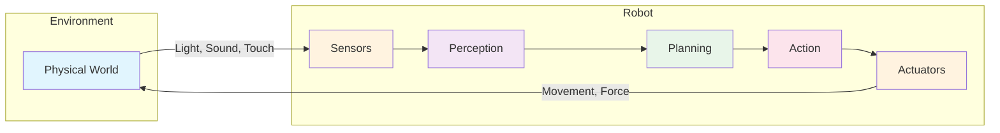
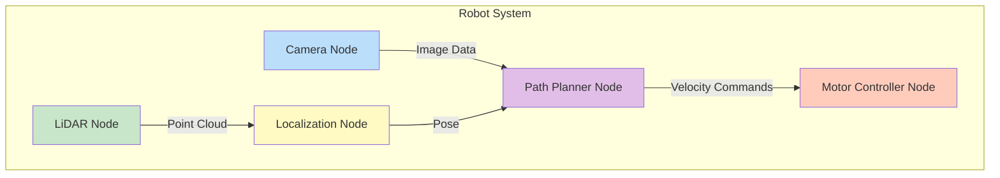
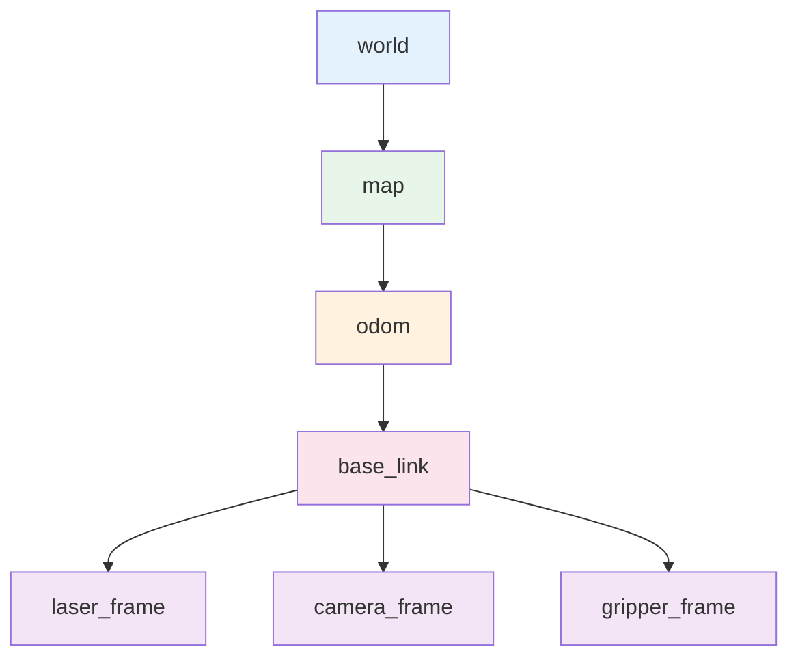

# Chapter 1: Introduction to Physical AI & ROS 2

## Learning Objectives

By the end of this chapter, you will be able to:

- **Understand** the core concepts of Physical AI and how it differs from traditional AI
- **Explain** the sense-plan-act paradigm that governs robotic systems
- **Describe** the architecture and key components of ROS 2
- **Configure** a basic ROS 2 development environment
- **Implement** a simple publisher-subscriber communication pattern
- **Identify** real-world applications of Physical AI in various industries

## Prerequisites

Before starting this chapter, ensure you have:

- Basic understanding of programming concepts (variables, functions, loops)
- Familiarity with command-line interfaces (terminal/shell)
- Python 3.8+ installed on your system
- A computer running Ubuntu 22.04 (recommended) or Windows with WSL2

---

## 1. What is Physical AI?

Physical AI, also known as **embodied artificial intelligence**, represents a paradigm shift in how we think about intelligent systems. Unlike traditional AI that operates purely in the digital realm—processing text, images, or data—Physical AI systems interact directly with the physical world through sensors and actuators.

### 1.1 The Evolution from Digital to Physical AI

The journey from digital AI to Physical AI represents one of the most significant transitions in the field of artificial intelligence. Traditional AI systems, such as chatbots, recommendation engines, and image classifiers, operate entirely within computational boundaries. They receive digital inputs, process them using algorithms, and produce digital outputs.

Physical AI extends this capability into the real world. A Physical AI system must:

1. **Perceive** the environment through sensors (cameras, LiDAR, IMUs, touch sensors)
2. **Understand** and interpret sensor data in real-time
3. **Plan** actions based on goals and environmental constraints
4. **Execute** physical movements through actuators (motors, grippers, wheels)
5. **Adapt** to unexpected changes and uncertainties in the physical world

This creates a continuous feedback loop where the AI's actions affect its environment, which in turn affects future perceptions—a fundamental difference from isolated digital AI systems.

### 1.2 The Sense-Plan-Act Paradigm

At the heart of Physical AI lies the **sense-plan-act** paradigm, a foundational framework for understanding how robots interact with their environment.



**Sensing**: The robot gathers information about its environment through various sensors. A mobile robot might use cameras for visual perception, LiDAR for depth mapping, and IMUs (Inertial Measurement Units) for orientation tracking. Each sensor provides a different perspective on the physical world.

**Planning**: Based on the perceived information, the robot must decide what actions to take. This involves understanding the current state, predicting future states, and selecting actions that move toward desired goals. Planning algorithms range from simple reactive behaviors to complex motion planning and task scheduling.

**Acting**: Finally, the robot executes its planned actions through actuators. This might involve moving wheels to navigate, rotating joints to manipulate objects, or activating grippers to grasp items. The execution must account for physical constraints like motor speeds, joint limits, and environmental obstacles.

### 1.3 Challenges Unique to Physical AI

Physical AI faces challenges that don't exist in purely digital systems:

**Uncertainty and Noise**: Real-world sensors are imperfect. Cameras can be affected by lighting conditions, LiDAR can miss transparent objects, and GPS signals can drift. Physical AI systems must handle this uncertainty gracefully.

**Real-Time Constraints**: A self-driving car cannot take minutes to decide whether to brake—it must react in milliseconds. Physical AI systems operate under strict timing requirements where delayed responses can have serious consequences.

**Physical Constraints**: Robots have limited battery life, payload capacity, and range of motion. AI systems must plan within these physical limitations.

**Safety Requirements**: Unlike a chatbot that can occasionally give wrong answers, a malfunctioning robot can cause physical harm. Physical AI systems require robust safety mechanisms and fail-safes.

---

## 2. Introduction to ROS 2

The **Robot Operating System 2 (ROS 2)** is not actually an operating system in the traditional sense. Instead, it's a flexible framework for writing robot software. ROS 2 provides the tools, libraries, and conventions needed to create complex robotic applications.

### 2.1 Why ROS 2?

Before ROS, robotics developers faced a common problem: every robot project started from scratch. Teams would write their own communication protocols, sensor drivers, and control algorithms. This led to significant duplication of effort and made it difficult to share code between projects.

ROS (and later ROS 2) solved this by providing:

- **Standardized Communication**: A common way for different parts of a robot system to exchange information
- **Hardware Abstraction**: Standard interfaces that work with many different sensors and actuators
- **Package Ecosystem**: Thousands of reusable packages for navigation, perception, manipulation, and more
- **Development Tools**: Visualization, debugging, and testing utilities
- **Community**: A global community of researchers and developers sharing knowledge and code

### 2.2 ROS 2 vs ROS 1

ROS 2 is a complete redesign of the original ROS framework, addressing several limitations:

| Feature | ROS 1 | ROS 2 |
|---------|-------|-------|
| **Communication** | Custom protocol (TCPROS) | DDS (Data Distribution Service) |
| **Real-Time Support** | Limited | First-class support |
| **Security** | Minimal | Built-in encryption and access control |
| **Multi-Robot** | Challenging | Native support |
| **Platform** | Linux only | Linux, Windows, macOS |
| **Lifecycle** | Manual node management | Managed node lifecycle |

### 2.3 Core Concepts of ROS 2

Understanding ROS 2 requires familiarity with several key concepts:

#### Nodes

A **node** is the fundamental building block of ROS 2. Each node is a process that performs computation. A typical robot system consists of many nodes working together: one node might process camera images, another handles motor control, and a third performs path planning.



The modular nature of nodes provides several benefits:
- **Fault Isolation**: If one node crashes, others can continue operating
- **Reusability**: Nodes can be used across different robot projects
- **Distributed Computing**: Nodes can run on different computers
- **Testing**: Individual nodes can be tested in isolation

#### Topics

**Topics** are named buses over which nodes exchange messages. A node can **publish** messages to a topic or **subscribe** to receive messages from a topic. This publish-subscribe pattern enables loose coupling between nodes—publishers don't need to know who their subscribers are.

For example, a camera node might publish images to the `/camera/image_raw` topic. Any node interested in camera data can subscribe to this topic without the camera node needing to know about them.

#### Services

While topics enable continuous data streams, **services** provide a request-response pattern. A node can offer a service that other nodes can call. The calling node sends a request and waits for a response.

Services are useful for operations that:
- Have a clear input and output
- Should only happen when explicitly requested
- Need to return a result to the caller

For example, a mapping node might offer a `/save_map` service that saves the current map to a file when called.

#### Actions

**Actions** are similar to services but designed for longer-running tasks. An action allows a client to:
- Send a goal to an action server
- Receive periodic feedback on progress
- Cancel the goal if needed
- Receive a final result when complete

Navigation is a common use case for actions—sending a robot to a destination can take minutes, and you want progress updates along the way.

---

## 3. Setting Up Your ROS 2 Environment

Let's get hands-on and set up a ROS 2 development environment. We'll use **ROS 2 Humble Hawksbill**, the current Long-Term Support (LTS) release.

### 3.1 Installation on Ubuntu 22.04

First, set up the ROS 2 apt repository:

```bash
# Set locale
sudo apt update && sudo apt install locales
sudo locale-gen en_US en_US.UTF-8
sudo update-locale LC_ALL=en_US.UTF-8 LANG=en_US.UTF-8
export LANG=en_US.UTF-8

# Add the ROS 2 GPG key
sudo apt install software-properties-common
sudo add-apt-repository universe
sudo apt update && sudo apt install curl -y
sudo curl -sSL https://raw.githubusercontent.com/ros/rosdistro/master/ros.key -o /usr/share/keyrings/ros-archive-keyring.gpg

# Add the repository to sources list
echo "deb [arch=$(dpkg --print-architecture) signed-by=/usr/share/keyrings/ros-archive-keyring.gpg] http://packages.ros.org/ros2/ubuntu $(. /etc/os-release && echo $UBUNTU_CODENAME) main" | sudo tee /etc/apt/sources.list.d/ros2.list > /dev/null
```

Now install ROS 2 Humble:

```bash
# Update and install ROS 2
sudo apt update
sudo apt upgrade
sudo apt install ros-humble-desktop

# Install development tools
sudo apt install ros-dev-tools
```

Finally, source the ROS 2 setup script:

```bash
# Add to your .bashrc for automatic sourcing
echo "source /opt/ros/humble/setup.bash" >> ~/.bashrc
source ~/.bashrc
```

### 3.2 Verifying the Installation

Let's verify that ROS 2 is working correctly by running some example nodes:

```bash
# Terminal 1: Run a talker node
ros2 run demo_nodes_cpp talker

# Terminal 2: Run a listener node
ros2 run demo_nodes_cpp listener
```

You should see the talker publishing messages and the listener receiving them. This demonstrates the basic publish-subscribe communication pattern.

### 3.3 Understanding the Workspace Structure

ROS 2 uses **workspaces** to organize packages. A typical workspace structure looks like this:

```
my_robot_ws/
├── src/                    # Source code for your packages
│   ├── my_robot/          # A custom package
│   │   ├── package.xml    # Package metadata
│   │   ├── setup.py       # Python package setup
│   │   ├── my_robot/      # Python module
│   │   │   └── __init__.py
│   │   └── resource/
│   └── my_robot_msgs/     # Custom message definitions
├── build/                  # Build artifacts (generated)
├── install/               # Installed packages (generated)
└── log/                   # Build logs (generated)
```

Create your first workspace:

```bash
# Create workspace directory
mkdir -p ~/ros2_ws/src
cd ~/ros2_ws

# Build the workspace (even if empty)
colcon build

# Source the workspace
source install/setup.bash
```

---

## 4. Your First ROS 2 Program

Let's create a simple ROS 2 package that demonstrates the publisher-subscriber pattern—the foundation of ROS 2 communication.

### 4.1 Creating a Package

```bash
cd ~/ros2_ws/src

# Create a Python package
ros2 pkg create --build-type ament_python --node-name talker my_first_package
```

This creates a package with the following structure:

```
my_first_package/
├── package.xml
├── setup.py
├── setup.cfg
├── resource/
│   └── my_first_package
├── my_first_package/
│   ├── __init__.py
│   └── talker.py
└── test/
```

### 4.2 Writing a Publisher

Edit `my_first_package/talker.py`:

```python
import rclpy
from rclpy.node import Node
from std_msgs.msg import String


class MinimalPublisher(Node):
    """A minimal ROS 2 publisher node."""

    def __init__(self):
        super().__init__('minimal_publisher')

        # Create a publisher on the 'topic' topic
        self.publisher_ = self.create_publisher(
            String,           # Message type
            'topic',          # Topic name
            10                # Queue size
        )

        # Create a timer that calls the callback every 0.5 seconds
        timer_period = 0.5  # seconds
        self.timer = self.create_timer(timer_period, self.timer_callback)
        self.i = 0

        self.get_logger().info('Publisher node started')

    def timer_callback(self):
        """Callback function called by the timer."""
        msg = String()
        msg.data = f'Hello, Physical AI! Message #{self.i}'

        self.publisher_.publish(msg)
        self.get_logger().info(f'Publishing: "{msg.data}"')

        self.i += 1


def main(args=None):
    rclpy.init(args=args)

    minimal_publisher = MinimalPublisher()

    try:
        rclpy.spin(minimal_publisher)
    except KeyboardInterrupt:
        pass
    finally:
        minimal_publisher.destroy_node()
        rclpy.shutdown()


if __name__ == '__main__':
    main()
```

### 4.3 Writing a Subscriber

Create a new file `my_first_package/listener.py`:

```python
import rclpy
from rclpy.node import Node
from std_msgs.msg import String


class MinimalSubscriber(Node):
    """A minimal ROS 2 subscriber node."""

    def __init__(self):
        super().__init__('minimal_subscriber')

        # Create a subscription to the 'topic' topic
        self.subscription = self.create_subscription(
            String,                    # Message type
            'topic',                   # Topic name
            self.listener_callback,    # Callback function
            10                         # Queue size
        )

        self.get_logger().info('Subscriber node started')

    def listener_callback(self, msg):
        """Callback function called when a message is received."""
        self.get_logger().info(f'Received: "{msg.data}"')


def main(args=None):
    rclpy.init(args=args)

    minimal_subscriber = MinimalSubscriber()

    try:
        rclpy.spin(minimal_subscriber)
    except KeyboardInterrupt:
        pass
    finally:
        minimal_subscriber.destroy_node()
        rclpy.shutdown()


if __name__ == '__main__':
    main()
```

### 4.4 Updating Package Configuration

Update `setup.py` to include both entry points:

```python
from setuptools import setup

package_name = 'my_first_package'

setup(
    name=package_name,
    version='0.0.1',
    packages=[package_name],
    data_files=[
        ('share/ament_index/resource_index/packages',
            ['resource/' + package_name]),
        ('share/' + package_name, ['package.xml']),
    ],
    install_requires=['setuptools'],
    zip_safe=True,
    maintainer='Your Name',
    maintainer_email='your.email@example.com',
    description='My first ROS 2 package',
    license='Apache License 2.0',
    tests_require=['pytest'],
    entry_points={
        'console_scripts': [
            'talker = my_first_package.talker:main',
            'listener = my_first_package.listener:main',
        ],
    },
)
```

### 4.5 Building and Running

```bash
# Build the package
cd ~/ros2_ws
colcon build --packages-select my_first_package

# Source the workspace
source install/setup.bash

# Terminal 1: Run the talker
ros2 run my_first_package talker

# Terminal 2: Run the listener
ros2 run my_first_package listener
```

You should see messages flowing from the talker to the listener!

---

## 5. Advanced ROS 2 Concepts

Now that you understand the basics, let's explore more advanced concepts that are essential for building production-ready Physical AI systems.

### 5.1 Quality of Service (QoS) Policies

One of ROS 2's most powerful features is its configurable **Quality of Service (QoS)** system. QoS policies control how messages are delivered between publishers and subscribers, allowing you to tune communication for different requirements.

#### Understanding QoS Profiles

QoS policies define several key parameters:

| Policy | Options | Description |
|--------|---------|-------------|
| **Reliability** | Reliable / Best Effort | Whether delivery is guaranteed |
| **Durability** | Transient Local / Volatile | Whether late subscribers receive past messages |
| **History** | Keep Last / Keep All | How many messages to store |
| **Depth** | Integer | Number of messages to keep in history |
| **Deadline** | Duration | Maximum time between messages |
| **Lifespan** | Duration | How long a message is valid |
| **Liveliness** | Automatic / Manual | How to determine if publisher is alive |

#### Choosing the Right QoS Profile

Different robot subsystems have different communication requirements:

**Sensor Data (Best Effort, Volatile)**
```python
from rclpy.qos import QoSProfile, ReliabilityPolicy, DurabilityPolicy

sensor_qos = QoSProfile(
    reliability=ReliabilityPolicy.BEST_EFFORT,
    durability=DurabilityPolicy.VOLATILE,
    depth=1
)
```
For high-frequency sensor data like camera images or LiDAR scans, we often prefer "best effort" reliability. Missing an occasional frame is acceptable, but low latency is critical.

**Command Data (Reliable, Volatile)**
```python
command_qos = QoSProfile(
    reliability=ReliabilityPolicy.RELIABLE,
    durability=DurabilityPolicy.VOLATILE,
    depth=10
)
```
For velocity commands or goal positions, we want guaranteed delivery—missing a command could cause the robot to crash.

**Configuration Data (Reliable, Transient Local)**
```python
config_qos = QoSProfile(
    reliability=ReliabilityPolicy.RELIABLE,
    durability=DurabilityPolicy.TRANSIENT_LOCAL,
    depth=1
)
```
For configuration like map data or robot descriptions, we want new subscribers to receive the last published value even if they start after the publisher.

### 5.2 Parameters

**Parameters** allow you to configure nodes at runtime without modifying code. They are key-value pairs that can be integers, floats, strings, booleans, or arrays.

#### Declaring and Using Parameters

```python
import rclpy
from rclpy.node import Node

class ConfigurableNode(Node):
    def __init__(self):
        super().__init__('configurable_node')

        # Declare parameters with default values
        self.declare_parameter('robot_name', 'default_robot')
        self.declare_parameter('max_speed', 1.0)
        self.declare_parameter('enable_logging', True)

        # Get parameter values
        robot_name = self.get_parameter('robot_name').value
        max_speed = self.get_parameter('max_speed').value

        self.get_logger().info(f'Robot: {robot_name}, Max Speed: {max_speed} m/s')
```

#### Setting Parameters via Command Line

```bash
# Set parameters when launching
ros2 run my_package my_node --ros-args -p robot_name:=my_robot -p max_speed:=2.5

# Change parameters at runtime
ros2 param set /configurable_node max_speed 3.0

# List all parameters
ros2 param list /configurable_node

# Get parameter value
ros2 param get /configurable_node max_speed
```

Parameters make your nodes flexible and reusable. The same navigation node can work on different robots with different speed limits just by changing parameter values.

### 5.3 Launch Files

As your robot system grows, manually starting dozens of nodes becomes impractical. **Launch files** automate this process, allowing you to start multiple nodes with proper configuration in a single command.

#### Python Launch Files

ROS 2 uses Python for launch files, providing the full power of a programming language:

```python
# launch/robot_bringup.launch.py
from launch import LaunchDescription
from launch_ros.actions import Node
from launch.actions import DeclareLaunchArgument
from launch.substitutions import LaunchConfiguration

def generate_launch_description():
    # Declare launch arguments
    robot_name_arg = DeclareLaunchArgument(
        'robot_name',
        default_value='physical_ai_robot',
        description='Name of the robot'
    )

    # Get argument values
    robot_name = LaunchConfiguration('robot_name')

    # Define nodes to launch
    camera_node = Node(
        package='camera_driver',
        executable='camera_node',
        name='front_camera',
        parameters=[{'camera_id': 0, 'fps': 30}],
        remappings=[('/image_raw', '/camera/front/image')]
    )

    lidar_node = Node(
        package='lidar_driver',
        executable='lidar_node',
        name='main_lidar',
        parameters=[{'scan_rate': 10.0}]
    )

    navigation_node = Node(
        package='nav2_bringup',
        executable='navigation_launch.py',
        parameters=[{'robot_name': robot_name}]
    )

    return LaunchDescription([
        robot_name_arg,
        camera_node,
        lidar_node,
        navigation_node,
    ])
```

#### Running Launch Files

```bash
# Run with default parameters
ros2 launch my_robot robot_bringup.launch.py

# Override parameters
ros2 launch my_robot robot_bringup.launch.py robot_name:=delivery_bot
```

### 5.4 TF2: The Transform Library

Robots need to track the spatial relationships between different parts of their body and the environment. A camera is mounted at a certain position on the robot, the robot is at a certain position in the room, and objects are detected relative to the camera. **TF2** (Transform Library version 2) manages these spatial relationships.

#### Understanding Frames and Transforms

Every sensor and component has a **coordinate frame**. TF2 maintains a tree of transforms between frames:



**Common frames in robotics:**
- **world**: Fixed global reference frame
- **map**: Reference frame for the map
- **odom**: Odometry frame (may drift over time)
- **base_link**: Robot's body center
- **sensor frames**: Camera, LiDAR, IMU positions

#### Publishing Transforms

```python
import rclpy
from rclpy.node import Node
from geometry_msgs.msg import TransformStamped
from tf2_ros import TransformBroadcaster
import math

class FramePublisher(Node):
    def __init__(self):
        super().__init__('frame_publisher')

        self.tf_broadcaster = TransformBroadcaster(self)
        self.timer = self.create_timer(0.1, self.broadcast_timer_callback)

    def broadcast_timer_callback(self):
        t = TransformStamped()

        t.header.stamp = self.get_clock().now().to_msg()
        t.header.frame_id = 'base_link'
        t.child_frame_id = 'camera_frame'

        # Camera is 0.5m forward, 0.3m up from base
        t.transform.translation.x = 0.5
        t.transform.translation.y = 0.0
        t.transform.translation.z = 0.3

        # Camera tilted 15 degrees down
        angle = math.radians(-15)
        t.transform.rotation.x = math.sin(angle / 2)
        t.transform.rotation.y = 0.0
        t.transform.rotation.z = 0.0
        t.transform.rotation.w = math.cos(angle / 2)

        self.tf_broadcaster.sendTransform(t)
```

#### Looking Up Transforms

```python
from tf2_ros import Buffer, TransformListener

class TransformUser(Node):
    def __init__(self):
        super().__init__('transform_user')

        self.tf_buffer = Buffer()
        self.tf_listener = TransformListener(self.tf_buffer, self)

    def get_robot_position_in_map(self):
        try:
            transform = self.tf_buffer.lookup_transform(
                'map',           # Target frame
                'base_link',     # Source frame
                rclpy.time.Time() # Time (latest)
            )

            position = transform.transform.translation
            self.get_logger().info(
                f'Robot at ({position.x:.2f}, {position.y:.2f}, {position.z:.2f})'
            )
            return transform

        except Exception as e:
            self.get_logger().warn(f'Could not get transform: {e}')
            return None
```

TF2 automatically chains transforms. If you need to transform a point detected by the camera into map coordinates, TF2 computes: `camera_frame → base_link → odom → map`.

---

## 6. The Robot Description Format (URDF)

To simulate and visualize robots, we need a standardized way to describe their structure. The **Unified Robot Description Format (URDF)** is an XML format that defines a robot's links, joints, sensors, and physical properties.

### 6.1 URDF Structure

A URDF file describes the robot as a tree of **links** connected by **joints**:

```xml
<?xml version="1.0"?>
<robot name="simple_robot">

  <!-- Base link (the robot's body) -->
  <link name="base_link">
    <visual>
      <geometry>
        <box size="0.5 0.3 0.1"/>
      </geometry>
      <material name="blue">
        <color rgba="0 0 0.8 1"/>
      </material>
    </visual>
    <collision>
      <geometry>
        <box size="0.5 0.3 0.1"/>
      </geometry>
    </collision>
    <inertial>
      <mass value="10.0"/>
      <inertia ixx="0.1" ixy="0" ixz="0" iyy="0.1" iyz="0" izz="0.1"/>
    </inertial>
  </link>

  <!-- Left wheel -->
  <link name="left_wheel">
    <visual>
      <geometry>
        <cylinder radius="0.1" length="0.05"/>
      </geometry>
      <material name="black">
        <color rgba="0.1 0.1 0.1 1"/>
      </material>
    </visual>
  </link>

  <!-- Joint connecting wheel to base -->
  <joint name="left_wheel_joint" type="continuous">
    <parent link="base_link"/>
    <child link="left_wheel"/>
    <origin xyz="0 0.175 0" rpy="1.5708 0 0"/>
    <axis xyz="0 0 1"/>
  </joint>

</robot>
```

### 6.2 Link Properties

Each link can have:
- **Visual**: How the link appears in visualization (shape, color, mesh)
- **Collision**: Simplified geometry for collision detection
- **Inertial**: Mass and moment of inertia for physics simulation

### 6.3 Joint Types

| Joint Type | Description | Degrees of Freedom |
|------------|-------------|-------------------|
| **fixed** | No movement between links | 0 |
| **revolute** | Rotation around axis with limits | 1 |
| **continuous** | Unlimited rotation (wheels) | 1 |
| **prismatic** | Linear motion along axis | 1 |
| **floating** | 6-DOF freedom | 6 |
| **planar** | Motion in a plane | 3 |

### 6.4 Loading URDF in ROS 2

```bash
# Publish robot description to /robot_description topic
ros2 param set /robot_state_publisher robot_description "$(cat my_robot.urdf)"

# Or use launch file
ros2 launch urdf_tutorial display.launch.py model:=my_robot.urdf
```

---

## 7. Real-World Applications of Physical AI

Physical AI is transforming industries across the globe. Understanding these applications helps contextualize why the technologies we're learning matter and provides inspiration for your own projects.

### 7.1 Autonomous Vehicles

Self-driving cars represent perhaps the most ambitious and visible application of Physical AI. These systems must navigate complex, dynamic environments at high speeds while making split-second safety decisions.

**The Technology Stack:**
- **Perception Pipeline**: Multiple cameras (typically 8-12), LiDAR sensors, radar, and ultrasonic sensors work together to build a 360-degree understanding of the environment
- **Sensor Fusion**: Algorithms combine data from all sensors, leveraging each sensor's strengths. Cameras excel at classification; LiDAR provides precise depth; radar works in all weather conditions
- **HD Maps**: Pre-built detailed maps include lane markings, traffic signs, and semantic information, reducing the real-time perception burden
- **Behavior Prediction**: Machine learning models predict what pedestrians, cyclists, and other vehicles will do in the next few seconds
- **Motion Planning**: Algorithms generate safe trajectories that consider vehicle dynamics, comfort, and traffic rules
- **Control Systems**: Low-level controllers execute the planned trajectory by managing steering, throttle, and brakes

**Industry Landscape:**
Companies at the forefront include Waymo (with over 20 million autonomous miles driven), Cruise (operating in San Francisco), Tesla (with its camera-only approach), and emerging players like Zoox and Aurora. Each takes a slightly different approach to the technology stack, but all rely on the core Physical AI principles we've discussed.

### 7.2 Warehouse and Logistics Automation

The e-commerce explosion has driven massive investment in warehouse automation. Physical AI systems are essential to meeting the demand for fast, accurate order fulfillment.

**Amazon Robotics (formerly Kiva Systems):**
Amazon deploys over 750,000 robots across its fulfillment centers. These robots use a "goods-to-person" model:
- Robots navigate beneath inventory shelves and lift entire shelf units
- Multiple robots coordinate to bring items to human workers for picking
- Sophisticated traffic management prevents collisions and optimizes throughput
- ROS 2-based systems enable modular, scalable deployments

**Autonomous Mobile Robots (AMRs):**
Unlike fixed infrastructure (conveyors, AS/RS systems), AMRs can navigate freely:
- Use SLAM (Simultaneous Localization and Mapping) to build and update maps
- Dynamically route around obstacles and humans
- Integrate with warehouse management systems for task assignment
- Can be deployed incrementally without facility redesign

**Robotic Picking:**
While navigation is largely solved, picking items from bins remains challenging:
- Requires sophisticated computer vision to identify items
- Must plan grasps for objects of varying shapes and materials
- Suction grippers, parallel grippers, and soft grippers each have trade-offs
- Leading companies include Berkshire Grey, Plus One Robotics, and Covariant

### 7.3 Healthcare and Medical Robotics

Physical AI is revolutionizing healthcare across multiple domains, from surgery to rehabilitation to hospital logistics.

**Surgical Robotics:**
The da Vinci surgical system (Intuitive Surgical) has performed over 10 million procedures. Key benefits include:
- Sub-millimeter precision impossible for human hands alone
- 3D visualization with 10x magnification
- Wristed instruments that can rotate 540 degrees
- Shorter hospital stays and faster recovery for patients

Emerging autonomous capabilities include automatic suturing and tissue manipulation under surgeon supervision.

**Rehabilitation Robotics:**
Physical therapy robots help patients recover motor function after strokes, spinal cord injuries, or orthopedic surgeries:
- Exoskeletons like ReWalk and Ekso provide powered walking assistance
- Upper-limb devices like the Armeo Power guide arm movements through therapeutic exercises
- Intelligent systems adapt difficulty based on patient progress
- Data logging enables objective measurement of recovery

**Hospital Logistics:**
Service robots are increasingly common in hospitals:
- **TUG robots** (Aethon) transport medications, meals, and supplies, traveling over 3 million miles annually across deployments
- **Moxi** (Diligent Robotics) assists nurses by delivering items and performing routine tasks
- **UV disinfection robots** autonomously sanitize patient rooms using ultraviolet light

### 7.4 Agricultural Automation

Agriculture faces significant labor shortages, and Physical AI offers solutions for many farming operations.

**Autonomous Tractors and Field Robots:**
- John Deere's autonomous tractors use GPS and computer vision for precision navigation
- Can work 24/7, improving field utilization
- Precision implements reduce seed, water, and chemical usage by up to 15%

**Drone-Based Monitoring:**
Agricultural drones equipped with multispectral cameras:
- Create detailed crop health maps using NDVI (Normalized Difference Vegetation Index)
- Identify pest infestations, disease outbreaks, and irrigation problems early
- Cover hundreds of acres per hour, providing insights impossible with ground inspection

**Robotic Harvesting:**
Harvesting delicate crops like strawberries, apples, and lettuce requires sophisticated manipulation:
- Computer vision identifies ripe fruit and plans pick points
- Soft robotics and compliant grippers avoid damaging produce
- Companies like Abundant Robotics (apples) and Harvest CROO (strawberries) have demonstrated viable systems
- Current robots typically achieve 60-80% of human picking rates but can work longer hours

### 7.5 Manufacturing and Industrial Robotics

While industrial robots have existed for decades, Physical AI is transforming how they're deployed and operated.

**Collaborative Robots (Cobots):**
Traditional industrial robots operate in safety cages, isolated from humans. Cobots like Universal Robots' UR series and ABB's YuMi work alongside people:
- Force-torque sensors detect collisions and stop motion
- Teach pendants and direct manipulation simplify programming
- Lower cost makes automation accessible to small businesses
- Suitable for tasks like assembly, packaging, and machine tending

**AI-Powered Quality Inspection:**
Computer vision systems automate visual inspection:
- Deep learning models detect defects invisible to rule-based systems
- Can inspect thousands of parts per hour with sub-millimeter accuracy
- Increasingly deployed on "edge" devices near the production line
- Examples include semiconductor wafer inspection and automotive paint quality

**Digital Twins and Simulation:**
Modern factories increasingly rely on simulation:
- Virtual models of production lines enable testing before physical deployment
- Real-time synchronization between physical and digital enables predictive maintenance
- ROS 2 and Gazebo (which we'll cover in Chapter 2) are key tools for robotics simulation

---

## Key Takeaways

After completing this chapter, you should understand:

- **Physical AI** extends artificial intelligence into the real world through sensors and actuators, operating under the sense-plan-act paradigm. Unlike digital AI that processes data in isolation, Physical AI creates continuous feedback loops with its environment.

- **ROS 2** provides a standardized framework for building robotic applications with improved real-time support, security, and multi-platform compatibility. It solves the problem of code reuse in robotics through standardized communication and a rich package ecosystem.

- **Nodes** are the building blocks of ROS 2 systems, communicating through **topics** (publish-subscribe), **services** (request-response), and **actions** (long-running goals). This modular architecture enables fault isolation, reusability, and distributed computing.

- **Quality of Service (QoS)** policies allow fine-grained control over message delivery, enabling you to choose between reliability and performance based on your application's needs.

- **Parameters** provide runtime configuration, making nodes flexible and reusable across different robots and scenarios without code changes.

- **Launch files** automate complex system startup, managing multiple nodes, parameters, and remappings in a single command.

- **TF2** manages coordinate frame relationships, enabling you to transform sensor data between different reference frames—essential for any robot with multiple sensors.

- **URDF** provides a standard format for describing robot structure, enabling visualization, simulation, and physics-based modeling.

- Physical AI faces unique challenges including uncertainty, real-time constraints, physical limitations, and safety requirements that don't exist in purely digital systems.

- Applications span autonomous vehicles, warehouse automation, healthcare, agriculture, and manufacturing—demonstrating the breadth of Physical AI's impact on society.

---

## Exercises

Test your understanding with these hands-on exercises:

### Exercise 1: Enhanced Publisher (Beginner)
Modify the publisher from Section 4 to include a timestamp in each message. Instead of `std_msgs/String`, use `std_msgs/Header` which includes a timestamp field. Your output should look like:
```
[INFO] Publishing: "Message #5 at 1704567890.123456789"
```
**Hint**: Import `from builtin_interfaces.msg import Time` and use `self.get_clock().now()`.

### Exercise 2: Message Transformer Node (Intermediate)
Create a third node that acts as a message transformer:
1. Subscribe to the `/topic` topic from the original talker
2. Transform incoming messages (convert text to uppercase)
3. Publish the transformed messages to a new topic `/transformed_topic`
4. Verify the data flow using `ros2 topic echo`

This exercise teaches you how to build processing pipelines—a common pattern in robotics where raw sensor data flows through multiple processing stages.

### Exercise 3: ROS 2 CLI Exploration (Beginner)
Use ROS 2's command-line tools to explore a running system:
```bash
# List all active nodes
ros2 node list

# Get detailed info about a specific node
ros2 node info /minimal_publisher

# List all active topics
ros2 topic list

# See message content in real-time
ros2 topic echo /topic

# Get topic statistics
ros2 topic info /topic --verbose
```
Document the output for each command. What information does each command provide? When would you use each one during development or debugging?

### Exercise 4: QoS Experimentation (Intermediate)
Modify the publisher and subscriber to use different QoS profiles:
1. First, set both to "reliable" delivery. Does every message arrive?
2. Change the publisher to "best effort" while keeping the subscriber "reliable". What happens?
3. Set both to "best effort". Is there any difference in behavior?
4. Add artificial network delay using `ros2 topic pub` at a slow rate and observe behavior differences.

### Exercise 5: Parameter-Driven Behavior (Intermediate)
Extend the publisher node to be configurable via parameters:
- `message_prefix`: String to prepend to all messages (default: "Hello")
- `publish_rate`: Messages per second (default: 2.0)
- `max_count`: Maximum messages to publish before stopping (default: -1 for unlimited)

Test your node by launching with different parameter values:
```bash
ros2 run my_package talker --ros-args -p message_prefix:="Greetings" -p publish_rate:=5.0
```

### Exercise 6: Robot Research Project (Research)
Research and compare three different mobile robot platforms that support ROS 2. For each platform, document:
- Hardware specifications (sensors, compute, actuators)
- Intended applications (research, industrial, educational)
- Available ROS 2 packages
- Approximate cost

Suggested platforms to investigate: TurtleBot4, Clearpath Husky, Unitree Go2, Boston Dynamics Spot, or any others that interest you.

---

## Further Reading

- [ROS 2 Documentation](https://docs.ros.org/en/humble/)
- [ROS 2 Tutorials](https://docs.ros.org/en/humble/Tutorials.html)
- [The Robotics Back-End - ROS 2 Tutorials](https://roboticsbackend.com/category/ros2/)
- [Springer Handbook of Robotics](https://link.springer.com/referencework/10.1007/978-3-319-32552-1)

---

*Next Chapter: [Simulation with Gazebo](/docs/chapter-2) - Learn to test your robots in virtual environments before deploying to hardware.*
