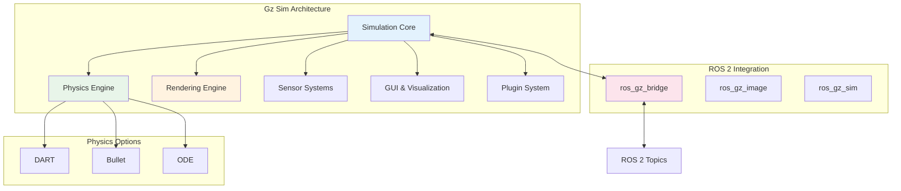
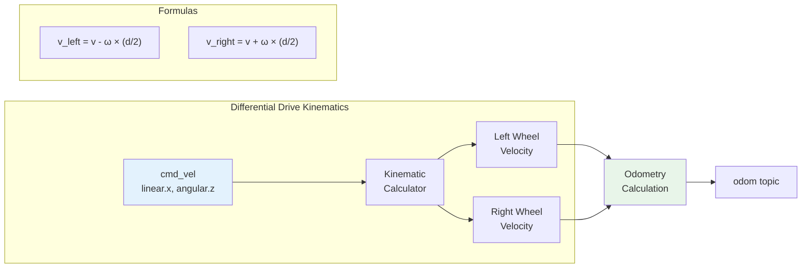

# Chapter 2: Simulation with Gazebo

## Learning Objectives

By the end of this chapter, you will be able to:

- **Understand** why simulation is essential for robotics development and how it accelerates the development cycle
- **Explain** Gazebo's architecture, including its physics engines, rendering system, and plugin framework
- **Configure** Gazebo simulation environments with custom worlds, lighting, and terrain
- **Create** robot models using SDF (Simulation Description Format) and integrate URDF models
- **Implement** simulated sensors including cameras, LiDAR, IMU, and depth sensors
- **Connect** ROS 2 nodes to simulated robots using ros_gz_bridge
- **Debug** robot behavior in simulation before deploying to physical hardware

## Prerequisites

Before starting this chapter, ensure you have:

- Completed Chapter 1 (Introduction to Physical AI & ROS 2)
- ROS 2 Humble installed and working
- Basic understanding of URDF from Chapter 1
- A computer with at least 8GB RAM and a dedicated GPU (recommended)
- Ubuntu 22.04 or compatible operating system

---

## 1. Why Simulation Matters

Before we dive into Gazebo, let's understand why simulation is crucial for robotics development. In the world of Physical AI, testing directly on hardware is expensive, time-consuming, and potentially dangerous.

### 1.1 The Cost of Physical Testing

Consider developing an autonomous vehicle. Every hour of real-world testing requires:
- A physical vehicle ($50,000+)
- Safety drivers ($50-100/hour)
- Fuel and maintenance
- Insurance and permits
- Risk of accidents and liability

In contrast, simulation allows you to test thousands of scenarios overnight on a standard computer. Waymo reports running over 15 billion miles in simulation—a distance impossible to achieve in the real world.

### 1.2 Benefits of Simulation-First Development

**Rapid Iteration**: Change code, test immediately. No need to charge batteries, reset hardware, or wait for good weather.

**Safe Failure**: Your simulated robot can crash into walls, fall off cliffs, or collide with pedestrians without consequences. Learn from failures without breaking equipment.

**Scenario Coverage**: Test edge cases that rarely occur in the real world: sensor failures, extreme weather, unusual obstacles, and adversarial conditions.

**Reproducibility**: Debug issues by replaying exact scenarios. Real-world debugging often involves "I couldn't reproduce it" frustrations.

**Parallelization**: Run hundreds of simulation instances simultaneously across cloud computers, accelerating testing by orders of magnitude.

### 1.3 The Simulation-to-Reality Gap

While simulation offers tremendous benefits, there's always a gap between simulated and real-world performance. This "sim-to-real gap" arises from:

- **Physics Approximations**: Real physics is incredibly complex. Simulations use simplified models that don't perfectly capture friction, deformation, or fluid dynamics.
- **Sensor Noise**: Real sensors have noise, drift, and failure modes difficult to model accurately.
- **Environmental Variation**: Real lighting, textures, and materials vary in ways simulations struggle to capture.
- **Unmodeled Dynamics**: Cable management, wear and tear, temperature effects—many factors affect real robots but aren't simulated.

Modern robotics research focuses heavily on techniques to bridge this gap, including domain randomization, system identification, and sim-to-real transfer learning.

---

## 2. Introduction to Gazebo

**Gazebo** is the most widely used open-source robotics simulator, tightly integrated with ROS 2. Originally developed at Willow Garage (the creators of ROS), Gazebo provides high-fidelity physics simulation, sensor modeling, and a plugin architecture for extensibility.

### 2.1 Gazebo Evolution: Classic to Ignition to Gz

Gazebo has undergone significant evolution:

| Version | Years | Notes |
|---------|-------|-------|
| **Gazebo Classic** | 2004-2022 | Original version, tight ROS 1 integration |
| **Ignition Gazebo** | 2019-2022 | Complete rewrite with modern architecture |
| **Gz Sim** | 2022+ | Renamed from Ignition, ROS 2 native |

For ROS 2 Humble, we use **Gz Sim** (Gazebo Fortress or Garden releases). The architecture is modular, with separate libraries for physics, rendering, sensors, and GUI.

### 2.2 Gazebo Architecture



**Key Components:**

- **Simulation Core (gz-sim)**: The main simulation loop, managing entity-component system
- **Physics Engine (gz-physics)**: Pluggable physics backends (DART, Bullet, ODE)
- **Rendering (gz-rendering)**: 3D graphics using OGRE2 for realistic visualization
- **Sensors (gz-sensors)**: Simulated cameras, LiDAR, IMU, GPS, and more
- **Transport (gz-transport)**: Internal message passing between components
- **GUI (gz-gui)**: Qt-based user interface with dockable widgets

### 2.3 Installation

Install Gazebo Fortress (compatible with ROS 2 Humble):

```bash
# Install Gazebo Fortress
sudo apt update
sudo apt install gz-fortress

# Install ROS 2 - Gazebo integration packages
sudo apt install ros-humble-ros-gz

# Verify installation
gz sim --version
```

The `ros-humble-ros-gz` package includes:
- `ros_gz_bridge`: Bidirectional message conversion between ROS 2 and Gazebo
- `ros_gz_sim`: Launch file helpers and spawn utilities
- `ros_gz_image`: Image transport for Gazebo cameras

---

## 3. Creating Your First Simulation World

A Gazebo world defines the environment where your robot operates: ground planes, obstacles, lighting, and physics properties.

### 3.1 Understanding SDF (Simulation Description Format)

While URDF describes robots, **SDF** describes complete simulation environments including:
- Multiple models (robots, objects, terrain)
- Lighting and atmospheric conditions
- Physics engine configuration
- Sensors with noise models
- Plugins for custom behavior

Here's a minimal world file:

```xml
<?xml version="1.0" ?>
<sdf version="1.8">
  <world name="physical_ai_world">

    <!-- Physics configuration -->
    <physics name="1ms" type="dart">
      <max_step_size>0.001</max_step_size>
      <real_time_factor>1.0</real_time_factor>
    </physics>

    <!-- Lighting -->
    <light type="directional" name="sun">
      <cast_shadows>true</cast_shadows>
      <pose>0 0 10 0 0 0</pose>
      <diffuse>0.8 0.8 0.8 1</diffuse>
      <specular>0.2 0.2 0.2 1</specular>
      <direction>-0.5 0.1 -0.9</direction>
    </light>

    <!-- Ground plane -->
    <model name="ground_plane">
      <static>true</static>
      <link name="link">
        <collision name="collision">
          <geometry>
            <plane>
              <normal>0 0 1</normal>
              <size>100 100</size>
            </plane>
          </geometry>
        </collision>
        <visual name="visual">
          <geometry>
            <plane>
              <normal>0 0 1</normal>
              <size>100 100</size>
            </plane>
          </geometry>
          <material>
            <ambient>0.8 0.8 0.8 1</ambient>
            <diffuse>0.8 0.8 0.8 1</diffuse>
          </material>
        </visual>
      </link>
    </model>

    <!-- A simple obstacle -->
    <model name="box_obstacle">
      <static>true</static>
      <pose>2 0 0.5 0 0 0</pose>
      <link name="link">
        <collision name="collision">
          <geometry>
            <box><size>1 1 1</size></box>
          </geometry>
        </collision>
        <visual name="visual">
          <geometry>
            <box><size>1 1 1</size></box>
          </geometry>
          <material>
            <ambient>0.8 0.2 0.2 1</ambient>
          </material>
        </visual>
      </link>
    </model>

  </world>
</sdf>
```

### 3.2 Running the Simulation

Save the world file as `my_world.sdf` and launch it:

```bash
# Start Gazebo with your world
gz sim my_world.sdf

# Or run headless (no GUI) for automated testing
gz sim -s my_world.sdf  # Server only
```

### 3.3 World Building Best Practices

**Organize with Include Files**: Break large worlds into reusable model files:

```xml
<include>
  <uri>model://warehouse_robot</uri>
  <pose>0 0 0 0 0 0</pose>
</include>
```

**Configure Physics Appropriately**:
- Higher `max_step_size` = faster simulation, less accuracy
- Lower `real_time_factor` = slower than real-time, useful for complex simulations
- Choose physics engine based on needs: DART for articulated bodies, Bullet for rigid body dynamics

**Add Realistic Lighting**: Poor lighting makes camera-based perception unrealistic. Add multiple light sources and enable shadows for training vision systems.

---

## 4. Robot Models in Gazebo

To simulate your robot, you need a model that describes its physical structure, appearance, and behavior.

### 4.1 Converting URDF to SDF

Gazebo can use URDF files directly or convert them to SDF. However, SDF supports features URDF doesn't, so conversion may be necessary:

```bash
# Convert URDF to SDF
gz sdf -p my_robot.urdf > my_robot.sdf
```

### 4.2 Creating a Differential Drive Robot

Let's create a complete differential drive robot—the most common mobile robot type:

```xml
<?xml version="1.0" ?>
<sdf version="1.8">
  <model name="diff_drive_robot">

    <!-- Robot base -->
    <link name="base_link">
      <inertial>
        <mass>5.0</mass>
        <inertia>
          <ixx>0.1</ixx><iyy>0.1</iyy><izz>0.1</izz>
        </inertia>
      </inertial>

      <collision name="base_collision">
        <geometry>
          <box><size>0.4 0.3 0.1</size></box>
        </geometry>
      </collision>

      <visual name="base_visual">
        <geometry>
          <box><size>0.4 0.3 0.1</size></box>
        </geometry>
        <material>
          <ambient>0.2 0.2 0.8 1</ambient>
        </material>
      </visual>
    </link>

    <!-- Left wheel -->
    <link name="left_wheel">
      <pose>0 0.175 0 -1.5707 0 0</pose>
      <inertial>
        <mass>0.5</mass>
        <inertia>
          <ixx>0.001</ixx><iyy>0.001</iyy><izz>0.001</izz>
        </inertia>
      </inertial>

      <collision name="collision">
        <geometry>
          <cylinder>
            <radius>0.08</radius>
            <length>0.04</length>
          </cylinder>
        </geometry>
        <surface>
          <friction>
            <ode><mu>1.0</mu><mu2>1.0</mu2></ode>
          </friction>
        </surface>
      </collision>

      <visual name="visual">
        <geometry>
          <cylinder>
            <radius>0.08</radius>
            <length>0.04</length>
          </cylinder>
        </geometry>
        <material>
          <ambient>0.1 0.1 0.1 1</ambient>
        </material>
      </visual>
    </link>

    <!-- Right wheel (similar to left) -->
    <link name="right_wheel">
      <pose>0 -0.175 0 -1.5707 0 0</pose>
      <inertial>
        <mass>0.5</mass>
        <inertia>
          <ixx>0.001</ixx><iyy>0.001</iyy><izz>0.001</izz>
        </inertia>
      </inertial>

      <collision name="collision">
        <geometry>
          <cylinder>
            <radius>0.08</radius>
            <length>0.04</length>
          </cylinder>
        </geometry>
        <surface>
          <friction>
            <ode><mu>1.0</mu><mu2>1.0</mu2></ode>
          </friction>
        </surface>
      </collision>

      <visual name="visual">
        <geometry>
          <cylinder>
            <radius>0.08</radius>
            <length>0.04</length>
          </cylinder>
        </geometry>
        <material>
          <ambient>0.1 0.1 0.1 1</ambient>
        </material>
      </visual>
    </link>

    <!-- Caster wheel for stability -->
    <link name="caster">
      <pose>-0.15 0 -0.04 0 0 0</pose>
      <inertial>
        <mass>0.1</mass>
        <inertia>
          <ixx>0.0001</ixx><iyy>0.0001</iyy><izz>0.0001</izz>
        </inertia>
      </inertial>

      <collision name="collision">
        <geometry>
          <sphere><radius>0.04</radius></sphere>
        </geometry>
        <surface>
          <friction>
            <ode><mu>0.0</mu><mu2>0.0</mu2></ode>
          </friction>
        </surface>
      </collision>

      <visual name="visual">
        <geometry>
          <sphere><radius>0.04</radius></sphere>
        </geometry>
      </visual>
    </link>

    <!-- Joints -->
    <joint name="left_wheel_joint" type="revolute">
      <parent>base_link</parent>
      <child>left_wheel</child>
      <axis><xyz>0 0 1</xyz></axis>
    </joint>

    <joint name="right_wheel_joint" type="revolute">
      <parent>base_link</parent>
      <child>right_wheel</child>
      <axis><xyz>0 0 1</xyz></axis>
    </joint>

    <joint name="caster_joint" type="ball">
      <parent>base_link</parent>
      <child>caster</child>
    </joint>

    <!-- Differential drive plugin -->
    <plugin
      filename="gz-sim-diff-drive-system"
      name="gz::sim::systems::DiffDrive">
      <left_joint>left_wheel_joint</left_joint>
      <right_joint>right_wheel_joint</right_joint>
      <wheel_separation>0.35</wheel_separation>
      <wheel_radius>0.08</wheel_radius>
      <topic>cmd_vel</topic>
      <odom_topic>odom</odom_topic>
    </plugin>

  </model>
</sdf>
```

### 4.3 Understanding the Differential Drive Plugin

The `gz-sim-diff-drive-system` plugin converts velocity commands into wheel rotations:



Where:
- `v` = linear velocity (m/s)
- `ω` = angular velocity (rad/s)
- `d` = wheel separation

---

## 5. Simulating Sensors

Sensors are the eyes and ears of your robot. Gazebo provides high-fidelity sensor simulations with configurable noise models.

### 5.1 Adding a Camera

```xml
<!-- Camera sensor link -->
<link name="camera_link">
  <pose>0.2 0 0.15 0 0 0</pose>
  <inertial>
    <mass>0.1</mass>
    <inertia>
      <ixx>0.0001</ixx><iyy>0.0001</iyy><izz>0.0001</izz>
    </inertia>
  </inertial>

  <visual name="visual">
    <geometry>
      <box><size>0.02 0.05 0.05</size></box>
    </geometry>
    <material>
      <ambient>0.1 0.1 0.1 1</ambient>
    </material>
  </visual>

  <sensor name="camera" type="camera">
    <always_on>true</always_on>
    <update_rate>30</update_rate>
    <visualize>true</visualize>

    <camera>
      <horizontal_fov>1.047</horizontal_fov>
      <image>
        <width>640</width>
        <height>480</height>
        <format>R8G8B8</format>
      </image>
      <clip>
        <near>0.1</near>
        <far>100</far>
      </clip>
      <noise>
        <type>gaussian</type>
        <mean>0</mean>
        <stddev>0.007</stddev>
      </noise>
    </camera>

    <topic>camera/image_raw</topic>
  </sensor>
</link>

<joint name="camera_joint" type="fixed">
  <parent>base_link</parent>
  <child>camera_link</child>
</joint>
```

### 5.2 Adding a LiDAR

LiDAR (Light Detection and Ranging) provides 360-degree distance measurements:

```xml
<link name="lidar_link">
  <pose>0 0 0.2 0 0 0</pose>
  <inertial>
    <mass>0.2</mass>
    <inertia>
      <ixx>0.0001</ixx><iyy>0.0001</iyy><izz>0.0001</izz>
    </inertia>
  </inertial>

  <visual name="visual">
    <geometry>
      <cylinder>
        <radius>0.03</radius>
        <length>0.05</length>
      </cylinder>
    </geometry>
  </visual>

  <sensor name="lidar" type="gpu_lidar">
    <always_on>true</always_on>
    <update_rate>10</update_rate>
    <visualize>true</visualize>

    <lidar>
      <scan>
        <horizontal>
          <samples>360</samples>
          <resolution>1</resolution>
          <min_angle>-3.14159</min_angle>
          <max_angle>3.14159</max_angle>
        </horizontal>
        <vertical>
          <samples>1</samples>
          <resolution>1</resolution>
          <min_angle>0</min_angle>
          <max_angle>0</max_angle>
        </vertical>
      </scan>
      <range>
        <min>0.1</min>
        <max>30.0</max>
        <resolution>0.01</resolution>
      </range>
      <noise>
        <type>gaussian</type>
        <mean>0</mean>
        <stddev>0.01</stddev>
      </noise>
    </lidar>

    <topic>scan</topic>
  </sensor>
</link>
```

### 5.3 Adding an IMU

The Inertial Measurement Unit provides acceleration and angular velocity:

```xml
<sensor name="imu" type="imu">
  <always_on>true</always_on>
  <update_rate>100</update_rate>

  <imu>
    <angular_velocity>
      <x><noise type="gaussian">
        <mean>0</mean><stddev>0.0001</stddev>
      </noise></x>
      <y><noise type="gaussian">
        <mean>0</mean><stddev>0.0001</stddev>
      </noise></y>
      <z><noise type="gaussian">
        <mean>0</mean><stddev>0.0001</stddev>
      </noise></z>
    </angular_velocity>
    <linear_acceleration>
      <x><noise type="gaussian">
        <mean>0</mean><stddev>0.001</stddev>
      </noise></x>
      <y><noise type="gaussian">
        <mean>0</mean><stddev>0.001</stddev>
      </noise></y>
      <z><noise type="gaussian">
        <mean>0</mean><stddev>0.001</stddev>
      </noise></z>
    </linear_acceleration>
  </imu>

  <topic>imu</topic>
</sensor>
```

### 5.4 Sensor Noise Models

Realistic simulation requires realistic sensor noise. Gazebo supports several noise types:

| Noise Type | Description | Parameters |
|------------|-------------|------------|
| **Gaussian** | Normal distribution around true value | mean, stddev |
| **Gaussian Quantized** | Gaussian + discretization | mean, stddev, precision |
| **Custom** | Plugin-defined noise model | Varies |

**Why Noise Matters**: Training perception algorithms on perfect sensor data leads to poor real-world performance. Adding noise during simulation helps create robust systems.

---

## 6. ROS 2 - Gazebo Integration

The `ros_gz_bridge` package enables communication between ROS 2 and Gazebo, converting messages bidirectionally.

### 6.1 Launching Robot in Gazebo with ROS 2

Create a launch file that starts Gazebo and spawns your robot:

```python
# launch/simulation.launch.py
from launch import LaunchDescription
from launch.actions import IncludeLaunchDescription, DeclareLaunchArgument
from launch.launch_description_sources import PythonLaunchDescriptionSource
from launch.substitutions import LaunchConfiguration, PathJoinSubstitution
from launch_ros.actions import Node
from launch_ros.substitutions import FindPackageShare


def generate_launch_description():
    # Get package path
    pkg_share = FindPackageShare('my_robot_sim')

    # World file argument
    world_arg = DeclareLaunchArgument(
        'world',
        default_value='my_world.sdf',
        description='Name of world file'
    )

    # Launch Gazebo
    gazebo = IncludeLaunchDescription(
        PythonLaunchDescriptionSource([
            PathJoinSubstitution([
                FindPackageShare('ros_gz_sim'),
                'launch',
                'gz_sim.launch.py'
            ])
        ]),
        launch_arguments={
            'gz_args': ['-r ', LaunchConfiguration('world')]
        }.items()
    )

    # Spawn robot
    spawn_robot = Node(
        package='ros_gz_sim',
        executable='create',
        arguments=[
            '-name', 'my_robot',
            '-file', PathJoinSubstitution([pkg_share, 'models', 'robot.sdf']),
            '-x', '0',
            '-y', '0',
            '-z', '0.1'
        ],
        output='screen'
    )

    # Bridge for cmd_vel (ROS 2 -> Gazebo)
    bridge_cmd_vel = Node(
        package='ros_gz_bridge',
        executable='parameter_bridge',
        arguments=[
            '/cmd_vel@geometry_msgs/msg/Twist@gz.msgs.Twist'
        ],
        output='screen'
    )

    # Bridge for odometry (Gazebo -> ROS 2)
    bridge_odom = Node(
        package='ros_gz_bridge',
        executable='parameter_bridge',
        arguments=[
            '/odom@nav_msgs/msg/Odometry@gz.msgs.Odometry'
        ],
        output='screen'
    )

    # Bridge for LiDAR (Gazebo -> ROS 2)
    bridge_lidar = Node(
        package='ros_gz_bridge',
        executable='parameter_bridge',
        arguments=[
            '/scan@sensor_msgs/msg/LaserScan@gz.msgs.LaserScan'
        ],
        output='screen'
    )

    # Bridge for camera (Gazebo -> ROS 2)
    bridge_camera = Node(
        package='ros_gz_image',
        executable='image_bridge',
        arguments=['/camera/image_raw'],
        output='screen'
    )

    return LaunchDescription([
        world_arg,
        gazebo,
        spawn_robot,
        bridge_cmd_vel,
        bridge_odom,
        bridge_lidar,
        bridge_camera,
    ])
```

### 6.2 Controlling the Simulated Robot

With the bridge running, you can control your simulated robot using standard ROS 2 tools:

```bash
# Publish velocity commands
ros2 topic pub /cmd_vel geometry_msgs/msg/Twist "{linear: {x: 0.5}, angular: {z: 0.2}}"

# View odometry
ros2 topic echo /odom

# Visualize LiDAR in RViz2
ros2 run rviz2 rviz2

# View camera feed
ros2 run image_view image_view --ros-args -r image:=/camera/image_raw
```

### 6.3 Writing a Simple Controller

Let's write a ROS 2 node that controls the simulated robot:

```python
import rclpy
from rclpy.node import Node
from geometry_msgs.msg import Twist
from sensor_msgs.msg import LaserScan
import math


class ObstacleAvoider(Node):
    """Simple obstacle avoidance using LiDAR."""

    def __init__(self):
        super().__init__('obstacle_avoider')

        # Publisher for velocity commands
        self.cmd_pub = self.create_publisher(Twist, 'cmd_vel', 10)

        # Subscriber for LiDAR data
        self.scan_sub = self.create_subscription(
            LaserScan,
            'scan',
            self.scan_callback,
            10
        )

        # Parameters
        self.declare_parameter('min_distance', 0.5)
        self.declare_parameter('linear_speed', 0.3)
        self.declare_parameter('angular_speed', 0.5)

        self.get_logger().info('Obstacle avoider started')

    def scan_callback(self, msg: LaserScan):
        """Process LiDAR scan and generate velocity command."""
        min_dist = self.get_parameter('min_distance').value
        lin_speed = self.get_parameter('linear_speed').value
        ang_speed = self.get_parameter('angular_speed').value

        # Find minimum distance in front of robot (-30 to +30 degrees)
        front_ranges = []
        for i, r in enumerate(msg.ranges):
            angle = msg.angle_min + i * msg.angle_increment
            if -math.pi/6 < angle < math.pi/6:
                if msg.range_min < r < msg.range_max:
                    front_ranges.append(r)

        cmd = Twist()

        if front_ranges:
            front_min = min(front_ranges)

            if front_min < min_dist:
                # Obstacle detected - turn
                cmd.linear.x = 0.0
                cmd.angular.z = ang_speed
                self.get_logger().info(f'Obstacle at {front_min:.2f}m - turning')
            else:
                # Clear ahead - go forward
                cmd.linear.x = lin_speed
                cmd.angular.z = 0.0
        else:
            # No valid readings - stop
            cmd.linear.x = 0.0
            cmd.angular.z = 0.0

        self.cmd_pub.publish(cmd)


def main(args=None):
    rclpy.init(args=args)
    node = ObstacleAvoider()

    try:
        rclpy.spin(node)
    except KeyboardInterrupt:
        pass
    finally:
        node.destroy_node()
        rclpy.shutdown()


if __name__ == '__main__':
    main()
```

---

## 7. Advanced Simulation Techniques

### 7.1 Domain Randomization

To bridge the sim-to-real gap, randomize simulation parameters during training:

```xml
<!-- Randomize friction -->
<surface>
  <friction>
    <ode>
      <mu>0.8</mu>  <!-- Vary between 0.5 and 1.2 -->
    </ode>
  </friction>
</surface>
```

Implement programmatic randomization in a Gazebo plugin:

```cpp
// Pseudo-code for domain randomization plugin
void OnUpdate() {
    // Randomize lighting
    light->SetDiffuse(RandomColor());

    // Randomize mass (within 20% of nominal)
    link->SetMass(nominal_mass * RandomRange(0.8, 1.2));

    // Randomize sensor noise
    camera->SetNoiseStddev(RandomRange(0.005, 0.02));
}
```

### 7.2 Parallel Simulation

Run multiple simulation instances for faster data collection:

```bash
# Terminal 1
GZ_SIM_RESOURCE_PATH=./models gz sim -s world.sdf --network-role primary

# Terminals 2-N (secondary instances)
gz sim -s world.sdf --network-role secondary --network-secondaries N
```

### 7.3 Headless Simulation for CI/CD

Run simulations without graphics for automated testing:

```bash
# Run simulation headless
gz sim -s -r world.sdf &

# Run your test script
python3 run_test.py

# Check results and cleanup
gz sim --stop
```

Integrate with GitHub Actions or Jenkins for continuous testing of robot algorithms.

---

## 8. Visualization and Debugging Tools

Effective debugging requires visibility into what your robot is "thinking." ROS 2 and Gazebo provide powerful visualization tools.

### 8.1 RViz2: Robot Visualization

RViz2 is the primary visualization tool for ROS 2. It displays sensor data, robot models, and algorithm outputs in a 3D environment.

```bash
# Launch RViz2
ros2 run rviz2 rviz2

# Or with a saved configuration
ros2 run rviz2 rviz2 -d my_config.rviz
```

**Essential RViz2 Displays:**

| Display Type | Use Case | Key Settings |
|--------------|----------|--------------|
| **RobotModel** | Show robot URDF | Topic: `/robot_description` |
| **LaserScan** | Visualize LiDAR | Topic: `/scan`, Color by intensity |
| **PointCloud2** | 3D LiDAR data | Topic: `/points`, Decay time |
| **Image** | Camera feeds | Topic: `/camera/image_raw` |
| **TF** | Coordinate frames | Show axes, names |
| **Path** | Navigation paths | Topic: `/plan` |
| **Marker** | Custom visualizations | Topic: `/visualization_marker` |

**Creating Custom Markers:**

```python
from visualization_msgs.msg import Marker
from geometry_msgs.msg import Point

def create_sphere_marker(position, color, marker_id=0):
    """Create a sphere marker for RViz2 visualization."""
    marker = Marker()
    marker.header.frame_id = "map"
    marker.header.stamp = self.get_clock().now().to_msg()
    marker.ns = "my_markers"
    marker.id = marker_id
    marker.type = Marker.SPHERE
    marker.action = Marker.ADD

    marker.pose.position.x = position[0]
    marker.pose.position.y = position[1]
    marker.pose.position.z = position[2]
    marker.pose.orientation.w = 1.0

    marker.scale.x = 0.2
    marker.scale.y = 0.2
    marker.scale.z = 0.2

    marker.color.r = color[0]
    marker.color.g = color[1]
    marker.color.b = color[2]
    marker.color.a = 1.0

    return marker
```

### 8.2 Gazebo GUI Tools

Gazebo provides built-in tools for simulation inspection:

**Model Inspector**: Right-click any model to view:
- Link masses and inertias
- Joint types and limits
- Collision geometries
- Sensor configurations

**Topic Viewer**: View any Gazebo transport topic:
```bash
# List Gazebo topics
gz topic -l

# Echo a specific topic
gz topic -e /model/my_robot/odometry
```

**Plot Tool**: Visualize numeric values over time:
```bash
# Open the plotting tool
gz plot
# Then drag topics onto the plot area
```

### 8.3 Recording and Playback

Record simulation data for later analysis and playback:

```bash
# Record Gazebo state (world, models, poses)
gz log record --path ./recordings --period 0.01

# Playback a recording
gz sim -r --playback ./recordings/state.tlog
```

For ROS 2 data, use ros2bag:

```bash
# Record all topics
ros2 bag record -a

# Record specific topics
ros2 bag record /cmd_vel /odom /scan /camera/image_raw -o my_recording

# Playback
ros2 bag play my_recording
```

### 8.4 Common Debugging Scenarios

**Robot Not Moving:**
1. Check if velocity commands are being published: `ros2 topic echo /cmd_vel`
2. Verify the bridge is running: `ros2 node list | grep bridge`
3. Check Gazebo is receiving commands: `gz topic -e /model/my_robot/cmd_vel`
4. Inspect joint states in Gazebo's model inspector

**Sensor Data Not Appearing:**
1. Verify sensor is enabled in the SDF: `<always_on>true</always_on>`
2. Check topic names match: `ros2 topic list` vs `gz topic -l`
3. Confirm bridge configuration matches message types
4. Look for errors in terminal output

**Robot Falls Through Floor:**
1. Check collision geometry exists on all links
2. Verify physics engine is running (not paused)
3. Check mass and inertia values are reasonable
4. Ensure ground plane collision is enabled

---

## 9. Testing Methodologies for Simulation

Systematic testing ensures your robot behaves correctly across a range of scenarios.

### 9.1 Unit Testing Robot Behaviors

Test individual behaviors in isolation:

```python
import pytest
import rclpy
from rclpy.node import Node
from geometry_msgs.msg import Twist
from sensor_msgs.msg import LaserScan
from my_robot.obstacle_avoider import ObstacleAvoider


class TestObstacleAvoider:
    """Unit tests for obstacle avoidance behavior."""

    @pytest.fixture
    def node(self):
        """Create a test node."""
        rclpy.init()
        node = ObstacleAvoider()
        yield node
        node.destroy_node()
        rclpy.shutdown()

    def test_stop_when_obstacle_close(self, node):
        """Robot should stop when obstacle is within min_distance."""
        # Create fake scan with obstacle at 0.3m ahead
        scan = LaserScan()
        scan.angle_min = -3.14159
        scan.angle_max = 3.14159
        scan.angle_increment = 0.01745  # 1 degree
        scan.range_min = 0.1
        scan.range_max = 30.0
        scan.ranges = [10.0] * 360  # Far away everywhere
        scan.ranges[180] = 0.3  # Obstacle directly ahead

        # Process scan
        node.scan_callback(scan)

        # Verify robot stops
        # (In a real test, capture the published message)
        assert node.current_cmd.linear.x == 0.0

    def test_move_forward_when_clear(self, node):
        """Robot should move forward when path is clear."""
        scan = LaserScan()
        scan.angle_min = -3.14159
        scan.angle_max = 3.14159
        scan.angle_increment = 0.01745
        scan.range_min = 0.1
        scan.range_max = 30.0
        scan.ranges = [10.0] * 360  # Clear everywhere

        node.scan_callback(scan)

        assert node.current_cmd.linear.x > 0.0
```

### 9.2 Integration Testing with Simulation

Test complete systems using automated simulation scenarios:

```python
# test_navigation.py
import subprocess
import time
import rclpy
from nav_msgs.msg import Odometry
from geometry_msgs.msg import PoseStamped
import math


def test_robot_reaches_goal():
    """Test that robot navigates to a goal position."""
    # Start simulation
    sim_process = subprocess.Popen([
        'gz', 'sim', '-s', '-r', 'test_world.sdf'
    ])

    time.sleep(5)  # Wait for simulation to initialize

    try:
        rclpy.init()
        test_node = rclpy.create_node('test_node')

        # Subscribe to odometry
        final_pose = None

        def odom_callback(msg):
            nonlocal final_pose
            final_pose = msg.pose.pose

        test_node.create_subscription(Odometry, '/odom', odom_callback, 10)

        # Publish goal
        goal_pub = test_node.create_publisher(PoseStamped, '/goal_pose', 10)
        goal = PoseStamped()
        goal.header.frame_id = 'map'
        goal.pose.position.x = 5.0
        goal.pose.position.y = 0.0
        goal.pose.orientation.w = 1.0

        goal_pub.publish(goal)

        # Wait for navigation (with timeout)
        start_time = time.time()
        timeout = 60.0

        while time.time() - start_time < timeout:
            rclpy.spin_once(test_node, timeout_sec=0.1)

            if final_pose:
                distance_to_goal = math.sqrt(
                    (final_pose.position.x - 5.0)**2 +
                    (final_pose.position.y - 0.0)**2
                )

                if distance_to_goal < 0.5:
                    break

        # Assert robot reached goal
        assert final_pose is not None
        distance = math.sqrt(
            (final_pose.position.x - 5.0)**2 +
            (final_pose.position.y - 0.0)**2
        )
        assert distance < 0.5, f"Robot did not reach goal. Distance: {distance}"

    finally:
        sim_process.terminate()
        rclpy.shutdown()
```

### 9.3 Scenario-Based Testing

Create test scenarios covering edge cases:

| Scenario | Description | Success Criteria |
|----------|-------------|------------------|
| **Basic Navigation** | Navigate to point in open space | Reach within 0.5m |
| **Obstacle Avoidance** | Navigate around single obstacle | No collision, reach goal |
| **Narrow Passage** | Navigate through doorway | Pass without collision |
| **Dead End** | Navigate to blocked area | Detect and replan |
| **Dynamic Obstacle** | Avoid moving obstacle | No collision |
| **Sensor Failure** | Handle LiDAR dropout | Safe stop or fallback |

### 9.4 Performance Benchmarking

Measure key performance metrics:

```python
import time
import statistics

class PerformanceTracker:
    """Track and report performance metrics."""

    def __init__(self):
        self.navigation_times = []
        self.collision_count = 0
        self.path_lengths = []

    def record_navigation(self, start_time, end_time, path_length):
        """Record a navigation attempt."""
        self.navigation_times.append(end_time - start_time)
        self.path_lengths.append(path_length)

    def report(self):
        """Generate performance report."""
        return {
            'avg_navigation_time': statistics.mean(self.navigation_times),
            'std_navigation_time': statistics.stdev(self.navigation_times),
            'collision_rate': self.collision_count / len(self.navigation_times),
            'avg_path_length': statistics.mean(self.path_lengths),
            'path_efficiency': sum(self.direct_distances) / sum(self.path_lengths)
        }
```

---

## 10. From Simulation to Real Robot

The ultimate goal is deploying your tested code to physical hardware. This section covers the transition process.

### 10.1 Simulation-Reality Checklist

Before deploying to hardware, verify:

- [ ] **Topic names match** between simulation and real robot
- [ ] **Message types** are identical (same fields, units)
- [ ] **Frame IDs** in TF tree are consistent
- [ ] **Parameters** are appropriate for real hardware
- [ ] **Safety limits** are configured (max velocities, emergency stops)
- [ ] **Fallback behaviors** exist for sensor failures

### 10.2 Hardware Abstraction

Design your code to be hardware-agnostic:

```python
class RobotInterface:
    """Abstract interface for robot control."""

    def send_velocity(self, linear: float, angular: float):
        raise NotImplementedError

    def get_laser_scan(self) -> LaserScan:
        raise NotImplementedError


class SimulatedRobot(RobotInterface):
    """Implementation for Gazebo simulation."""

    def __init__(self, node):
        self.cmd_pub = node.create_publisher(Twist, '/cmd_vel', 10)
        self.scan_sub = node.create_subscription(
            LaserScan, '/scan', self._scan_callback, 10
        )

    def send_velocity(self, linear, angular):
        cmd = Twist()
        cmd.linear.x = linear
        cmd.angular.z = angular
        self.cmd_pub.publish(cmd)


class TurtleBot4(RobotInterface):
    """Implementation for TurtleBot4 hardware."""

    def __init__(self, node):
        # TurtleBot4-specific topic names
        self.cmd_pub = node.create_publisher(
            Twist, '/turtlebot4/cmd_vel', 10
        )
        self.scan_sub = node.create_subscription(
            LaserScan, '/scan', self._scan_callback, 10
        )

    def send_velocity(self, linear, angular):
        # Apply hardware-specific limits
        linear = max(-0.5, min(0.5, linear))
        angular = max(-1.0, min(1.0, angular))

        cmd = Twist()
        cmd.linear.x = linear
        cmd.angular.z = angular
        self.cmd_pub.publish(cmd)
```

### 10.3 Gradual Deployment Strategy

1. **Simulation Only**: Test all algorithms in simulation
2. **Hardware-in-the-Loop**: Connect real sensors to simulated physics
3. **Supervised Autonomy**: Run on hardware with human override ready
4. **Limited Autonomy**: Full autonomy in controlled environment
5. **Full Deployment**: Production operation with monitoring

---

## Key Takeaways

After completing this chapter, you should understand:

- **Simulation accelerates development** by enabling rapid iteration, safe failure, and comprehensive testing impossible in the real world. The investment in simulation infrastructure pays dividends throughout the development lifecycle. Major robotics companies run billions of simulated miles before deploying to physical hardware.

- **Gazebo (Gz Sim)** provides high-fidelity physics simulation with pluggable physics engines (DART, Bullet, ODE), realistic rendering through OGRE2, and comprehensive sensor models. The modular architecture allows customization for specific needs, from simple educational robots to complex industrial systems.

- **SDF (Simulation Description Format)** extends URDF with support for complete world descriptions, physics properties, sensor configurations, and plugin specifications essential for simulation. Understanding SDF is crucial for creating realistic test environments.

- **Sensor simulation** with appropriate noise models is critical for developing robust perception algorithms. Perfect sensor data in simulation leads to poor real-world performance. Always add Gaussian noise and consider sensor-specific artifacts like LiDAR multi-path reflections or camera lens distortion.

- **ros_gz_bridge** connects ROS 2 and Gazebo through bidirectional message conversion, enabling you to use the same ROS 2 nodes and tools with both simulated and real robots. This bridge is the key to seamless sim-to-real transitions.

- **The sim-to-real gap** is a fundamental challenge in robotics arising from physics approximations, sensor noise models, and environmental variations. Techniques like domain randomization, system identification, and careful validation help create systems that transfer from simulation to reality.

- **Differential drive kinematics** convert linear and angular velocity commands into wheel speeds, forming the foundation of mobile robot control. Understanding these equations is essential for tuning robot behavior.

- **RViz2** is the primary visualization tool for ROS 2, allowing you to see sensor data, robot models, and algorithm outputs simultaneously. Custom markers enable visualization of your own algorithms.

- **Testing methodologies** including unit tests, integration tests, and scenario-based testing ensure your robot behaves correctly across a wide range of conditions before deployment to hardware.

- **Hardware abstraction** through well-designed interfaces allows the same control code to run on simulation and multiple hardware platforms with minimal changes.

---

## Exercises

Test your understanding with these hands-on exercises:

### Exercise 1: Custom World Building (Beginner)
Create a warehouse-like world with:
- A 20m x 20m floor area
- At least 5 obstacles of varying sizes
- Proper lighting from multiple sources
- A designated "goal" area marked with a different color

Launch your robot in this world and manually drive it to the goal using `ros2 topic pub`.

### Exercise 2: Sensor Configuration (Intermediate)
Modify the robot model to add:
1. A depth camera (RGB-D) on the front
2. A rear-facing camera
3. Ultrasonic sensors on each side

Configure the ros_gz_bridge to publish all sensor data to ROS 2 topics. Visualize all sensors simultaneously in RViz2.

### Exercise 3: Wall Following Algorithm (Intermediate)
Implement a wall-following behavior:
1. Robot should maintain a constant distance (e.g., 0.5m) from a wall
2. Use the LiDAR to detect the wall distance
3. Implement a PID controller to maintain the desired distance
4. Test in a world with corridors

### Exercise 4: Multi-Robot Simulation (Advanced)
Create a simulation with two robots:
1. Spawn two instances of the differential drive robot
2. Give each robot a unique namespace (robot1, robot2)
3. Implement a simple coordination where both robots navigate without collision

### Exercise 5: Performance Benchmarking (Advanced)
Measure simulation performance:
1. Create worlds with varying complexity (10, 50, 100 obstacles)
2. Record real-time factor for each
3. Test with different physics engines (DART, Bullet)
4. Document the performance trade-offs

---

## Further Reading

- [Gazebo Sim Documentation](https://gazebosim.org/docs)
- [ROS 2 - Gazebo Integration Guide](https://gazebosim.org/docs/fortress/ros2_integration)
- [SDF Specification](http://sdformat.org/spec)
- [Domain Randomization for Sim-to-Real Transfer](https://arxiv.org/abs/1703.06907)
- [TurtleBot4 Simulation Package](https://github.com/turtlebot/turtlebot4_simulator)

---

*Next Chapter: [Vision-Language-Action Models](/docs/chapter-3) - Learn how modern AI models combine visual perception with language understanding to control robots.*
