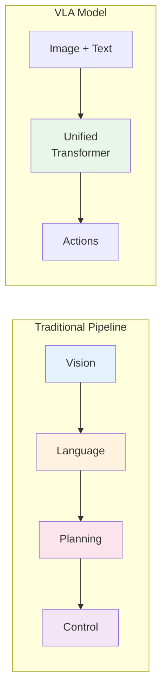
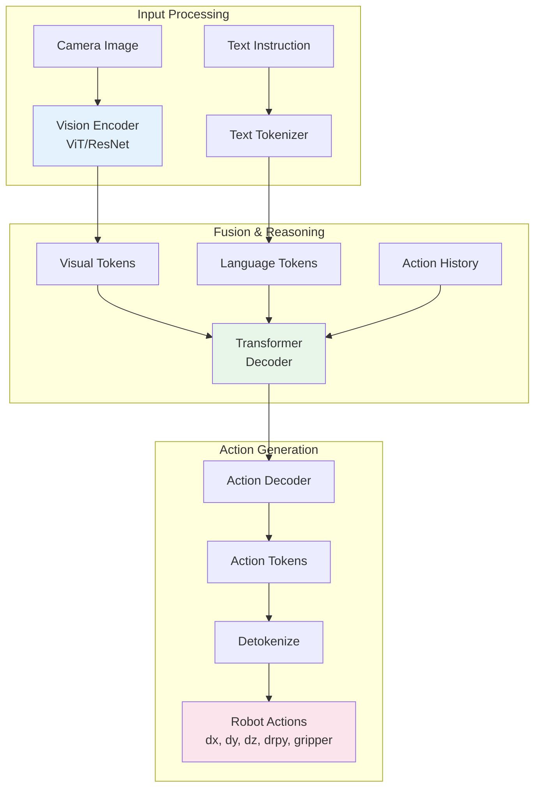
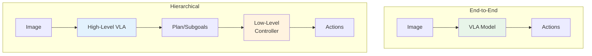

# Chapter 3: Vision-Language-Action Models

## Learning Objectives

By the end of this chapter, you will be able to:

- **Understand** the architecture and principles behind Vision-Language-Action (VLA) models
- **Explain** how transformers enable the fusion of vision, language, and action modalities
- **Describe** the evolution from separate perception and control systems to end-to-end VLA models
- **Compare** major VLA architectures including RT-2, PaLM-E, and OpenVLA
- **Implement** a basic VLA inference pipeline for robot control
- **Integrate** pre-trained VLA models with ROS 2 for practical applications
- **Evaluate** the capabilities and limitations of current VLA systems

## Prerequisites

Before starting this chapter, ensure you have:

- Completed Chapters 1 and 2 (ROS 2 basics and Gazebo simulation)
- Basic understanding of neural networks and deep learning concepts
- Familiarity with Python and PyTorch or TensorFlow
- Access to a GPU with at least 8GB VRAM (for running inference)
- Understanding of transformers and attention mechanisms (helpful but not required)

---

## 1. The Vision-Language-Action Revolution

Physical AI has traditionally relied on modular pipelines: a perception system processes images, a planner interprets the scene, and a controller executes actions. Each component is developed and tuned separately. Vision-Language-Action (VLA) models represent a paradigm shift—they combine all these capabilities in a single neural network that directly maps visual observations and language instructions to robot actions.

### 1.1 Why VLA Models Matter

Consider the task of asking a robot to "pick up the red cup." In a traditional system:

1. **Vision Module**: Detects objects, segments the scene, identifies "cup" and "red"
2. **Language Module**: Parses "pick up" as a grasping action
3. **Planning Module**: Computes a grasp pose for the cup
4. **Control Module**: Executes the motion to reach and grasp

Each module requires separate training data, careful integration, and failure modes multiply. If the vision system misdetects the cup, everything downstream fails.

VLA models learn this entire mapping end-to-end:



**Key advantages of VLA models:**

- **Emergent Capabilities**: Training on diverse data leads to generalization beyond explicit training examples
- **Natural Language Interface**: Control robots with intuitive instructions, not programming
- **Transfer Learning**: Pre-trained language models bring world knowledge to robotics
- **Simplified Development**: One model replaces multiple hand-engineered modules

### 1.2 The Evolution to VLA

The path to VLA models follows the broader trajectory of deep learning:

| Era | Approach | Example |
|-----|----------|---------|
| **2012-2016** | Separate vision and control | AlexNet + MPC |
| **2016-2019** | End-to-end visuomotor learning | Deep RL for robotics |
| **2019-2022** | Language-conditioned policies | CLIP + BC |
| **2022-Present** | Unified VLA transformers | RT-2, PaLM-E |

The breakthrough came from recognizing that large language models (LLMs) aren't just text processors—they're general sequence models that can represent any modality with appropriate tokenization.

---

## 2. Understanding VLA Architecture

At their core, VLA models are transformer-based neural networks that process multiple input modalities (images, text) and output action tokens.

### 2.1 The Transformer Foundation

Transformers, introduced in the "Attention Is All You Need" paper, revolutionized AI through their self-attention mechanism. For VLA models, transformers provide:

**Unified Representation**: Images, text, and actions become sequences of tokens processed identically.

**Cross-Modal Attention**: The model learns relationships between visual features and language concepts.

**Scalability**: Larger models with more data consistently improve performance.

### 2.2 Tokenizing Modalities

To feed diverse data into a transformer, everything must become tokens:

**Language Tokens**: Standard text tokenization (BPE, SentencePiece) converts instructions into token IDs.

**Vision Tokens**: Images are processed by a vision encoder (ViT, ResNet) producing feature vectors that become tokens.

**Action Tokens**: Robot actions are discretized into bins. For example, a gripper position from 0-100mm might be divided into 256 bins, each a unique token.

```python
# Example: Discretizing continuous actions to tokens
def action_to_token(continuous_action, min_val, max_val, num_bins=256):
    """Convert continuous action to discrete token."""
    normalized = (continuous_action - min_val) / (max_val - min_val)
    bin_index = int(normalized * (num_bins - 1))
    return min(max(bin_index, 0), num_bins - 1)

# Gripper position 45mm -> token 115 (if range is 0-100mm, 256 bins)
token = action_to_token(45.0, 0.0, 100.0, 256)  # Returns 115
```

### 2.3 VLA Model Architecture

A typical VLA model consists of:



**Vision Encoder**: Processes RGB images into visual tokens. Common choices include Vision Transformer (ViT) or convolutional networks like EfficientNet.

**Text Tokenizer**: Converts natural language instructions to token sequences using the same vocabulary as the base LLM.

**Transformer Backbone**: Often a pre-trained LLM (PaLM, LLaMA, Gemma) fine-tuned for robotics. This brings language understanding and world knowledge.

**Action Head**: Predicts discrete action tokens that are then converted back to continuous robot commands.

---

## 3. Major VLA Models

Several landmark models have shaped the VLA landscape. Understanding their design choices illuminates the field's evolution.

### 3.1 RT-2: Robotic Transformer 2

**Developed by**: Google DeepMind (2023)

RT-2 was the first model to demonstrate that vision-language models (VLMs) can directly output robot actions. Built on PaLI-X (a 55B parameter VLM), RT-2 treats robot actions as text tokens in a new "robot language."

**Key Innovations:**
- **Actions as Language**: Robot actions represented as strings like `"1 128 91 241 1 128 128"` for 7 DoF arm movements
- **Co-training**: Trained jointly on web data and robot demonstrations, enabling knowledge transfer
- **Emergent Reasoning**: Can follow novel instructions by combining language understanding with robotic skills

**Example RT-2 Interaction:**
```
Image: [Kitchen scene with fruit bowl]
Instruction: "Move the banana to the white bowl"
Output: "1 145 98 236 0 128 128"  # Decoded to robot commands
```

**Limitations**: Requires massive compute (55B parameters), inference is slow (~3-5 Hz), and outputs are specific to one robot embodiment.

### 3.2 PaLM-E: Embodied Multimodal Language Model

**Developed by**: Google Research (2023)

PaLM-E integrates visual information directly into PaLM's (540B parameter LLM) embedding space, enabling reasoning about the physical world.

**Key Features:**
- **Multimodal Prompting**: Can interleave images and text: "The robot should pick up [IMAGE: apple] and place it in [IMAGE: basket]"
- **Chain-of-Thought Planning**: Generates step-by-step plans before executing actions
- **Multi-Robot Transfer**: Same model can control different robot morphologies

**Planning Example:**
```
User: "Make me a sandwich"
PaLM-E:
1. Locate bread slices on counter
2. Pick up first bread slice
3. Place on cutting board
4. Locate peanut butter jar
5. Open jar lid
6. Pick up spreading knife
...
[Continues with executable sub-tasks]
```

### 3.3 OpenVLA: Open-Source VLA

**Developed by**: Stanford/Berkeley (2024)

OpenVLA democratizes VLA research by providing an open-source, reproducible alternative to proprietary models.

**Specifications:**
- **Architecture**: 7B parameter model based on Llama 2
- **Training Data**: Open X-Embodiment dataset (1M+ robot trajectories)
- **Inference Speed**: ~10 Hz on consumer GPUs
- **Open Weights**: Fully open-source with training code

**Practical Advantages:**
- Can be run locally without API costs
- Fine-tunable on custom robot data
- Active community development

### 3.4 Comparison Table

| Model | Parameters | Base Model | Open Source | Inference Speed |
|-------|------------|------------|-------------|-----------------|
| **RT-2** | 55B | PaLI-X | No | ~3 Hz |
| **PaLM-E** | 562B | PaLM | No | ~1 Hz |
| **OpenVLA** | 7B | Llama 2 | Yes | ~10 Hz |
| **Octo** | 93M | Custom | Yes | ~50 Hz |
| **RT-1** | 35M | EfficientNet | Partially | ~100 Hz |

---

## 4. Training VLA Models

Training a VLA model requires careful consideration of data, objectives, and computational resources.

### 4.1 Training Data: Robot Demonstrations

VLA models learn from demonstrations—recordings of successful task execution. Each demonstration contains:

- **Images**: Camera observations at each timestep
- **Language**: Natural language description of the task
- **Actions**: Robot commands executed at each step
- **Metadata**: Gripper state, success/failure labels

**Data Format Example:**
```python
demonstration = {
    "task": "pick up red block",
    "frames": [
        {
            "timestamp": 0.0,
            "image": np.array([...]),  # 224x224x3
            "action": {
                "delta_xyz": [0.01, 0.0, -0.02],
                "delta_rpy": [0.0, 0.0, 0.0],
                "gripper": 1.0  # Open
            },
            "gripper_state": "open"
        },
        # ... more frames
    ],
    "success": True
}
```

### 4.2 The Open X-Embodiment Dataset

The robotics community has created large-scale datasets for VLA training:

**Open X-Embodiment** (2023): 1M+ trajectories from 22 robot embodiments
- Bridge V2: 60k trajectories of kitchen manipulation
- RT-1 Data: 130k real-world robot episodes
- Berkeley UR5: Tabletop manipulation
- Stanford Kuka: Industrial arm tasks

**Dataset Characteristics:**
```
Total Trajectories: 1,000,000+
Robot Types: 22 different embodiments
Task Categories: 500+ unique tasks
Hours of Data: 100,000+ hours
```

### 4.3 Training Objective: Behavior Cloning

The primary training approach is **behavior cloning**—supervised learning to predict expert actions:

```python
def vla_loss(model, batch):
    """Compute VLA training loss."""
    images = batch["images"]          # [B, T, C, H, W]
    instructions = batch["text"]      # [B, max_len]
    target_actions = batch["actions"] # [B, T, action_dim]

    # Forward pass
    predicted_actions = model(images, instructions)

    # Cross-entropy loss for discrete action tokens
    loss = F.cross_entropy(
        predicted_actions.view(-1, num_action_bins),
        target_actions.view(-1)
    )

    return loss
```

### 4.4 Fine-Tuning for Custom Tasks

To adapt a pre-trained VLA to new tasks or robots:

```python
from transformers import AutoModelForVision2Seq
from openvla import OpenVLA

# Load pre-trained model
model = OpenVLA.from_pretrained("openvla/openvla-7b")

# Prepare custom dataset
train_dataset = RobotDemonstrationDataset(
    data_path="./my_robot_demos",
    transform=model.image_transform
)

# Fine-tune with LoRA for efficiency
from peft import LoraConfig, get_peft_model

lora_config = LoraConfig(
    r=16,
    lora_alpha=32,
    target_modules=["q_proj", "v_proj"],
    lora_dropout=0.05
)

model = get_peft_model(model, lora_config)

# Training loop
optimizer = torch.optim.AdamW(model.parameters(), lr=1e-4)

for epoch in range(10):
    for batch in train_dataset:
        loss = vla_loss(model, batch)
        loss.backward()
        optimizer.step()
        optimizer.zero_grad()
```

---

## 5. Implementing VLA Inference with ROS 2

Let's build a practical VLA inference pipeline that integrates with ROS 2.

### 5.1 System Architecture

```mermaid
graph LR
    subgraph "ROS 2"
        CAM[Camera Node] --> IMG[/camera/image_raw]
        CMD[Instruction Node] --> TXT[/instruction]
        IMG --> VLA_NODE
        TXT --> VLA_NODE
        VLA_NODE[VLA Node] --> ACT[/cmd_vel or /joint_commands]
    end

    subgraph "VLA Inference"
        VLA_NODE --> MODEL[VLA Model<br/>GPU]
        MODEL --> VLA_NODE
    end

    style VLA_NODE fill:#e8f5e9
    style MODEL fill:#fce4ec
```

### 5.2 VLA ROS 2 Node Implementation

```python
#!/usr/bin/env python3
"""VLA inference node for ROS 2."""

import rclpy
from rclpy.node import Node
from sensor_msgs.msg import Image
from std_msgs.msg import String
from geometry_msgs.msg import Twist
from cv_bridge import CvBridge
import torch
import numpy as np


class VLANode(Node):
    """ROS 2 node for VLA model inference."""

    def __init__(self):
        super().__init__('vla_node')

        # Parameters
        self.declare_parameter('model_path', 'openvla/openvla-7b')
        self.declare_parameter('device', 'cuda')
        self.declare_parameter('inference_rate', 10.0)

        model_path = self.get_parameter('model_path').value
        self.device = self.get_parameter('device').value

        # Load VLA model
        self.get_logger().info(f'Loading VLA model from {model_path}...')
        self.model = self._load_model(model_path)
        self.get_logger().info('Model loaded successfully')

        # Image processing
        self.bridge = CvBridge()
        self.current_image = None
        self.current_instruction = "stand by"

        # Subscribers
        self.image_sub = self.create_subscription(
            Image,
            '/camera/image_raw',
            self.image_callback,
            10
        )

        self.instruction_sub = self.create_subscription(
            String,
            '/instruction',
            self.instruction_callback,
            10
        )

        # Publisher
        self.action_pub = self.create_publisher(Twist, '/cmd_vel', 10)

        # Inference timer
        rate = self.get_parameter('inference_rate').value
        self.timer = self.create_timer(1.0 / rate, self.inference_callback)

        self.get_logger().info('VLA node initialized')

    def _load_model(self, model_path):
        """Load and prepare the VLA model."""
        from openvla import OpenVLA

        model = OpenVLA.from_pretrained(model_path)
        model = model.to(self.device)
        model.eval()

        return model

    def image_callback(self, msg: Image):
        """Store latest camera image."""
        try:
            cv_image = self.bridge.imgmsg_to_cv2(msg, 'rgb8')
            self.current_image = cv_image
        except Exception as e:
            self.get_logger().error(f'Image conversion failed: {e}')

    def instruction_callback(self, msg: String):
        """Update current instruction."""
        self.current_instruction = msg.data
        self.get_logger().info(f'New instruction: {msg.data}')

    def inference_callback(self):
        """Run VLA inference and publish actions."""
        if self.current_image is None:
            return

        try:
            # Preprocess image
            image_tensor = self._preprocess_image(self.current_image)

            # Run inference
            with torch.no_grad():
                actions = self.model.predict(
                    image_tensor,
                    self.current_instruction
                )

            # Convert to robot commands
            cmd = self._actions_to_twist(actions)
            self.action_pub.publish(cmd)

        except Exception as e:
            self.get_logger().error(f'Inference failed: {e}')

    def _preprocess_image(self, image):
        """Prepare image for model input."""
        # Resize to model's expected input size
        from PIL import Image as PILImage
        import torchvision.transforms as T

        transform = T.Compose([
            T.ToPILImage(),
            T.Resize((224, 224)),
            T.ToTensor(),
            T.Normalize(
                mean=[0.485, 0.456, 0.406],
                std=[0.229, 0.224, 0.225]
            )
        ])

        tensor = transform(image).unsqueeze(0)
        return tensor.to(self.device)

    def _actions_to_twist(self, actions):
        """Convert VLA output to Twist message."""
        cmd = Twist()

        # Assuming actions is [dx, dy, dz, drx, dry, drz, gripper]
        # Map to mobile robot: dx -> linear.x, drz -> angular.z
        cmd.linear.x = float(actions[0]) * 0.5  # Scale factor
        cmd.angular.z = float(actions[5]) * 1.0

        return cmd


def main(args=None):
    rclpy.init(args=args)
    node = VLANode()

    try:
        rclpy.spin(node)
    except KeyboardInterrupt:
        pass
    finally:
        node.destroy_node()
        rclpy.shutdown()


if __name__ == '__main__':
    main()
```

### 5.3 Sending Instructions

Create a simple node or CLI tool to send instructions:

```python
#!/usr/bin/env python3
"""Send instructions to the VLA node."""

import rclpy
from rclpy.node import Node
from std_msgs.msg import String
import sys


class InstructionSender(Node):
    def __init__(self):
        super().__init__('instruction_sender')
        self.publisher = self.create_publisher(String, '/instruction', 10)

    def send(self, instruction: str):
        msg = String()
        msg.data = instruction
        self.publisher.publish(msg)
        self.get_logger().info(f'Sent: {instruction}')


def main():
    rclpy.init()
    node = InstructionSender()

    if len(sys.argv) > 1:
        instruction = ' '.join(sys.argv[1:])
        node.send(instruction)
    else:
        # Interactive mode
        print("Enter instructions (Ctrl+C to exit):")
        while True:
            try:
                instruction = input("> ")
                node.send(instruction)
            except (KeyboardInterrupt, EOFError):
                break

    node.destroy_node()
    rclpy.shutdown()


if __name__ == '__main__':
    main()
```

Usage:
```bash
# One-shot instruction
ros2 run my_vla_pkg instruction_sender "pick up the red block"

# Interactive mode
ros2 run my_vla_pkg instruction_sender
> navigate to the door
> turn left
> stop
```

---

## 6. Prompting Strategies for VLA Models

The way you phrase instructions significantly impacts VLA model performance.

### 6.1 Effective Instruction Patterns

**Be Specific About Objects:**
- Good: "Pick up the **red cup** on the **left side** of the table"
- Poor: "Pick up the thing"

**Include Spatial Context:**
- Good: "Move the apple **from the bowl** to the **empty plate**"
- Poor: "Move the apple"

**Use Action Verbs:**
- Good: "**Grasp** the bottle, **lift** it 10cm, **rotate** 90 degrees"
- Poor: "Do something with the bottle"

### 6.2 Multi-Step Instructions

VLA models can handle complex, multi-step tasks when properly prompted:

```
Instruction: "First, pick up the sponge. Then, wipe the surface of the
table from left to right. Finally, place the sponge back in the bowl."
```

The model internally decomposes this into atomic actions.

### 6.3 Handling Failures

VLA models may fail or produce unexpected behavior. Implement fallback strategies:

```python
def execute_with_retry(vla_node, instruction, max_retries=3):
    """Execute instruction with retry logic."""
    for attempt in range(max_retries):
        success = vla_node.execute(instruction)

        if success:
            return True

        # Modify instruction on failure
        if attempt == 1:
            instruction = f"Try again: {instruction}"
        elif attempt == 2:
            instruction = f"Carefully and slowly, {instruction}"

    return False
```

---

## 7. Challenges and Limitations

While VLA models are revolutionary, they face significant challenges.

### 7.1 Real-Time Performance

Current VLA models are computationally expensive:

| Model | Parameters | GPU Required | Latency |
|-------|------------|--------------|---------|
| RT-2 (55B) | 55B | 8x A100 | 300ms |
| OpenVLA (7B) | 7B | 1x RTX 4090 | 100ms |
| Octo (93M) | 93M | 1x RTX 3080 | 20ms |

For tasks requiring fast reactions (>30 Hz), large VLA models may be impractical.

**Mitigation Strategies:**
- Model distillation to smaller architectures
- Action chunking (predict multiple future actions)
- Hybrid approaches (VLA for high-level planning, classical control for execution)

### 7.2 Generalization vs. Specialization

VLA models face a trade-off:
- **General models** (trained on diverse data) can attempt many tasks but may lack precision
- **Specialized models** (fine-tuned on specific tasks) excel at those tasks but fail elsewhere

### 7.3 Safety Concerns

VLA models can produce dangerous actions:
- Unexpected movements during failures
- Misinterpretation of ambiguous instructions
- Lack of explicit safety constraints

**Safety Measures:**
```python
class SafeVLAController:
    """VLA controller with safety bounds."""

    def __init__(self, vla_model, safety_config):
        self.model = vla_model
        self.max_velocity = safety_config.max_velocity
        self.workspace_bounds = safety_config.workspace_bounds

    def predict_safe_action(self, image, instruction):
        """Predict action with safety constraints."""
        raw_action = self.model.predict(image, instruction)

        # Velocity limiting
        raw_action[:3] = np.clip(
            raw_action[:3],
            -self.max_velocity,
            self.max_velocity
        )

        # Workspace bounding
        if not self._in_workspace(raw_action):
            return self._safe_stop_action()

        return raw_action

    def _in_workspace(self, action):
        """Check if action keeps robot in safe workspace."""
        # Implementation depends on robot kinematics
        pass

    def _safe_stop_action(self):
        """Return zero-velocity action."""
        return np.zeros(7)
```

### 7.4 The Embodiment Gap

VLA models trained on one robot don't directly transfer to another:
- Different joint configurations
- Varying sensor placements
- Distinct action spaces

**Solutions being explored:**
- Universal action spaces (normalized end-effector commands)
- Cross-embodiment training (Open X-Embodiment dataset)
- Embodiment-specific adapters

---

## 8. Future Directions

The VLA field is evolving rapidly. Key research directions include:

### 8.1 Simulation-to-Real Transfer

Training VLAs purely in simulation could dramatically reduce data collection costs:
- Domain randomization for visual robustness
- Physics-aware training for action realism
- Automatic curriculum generation

### 8.2 Multimodal Inputs

Future VLAs may incorporate additional modalities:
- **Tactile sensing**: Understand grasping forces and object properties
- **Audio**: Respond to voice commands, detect environmental sounds
- **Proprioception**: Better awareness of robot state

### 8.3 Interactive Learning

Moving beyond static datasets:
- Learning from human feedback during deployment
- Asking clarifying questions when uncertain
- Self-improvement through trial and error

### 8.4 Compositional Generalization

Combining known skills in novel ways:
- "Pick up the cup" + "Pour water" = "Pour water from the cup" (even if never demonstrated)
- Hierarchical skill composition
- Language-guided skill chaining

---

## 9. Practical Considerations for VLA Deployment

Deploying VLA models in real-world applications requires careful consideration of infrastructure, monitoring, and operational procedures.

### 9.1 Hardware Requirements

Running VLA models requires appropriate computational resources:

**Inference Hardware Options:**

| Deployment Scenario | Recommended Hardware | Power Consumption | Cost Range |
|--------------------|--------------------|-------------------|------------|
| **Research/Development** | RTX 4090 (24GB) | 450W | $1,600 |
| **Edge Deployment** | Jetson AGX Orin | 60W | $1,999 |
| **Cloud API** | A100 (40GB) | 400W | $10-15/hr |
| **Multi-robot Fleet** | L40S per robot | 350W | $7,000 |

**Memory Considerations:**
- 7B parameter models require ~14GB GPU memory in FP16
- Quantization (INT8, INT4) reduces memory by 2-4x with some accuracy loss
- Action caching can reduce redundant computation

```python
# Example: Loading a quantized model for edge deployment
from transformers import AutoModelForVision2Seq, BitsAndBytesConfig

quantization_config = BitsAndBytesConfig(
    load_in_8bit=True,  # Use 8-bit quantization
    llm_int8_threshold=6.0
)

model = AutoModelForVision2Seq.from_pretrained(
    "openvla/openvla-7b",
    quantization_config=quantization_config,
    device_map="auto"
)
```

### 9.2 Latency Optimization

VLA inference latency directly impacts robot performance. Strategies for reducing latency:

**Action Chunking**: Predict multiple future actions in a single inference, reducing the required control frequency.

```python
class ChunkedVLAController:
    """VLA controller with action chunking."""

    def __init__(self, model, chunk_size=10):
        self.model = model
        self.chunk_size = chunk_size
        self.action_buffer = []
        self.buffer_index = 0

    def get_action(self, image, instruction):
        """Get next action, running inference only when buffer is empty."""
        if self.buffer_index >= len(self.action_buffer):
            # Buffer empty - run inference for next chunk
            self.action_buffer = self.model.predict_chunk(
                image, instruction, num_actions=self.chunk_size
            )
            self.buffer_index = 0

        action = self.action_buffer[self.buffer_index]
        self.buffer_index += 1
        return action
```

**Model Compilation**: Use torch.compile or TensorRT for optimized inference.

```python
import torch

# Compile model for faster inference
model = torch.compile(model, mode="reduce-overhead")
```

**Asynchronous Inference**: Run model inference in a separate thread while the robot executes previous actions.

### 9.3 Monitoring and Logging

Production VLA deployments require comprehensive monitoring:

**Metrics to Track:**
- Inference latency (p50, p95, p99)
- Action distribution statistics
- Task success/failure rates
- GPU memory and utilization
- Safety constraint violations

```python
import time
from dataclasses import dataclass
from typing import List
import json


@dataclass
class VLAMetrics:
    """Metrics for VLA inference monitoring."""
    timestamp: float
    instruction: str
    inference_latency_ms: float
    action: List[float]
    safety_violation: bool = False
    estimated_success: float = 0.0


class VLAMonitor:
    """Monitor VLA performance in production."""

    def __init__(self, log_path: str):
        self.log_path = log_path
        self.metrics_buffer = []

    def log_inference(self, instruction, action, latency, safety_ok):
        """Log a single inference."""
        metrics = VLAMetrics(
            timestamp=time.time(),
            instruction=instruction,
            inference_latency_ms=latency * 1000,
            action=action.tolist(),
            safety_violation=not safety_ok
        )
        self.metrics_buffer.append(metrics)

        # Flush to disk periodically
        if len(self.metrics_buffer) >= 100:
            self._flush()

    def _flush(self):
        """Write metrics to log file."""
        with open(self.log_path, 'a') as f:
            for m in self.metrics_buffer:
                f.write(json.dumps(m.__dict__) + '\n')
        self.metrics_buffer = []

    def get_statistics(self):
        """Compute summary statistics."""
        if not self.metrics_buffer:
            return {}

        latencies = [m.inference_latency_ms for m in self.metrics_buffer]
        return {
            'count': len(self.metrics_buffer),
            'latency_p50': sorted(latencies)[len(latencies)//2],
            'latency_p95': sorted(latencies)[int(len(latencies)*0.95)],
            'safety_violation_rate': sum(
                1 for m in self.metrics_buffer if m.safety_violation
            ) / len(self.metrics_buffer)
        }
```

### 9.4 Failure Recovery

VLA models will occasionally fail. Robust systems need recovery strategies:

**Graceful Degradation:**
- Fall back to simpler policies when VLA fails
- Use confidence thresholds to detect uncertain predictions
- Implement safe stop behavior for ambiguous situations

**Human-in-the-Loop:**
- Allow operators to take over when needed
- Request clarification for ambiguous instructions
- Learn from corrections during operation

```python
class RobustVLAController:
    """VLA controller with failure recovery."""

    def __init__(self, vla_model, fallback_policy, confidence_threshold=0.7):
        self.vla = vla_model
        self.fallback = fallback_policy
        self.threshold = confidence_threshold
        self.consecutive_failures = 0
        self.max_failures = 3

    def get_action(self, image, instruction):
        """Get action with automatic fallback."""
        try:
            action, confidence = self.vla.predict_with_confidence(
                image, instruction
            )

            if confidence < self.threshold:
                self.consecutive_failures += 1
                if self.consecutive_failures >= self.max_failures:
                    return self._request_human_help()
                return self.fallback.get_action(image)

            self.consecutive_failures = 0
            return action

        except Exception as e:
            logging.error(f"VLA inference failed: {e}")
            return self.fallback.get_action(image)

    def _request_human_help(self):
        """Signal need for human intervention."""
        # Publish request for help, pause execution
        return self._safe_stop_action()
```

---

## 10. Case Studies: VLA in Practice

Understanding real-world applications helps contextualize VLA capabilities and limitations.

### 10.1 Kitchen Manipulation (Google Robotics)

Google's RT-2 has been extensively tested on kitchen tasks:

**Tasks Tested:**
- "Pick up the coke can and place it in the trash"
- "Move the green rice chip bag to the white bowl"
- "Put the apple in the top drawer"

**Performance Highlights:**
- 97% success on seen objects
- 76% success on novel objects (zero-shot generalization)
- 62% success on novel instructions combining known concepts

**Key Insight**: VLA models can generalize to new situations when trained on diverse data, but performance degrades on truly novel scenarios.

### 10.2 Warehouse Automation

VLA models are being explored for flexible warehouse picking:

**Advantages:**
- Handle diverse product shapes without per-item programming
- Adapt to changing inventory layouts
- Follow natural language picking instructions

**Challenges:**
- Speed requirements (current VLAs too slow for high-throughput)
- Reliability demands (>99.9% uptime expected)
- Integration with warehouse management systems

**Current Status**: Pilot programs use VLAs for slow, complex picks while traditional systems handle standard operations.

### 10.3 Healthcare Assistive Robotics

VLA models show promise for assistive applications:

**Use Cases:**
- Fetch and retrieval for mobility-impaired users
- Meal preparation assistance
- Object manipulation for daily living tasks

**Benefits:**
- Natural language interface accessible to non-technical users
- Adaptability to individual user preferences
- Can learn from corrections during use

**Ethical Considerations:**
- Privacy of visual data in home environments
- Dependency risks if technology fails
- Accessibility across different communication styles

---

## 11. Comparing VLA Approaches

Different VLA architectures make distinct trade-offs. Understanding these helps select the right approach for your application.

### 11.1 End-to-End vs. Hierarchical

**End-to-End VLAs** (RT-2, OpenVLA):
- Single model from pixels to actions
- Simpler training pipeline
- May lack fine-grained control

**Hierarchical VLAs** (PaLM-E with low-level controllers):
- High-level VLA generates plans
- Low-level controllers execute primitives
- More reliable for complex tasks



### 11.2 Proprietary vs. Open-Source

| Aspect | Proprietary (RT-2, PaLM-E) | Open-Source (OpenVLA, Octo) |
|--------|---------------------------|----------------------------|
| **Performance** | Generally higher | Improving rapidly |
| **Customization** | Limited | Full control |
| **Cost** | API fees | Compute costs only |
| **Data Privacy** | Data sent to provider | Runs locally |
| **Support** | Commercial support | Community |

### 11.3 Choosing the Right Model

**Use RT-2/PaLM-E when:**
- Maximum capability needed
- Resources available for API costs
- Integration with Google Cloud ecosystem

**Use OpenVLA when:**
- Open-source is required
- Custom fine-tuning needed
- Data privacy is critical

**Use Octo/RT-1 when:**
- Real-time performance critical (>30 Hz)
- Edge deployment with limited compute
- Specific, well-defined tasks

---

## Key Takeaways

After completing this chapter, you should understand:

- **Vision-Language-Action (VLA) models** unify perception, language understanding, and robot control in a single neural network, enabling natural language control of robots and emergent generalization capabilities.

- **Transformer architectures** enable VLA models by processing images, text, and actions as token sequences. Pre-trained language models bring world knowledge to robotics.

- **Action tokenization** converts continuous robot commands to discrete tokens, allowing language models to "speak" robot actions as a new language.

- **Major VLA models** include RT-2 (Google, 55B parameters), PaLM-E (Google, 562B parameters), and OpenVLA (open-source, 7B parameters). Each represents different trade-offs between capability and accessibility.

- **Training VLA models** requires large-scale robot demonstration datasets like Open X-Embodiment. Behavior cloning is the primary training approach, with fine-tuning enabling adaptation to new tasks.

- **ROS 2 integration** enables practical deployment of VLA models on real robots. Careful attention to latency, safety, and failure handling is essential.

- **Prompting strategies** significantly impact VLA performance. Specific, action-oriented instructions with spatial context work best.

- **Current limitations** include computational demands (slow inference), the embodiment gap (poor transfer between robots), and safety concerns (unpredictable failures).

- **Future directions** include simulation training, multimodal inputs, interactive learning, and compositional generalization—pushing toward more capable and practical robot AI.

---

## Exercises

Test your understanding with these hands-on exercises:

### Exercise 1: VLA Concepts (Beginner)
Explain in your own words:
1. Why are VLA models considered a "paradigm shift" from traditional robotics pipelines?
2. How does action tokenization work, and why is it necessary?
3. What is the "embodiment gap" and why does it matter?

### Exercise 2: Model Comparison (Beginner)
Create a comparison table for three VLA models (RT-2, OpenVLA, and one other of your choice) including:
- Parameter count
- Required hardware
- Open-source status
- Best use cases

### Exercise 3: Prompting Experiments (Intermediate)
If you have access to a VLA model API or demo:
1. Test the same task with three different instruction phrasings
2. Document which works best and hypothesize why
3. Identify failure modes and suggest improved prompts

### Exercise 4: ROS 2 Integration (Intermediate)
Extend the VLA ROS 2 node from Section 5 to:
1. Add a safety wrapper that limits maximum velocities
2. Implement action logging for debugging
3. Add a service to switch between "standby" and "active" modes

### Exercise 5: Fine-Tuning Simulation (Advanced)
Using the Gazebo simulation from Chapter 2:
1. Collect 100 demonstration trajectories for a simple task (e.g., navigate to object)
2. Format the data for VLA training
3. If compute allows, fine-tune a small model (Octo or similar)
4. Compare performance before and after fine-tuning

### Exercise 6: Research Survey (Advanced)
Write a 500-word summary of a recent VLA research paper (2024-present):
1. What problem does it address?
2. What is the proposed solution?
3. How is it evaluated?
4. What are the limitations?

---

## Further Reading

### Foundational Papers
- [RT-2: Vision-Language-Action Models](https://arxiv.org/abs/2307.15818) (Google DeepMind, 2023)
- [PaLM-E: An Embodied Multimodal Language Model](https://arxiv.org/abs/2303.03378) (Google, 2023)
- [OpenVLA: An Open-Source Vision-Language-Action Model](https://openvla.github.io/) (Stanford/Berkeley, 2024)

### Datasets
- [Open X-Embodiment Dataset](https://robotics-transformer-x.github.io/)
- [Bridge Data V2](https://rail-berkeley.github.io/bridgedata/)

### Tutorials and Code
- [OpenVLA GitHub Repository](https://github.com/openvla/openvla)
- [LeRobot: Hugging Face Robotics Library](https://github.com/huggingface/lerobot)
- [Octo: Generalist Robot Policy](https://octo-models.github.io/)

### Community
- [Robotics Transformer Discord](https://discord.gg/robotics-transformers)
- [Physical Intelligence (pi.ai)](https://www.physicalintelligence.company/)

---

*Conclusion: You have now completed the core chapters of this Physical AI textbook. You understand the foundations of Physical AI and ROS 2, can build and test robots in simulation with Gazebo, and appreciate the cutting-edge VLA models that are reshaping how we control robots. The journey continues as you apply these concepts to your own projects!*
