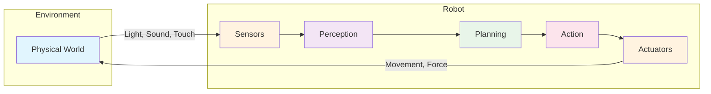
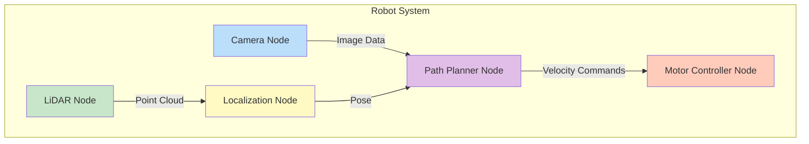
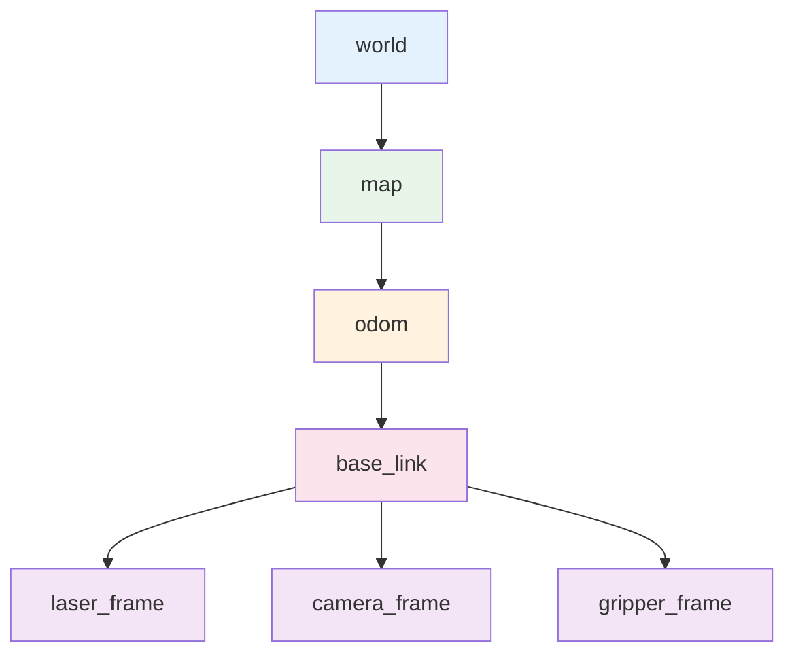

# باب 1: فزیکل اے آئی اور ROS 2 کا تعارف

## سیکھنے کے مقاصد

اس باب کے اختتام تک، آپ یہ کر سکیں گے:

- فزیکل اے آئی کے بنیادی تصورات کو **سمجھیں** اور یہ جانیں کہ یہ روایتی اے آئی سے کیسے مختلف ہے
- sense-plan-act پیراڈائم کی **وضاحت** کریں جو روبوٹک سسٹمز کو کنٹرول کرتا ہے
- ROS 2 کی ساخت اور اہم اجزاء کی **تفصیل** بیان کریں
- ایک بنیادی ROS 2 ڈویلپمنٹ ماحول **ترتیب** دیں
- ایک سادہ publisher-subscriber کمیونیکیشن پیٹرن **نافذ** کریں
- مختلف صنعتوں میں فزیکل اے آئی کی حقیقی دنیا کی ایپلیکیشنز کی **شناخت** کریں

## پہلے سے ضروری معلومات

اس باب کو شروع کرنے سے پہلے، یقینی بنائیں کہ آپ کے پاس:

- پروگرامنگ کے بنیادی تصورات کی سمجھ (variables، functions، loops)
- کمانڈ لائن انٹرفیس (ٹرمینل/شیل) سے واقفیت
- آپ کے سسٹم پر Python 3.8+ انسٹال ہو
- Ubuntu 22.04 (تجویز کردہ) یا WSL2 والی Windows چلانے والا کمپیوٹر

---

## 1. فزیکل اے آئی کیا ہے؟

فزیکل اے آئی، جسے **مجسم مصنوعی ذہانت** بھی کہا جاتا ہے، ذہین نظاموں کے بارے میں ہماری سوچ میں ایک اہم تبدیلی کی نمائندگی کرتا ہے۔ روایتی اے آئی کے برعکس جو خالصتاً ڈیجیٹل دائرے میں کام کرتا ہے—ٹیکسٹ، تصاویر، یا ڈیٹا پروسیس کرتا ہے—فزیکل اے آئی سسٹمز سینسرز اور ایکچویٹرز کے ذریعے براہ راست جسمانی دنیا کے ساتھ تعامل کرتے ہیں۔

### 1.1 ڈیجیٹل سے فزیکل اے آئی کا ارتقاء

ڈیجیٹل اے آئی سے فزیکل اے آئی کا سفر مصنوعی ذہانت کے شعبے میں سب سے اہم تبدیلیوں میں سے ایک ہے۔ روایتی اے آئی سسٹمز، جیسے چیٹ بوٹس، تجویزی انجنز، اور امیج کلاسیفائرز، مکمل طور پر کمپیوٹیشنل حدود میں کام کرتے ہیں۔ وہ ڈیجیٹل ان پٹس وصول کرتے ہیں، انہیں الگورتھمز کا استعمال کرتے ہوئے پروسیس کرتے ہیں، اور ڈیجیٹل آؤٹ پٹس پیدا کرتے ہیں۔

فزیکل اے آئی اس صلاحیت کو حقیقی دنیا میں بڑھاتا ہے۔ ایک فزیکل اے آئی سسٹم کو:

1. سینسرز (کیمرے، LiDAR، IMUs، ٹچ سینسرز) کے ذریعے ماحول کو **محسوس** کرنا چاہیے
2. سینسر ڈیٹا کو ریئل ٹائم میں **سمجھنا** اور تشریح کرنا چاہیے
3. اہداف اور ماحولیاتی رکاوٹوں کی بنیاد پر اقدامات کی **منصوبہ بندی** کرنی چاہیے
4. ایکچویٹرز (موٹرز، گرپرز، پہیے) کے ذریعے جسمانی حرکات **انجام** دینی چاہیے
5. جسمانی دنیا میں غیر متوقع تبدیلیوں اور غیر یقینی صورتحال کے مطابق **ڈھلنا** چاہیے

یہ ایک مسلسل فیڈ بیک لوپ بناتا ہے جہاں اے آئی کے اعمال اس کے ماحول کو متاثر کرتے ہیں، جو بدلے میں مستقبل کے ادراکات کو متاثر کرتا ہے—الگ تھلگ ڈیجیٹل اے آئی سسٹمز سے ایک بنیادی فرق۔

### 1.2 Sense-Plan-Act پیراڈائم

فزیکل اے آئی کے دل میں **sense-plan-act** پیراڈائم ہے، روبوٹس کے اپنے ماحول کے ساتھ تعامل کو سمجھنے کا ایک بنیادی فریم ورک۔



**محسوس کرنا**: روبوٹ مختلف سینسرز کے ذریعے اپنے ماحول کے بارے میں معلومات جمع کرتا ہے۔ ایک موبائل روبوٹ بصری ادراک کے لیے کیمرے، گہرائی کی نقشہ سازی کے لیے LiDAR، اور سمت بندی ٹریکنگ کے لیے IMUs استعمال کر سکتا ہے۔ ہر سینسر جسمانی دنیا پر ایک مختلف نقطہ نظر فراہم کرتا ہے۔

**منصوبہ بندی**: محسوس کی گئی معلومات کی بنیاد پر، روبوٹ کو فیصلہ کرنا ہوگا کہ کون سے اقدامات کرنے ہیں۔ اس میں موجودہ حالت کو سمجھنا، مستقبل کی حالتوں کی پیش گوئی کرنا، اور مطلوبہ اہداف کی طرف بڑھنے والے اقدامات کا انتخاب شامل ہے۔ منصوبہ بندی کے الگورتھمز سادہ reactive رویے سے لے کر پیچیدہ motion planning اور task scheduling تک ہوتے ہیں۔

**عمل کرنا**: آخر میں، روبوٹ ایکچویٹرز کے ذریعے اپنے منصوبہ بند اقدامات انجام دیتا ہے۔ اس میں نیویگیٹ کرنے کے لیے پہیے حرکت دینا، اشیاء کو سنبھالنے کے لیے جوڑ گھمانا، یا اشیاء پکڑنے کے لیے گرپرز کو فعال کرنا شامل ہو سکتا ہے۔ عمل درآمد کو موٹر کی رفتار، جوڑوں کی حدود، اور ماحولیاتی رکاوٹوں جیسی جسمانی رکاوٹوں کو مدنظر رکھنا ہوگا۔

### 1.3 فزیکل اے آئی کے منفرد چیلنجز

فزیکل اے آئی کو ایسے چیلنجز کا سامنا ہے جو خالصتاً ڈیجیٹل سسٹمز میں موجود نہیں:

**غیر یقینی صورتحال اور شور**: حقیقی دنیا کے سینسر نامکمل ہیں۔ کیمرے روشنی کی حالتوں سے متاثر ہو سکتے ہیں، LiDAR شفاف اشیاء سے محروم رہ سکتا ہے، اور GPS سگنلز بھٹک سکتے ہیں۔ فزیکل اے آئی سسٹمز کو اس غیر یقینی صورتحال کو احسن طریقے سے سنبھالنا ہوگا۔

**ریئل ٹائم رکاوٹیں**: ایک خودکار گاڑی بریک لگانے کا فیصلہ کرنے میں منٹ نہیں لے سکتی—اسے ملی سیکنڈز میں رد عمل دینا ہوگا۔ فزیکل اے آئی سسٹمز سخت وقت کی ضروریات کے تحت کام کرتے ہیں جہاں تاخیر سے ردعمل کے سنگین نتائج ہو سکتے ہیں۔

**جسمانی رکاوٹیں**: روبوٹس کی بیٹری کی زندگی، پے لوڈ کی گنجائش، اور حرکت کی حد محدود ہوتی ہے۔ اے آئی سسٹمز کو ان جسمانی حدود کے اندر منصوبہ بندی کرنی ہوگی۔

**حفاظتی تقاضے**: ایک چیٹ بوٹ کے برعکس جو کبھی کبھار غلط جوابات دے سکتا ہے، ایک خراب روبوٹ جسمانی نقصان پہنچا سکتا ہے۔ فزیکل اے آئی سسٹمز کو مضبوط حفاظتی میکانزم اور fail-safes کی ضرورت ہوتی ہے۔

---

## 2. ROS 2 کا تعارف

**روبوٹ آپریٹنگ سسٹم 2 (ROS 2)** دراصل روایتی معنوں میں آپریٹنگ سسٹم نہیں ہے۔ بلکہ، یہ روبوٹ سافٹ ویئر لکھنے کے لیے ایک لچکدار فریم ورک ہے۔ ROS 2 پیچیدہ روبوٹک ایپلیکیشنز بنانے کے لیے درکار ٹولز، لائبریریز، اور کنونشنز فراہم کرتا ہے۔

### 2.1 ROS 2 کیوں؟

ROS سے پہلے، روبوٹکس ڈویلپرز کو ایک عام مسئلے کا سامنا تھا: ہر روبوٹ پراجیکٹ شروع سے شروع ہوتا تھا۔ ٹیمیں اپنے کمیونیکیشن پروٹوکولز، سینسر ڈرائیورز، اور کنٹرول الگورتھمز لکھتی تھیں۔ اس سے کوشش کی نمایاں نقل ہوئی اور پراجیکٹس کے درمیان کوڈ شیئر کرنا مشکل ہو گیا۔

ROS (اور بعد میں ROS 2) نے اسے فراہم کر کے حل کیا:

- **معیاری کمیونیکیشن**: روبوٹ سسٹم کے مختلف حصوں کے لیے معلومات کے تبادلے کا ایک عام طریقہ
- **ہارڈویئر ایبسٹریکشن**: معیاری انٹرفیسز جو بہت سے مختلف سینسرز اور ایکچویٹرز کے ساتھ کام کرتے ہیں
- **پیکج ایکو سسٹم**: نیویگیشن، ادراک، ہیرا پھیری، اور مزید کے لیے ہزاروں دوبارہ قابل استعمال پیکجز
- **ڈویلپمنٹ ٹولز**: ویژولائزیشن، ڈیبگنگ، اور ٹیسٹنگ یوٹیلیٹیز
- **کمیونٹی**: محققین اور ڈویلپرز کی ایک عالمی کمیونٹی جو علم اور کوڈ شیئر کرتی ہے

### 2.2 ROS 2 بمقابلہ ROS 1

ROS 2 اصل ROS فریم ورک کی مکمل نئی ڈیزائن ہے، جو کئی حدود کو حل کرتی ہے:

| خصوصیت | ROS 1 | ROS 2 |
|---------|-------|-------|
| **کمیونیکیشن** | کسٹم پروٹوکول (TCPROS) | DDS (Data Distribution Service) |
| **ریئل ٹائم سپورٹ** | محدود | فرسٹ کلاس سپورٹ |
| **سیکیورٹی** | کم سے کم | بلٹ ان انکرپشن اور ایکسیس کنٹرول |
| **ملٹی روبوٹ** | مشکل | مقامی سپورٹ |
| **پلیٹ فارم** | صرف Linux | Linux، Windows، macOS |
| **لائف سائیکل** | دستی نوڈ مینجمنٹ | منظم نوڈ لائف سائیکل |

### 2.3 ROS 2 کے بنیادی تصورات

ROS 2 کو سمجھنے کے لیے کئی اہم تصورات سے واقفیت ضروری ہے:

#### نوڈز

ایک **نوڈ** ROS 2 کا بنیادی بلاک ہے۔ ہر نوڈ ایک پروسیس ہے جو computation انجام دیتا ہے۔ ایک عام روبوٹ سسٹم کئی نوڈز پر مشتمل ہوتا ہے جو مل کر کام کرتے ہیں: ایک نوڈ کیمرہ امیجز پروسیس کر سکتا ہے، دوسرا موٹر کنٹرول سنبھالتا ہے، اور تیسرا path planning انجام دیتا ہے۔



نوڈز کی ماڈیولر نوعیت کئی فوائد فراہم کرتی ہے:
- **فالٹ آئسولیشن**: اگر ایک نوڈ کریش ہو جائے، دوسرے کام جاری رکھ سکتے ہیں
- **دوبارہ استعمال**: نوڈز مختلف روبوٹ پراجیکٹس میں استعمال کیے جا سکتے ہیں
- **ڈسٹری بیوٹڈ کمپیوٹنگ**: نوڈز مختلف کمپیوٹرز پر چل سکتے ہیں
- **ٹیسٹنگ**: انفرادی نوڈز کو الگ تھلگ ٹیسٹ کیا جا سکتا ہے

#### ٹاپکس

**ٹاپکس** نامزد بسیں ہیں جن پر نوڈز پیغامات کا تبادلہ کرتے ہیں۔ ایک نوڈ ٹاپک پر پیغامات **publish** کر سکتا ہے یا ٹاپک سے پیغامات وصول کرنے کے لیے **subscribe** کر سکتا ہے۔ یہ publish-subscribe پیٹرن نوڈز کے درمیان loose coupling کو فعال کرتا ہے—publishers کو یہ جاننے کی ضرورت نہیں کہ ان کے subscribers کون ہیں۔

مثال کے طور پر، ایک کیمرہ نوڈ `/camera/image_raw` ٹاپک پر تصاویر publish کر سکتا ہے۔ کیمرہ ڈیٹا میں دلچسپی رکھنے والا کوئی بھی نوڈ کیمرہ نوڈ کو ان کے بارے میں جانے بغیر اس ٹاپک کو subscribe کر سکتا ہے۔

#### سروسز

جبکہ ٹاپکس مسلسل ڈیٹا سٹریمز کو فعال کرتے ہیں، **سروسز** request-response پیٹرن فراہم کرتی ہیں۔ ایک نوڈ ایک سروس پیش کر سکتا ہے جسے دوسرے نوڈز کال کر سکتے ہیں۔ کالنگ نوڈ ایک ریکوئسٹ بھیجتا ہے اور جواب کا انتظار کرتا ہے۔

سروسز ان آپریشنز کے لیے مفید ہیں جو:
- واضح ان پٹ اور آؤٹ پٹ رکھتے ہوں
- صرف واضح طور پر درخواست کرنے پر ہونے چاہیں
- کالر کو نتیجہ واپس کرنے کی ضرورت ہو

مثال کے طور پر، ایک میپنگ نوڈ `/save_map` سروس پیش کر سکتا ہے جو کال کرنے پر موجودہ نقشے کو فائل میں محفوظ کرتی ہے۔

#### ایکشنز

**ایکشنز** سروسز کی طرح ہیں لیکن طویل عرصے تک چلنے والے کاموں کے لیے ڈیزائن کیے گئے ہیں۔ ایک ایکشن کلائنٹ کو یہ اجازت دیتا ہے کہ:
- ایکشن سرور کو گول بھیجے
- پیشرفت پر وقفے وقفے سے فیڈ بیک حاصل کرے
- ضرورت ہو تو گول منسوخ کرے
- مکمل ہونے پر حتمی نتیجہ حاصل کرے

نیویگیشن ایکشنز کے لیے ایک عام use case ہے—روبوٹ کو منزل پر بھیجنے میں منٹ لگ سکتے ہیں، اور آپ راستے میں پیشرفت کی اپڈیٹس چاہتے ہیں۔

---

## 3. اپنا ROS 2 ماحول ترتیب دینا

آئیے عملی طور پر ROS 2 ڈویلپمنٹ ماحول ترتیب دیں۔ ہم **ROS 2 Humble Hawksbill** استعمال کریں گے، جو موجودہ Long-Term Support (LTS) ریلیز ہے۔

### 3.1 Ubuntu 22.04 پر انسٹالیشن

پہلے، ROS 2 apt ریپوزٹری سیٹ اپ کریں:

```bash
# Set locale
sudo apt update && sudo apt install locales
sudo locale-gen en_US en_US.UTF-8
sudo update-locale LC_ALL=en_US.UTF-8 LANG=en_US.UTF-8
export LANG=en_US.UTF-8

# Add the ROS 2 GPG key
sudo apt install software-properties-common
sudo add-apt-repository universe
sudo apt update && sudo apt install curl -y
sudo curl -sSL https://raw.githubusercontent.com/ros/rosdistro/master/ros.key -o /usr/share/keyrings/ros-archive-keyring.gpg

# Add the repository to sources list
echo "deb [arch=$(dpkg --print-architecture) signed-by=/usr/share/keyrings/ros-archive-keyring.gpg] http://packages.ros.org/ros2/ubuntu $(. /etc/os-release && echo $UBUNTU_CODENAME) main" | sudo tee /etc/apt/sources.list.d/ros2.list > /dev/null
```

اب ROS 2 Humble انسٹال کریں:

```bash
# Update and install ROS 2
sudo apt update
sudo apt upgrade
sudo apt install ros-humble-desktop

# Install development tools
sudo apt install ros-dev-tools
```

آخر میں، ROS 2 سیٹ اپ سکرپٹ سورس کریں:

```bash
# Add to your .bashrc for automatic sourcing
echo "source /opt/ros/humble/setup.bash" >> ~/.bashrc
source ~/.bashrc
```

### 3.2 انسٹالیشن کی تصدیق

آئیے کچھ مثالی نوڈز چلا کر تصدیق کریں کہ ROS 2 صحیح طریقے سے کام کر رہا ہے:

```bash
# Terminal 1: Run a talker node
ros2 run demo_nodes_cpp talker

# Terminal 2: Run a listener node
ros2 run demo_nodes_cpp listener
```

آپ کو talker کو پیغامات publish کرتے اور listener کو انہیں وصول کرتے دیکھنا چاہیے۔ یہ بنیادی publish-subscribe کمیونیکیشن پیٹرن کا مظاہرہ کرتا ہے۔

### 3.3 ورک سپیس سٹرکچر کو سمجھنا

ROS 2 پیکجز کو منظم کرنے کے لیے **workspaces** استعمال کرتا ہے۔ ایک عام ورک سپیس سٹرکچر اس طرح نظر آتا ہے:

```
my_robot_ws/
├── src/                    # Source code for your packages
│   ├── my_robot/          # A custom package
│   │   ├── package.xml    # Package metadata
│   │   ├── setup.py       # Python package setup
│   │   ├── my_robot/      # Python module
│   │   │   └── __init__.py
│   │   └── resource/
│   └── my_robot_msgs/     # Custom message definitions
├── build/                  # Build artifacts (generated)
├── install/               # Installed packages (generated)
└── log/                   # Build logs (generated)
```

اپنا پہلا ورک سپیس بنائیں:

```bash
# Create workspace directory
mkdir -p ~/ros2_ws/src
cd ~/ros2_ws

# Build the workspace (even if empty)
colcon build

# Source the workspace
source install/setup.bash
```

---

## 4. آپ کا پہلا ROS 2 پروگرام

آئیے ایک سادہ ROS 2 پیکج بنائیں جو publisher-subscriber پیٹرن کا مظاہرہ کرے—ROS 2 کمیونیکیشن کی بنیاد۔

### 4.1 پیکج بنانا

```bash
cd ~/ros2_ws/src

# Create a Python package
ros2 pkg create --build-type ament_python --node-name talker my_first_package
```

یہ درج ذیل سٹرکچر کے ساتھ ایک پیکج بناتا ہے:

```
my_first_package/
├── package.xml
├── setup.py
├── setup.cfg
├── resource/
│   └── my_first_package
├── my_first_package/
│   ├── __init__.py
│   └── talker.py
└── test/
```

### 4.2 Publisher لکھنا

`my_first_package/talker.py` ایڈٹ کریں:

```python
import rclpy
from rclpy.node import Node
from std_msgs.msg import String


class MinimalPublisher(Node):
    """A minimal ROS 2 publisher node."""

    def __init__(self):
        super().__init__('minimal_publisher')

        # Create a publisher on the 'topic' topic
        self.publisher_ = self.create_publisher(
            String,           # Message type
            'topic',          # Topic name
            10                # Queue size
        )

        # Create a timer that calls the callback every 0.5 seconds
        timer_period = 0.5  # seconds
        self.timer = self.create_timer(timer_period, self.timer_callback)
        self.i = 0

        self.get_logger().info('Publisher node started')

    def timer_callback(self):
        """Callback function called by the timer."""
        msg = String()
        msg.data = f'Hello, Physical AI! Message #{self.i}'

        self.publisher_.publish(msg)
        self.get_logger().info(f'Publishing: "{msg.data}"')

        self.i += 1


def main(args=None):
    rclpy.init(args=args)

    minimal_publisher = MinimalPublisher()

    try:
        rclpy.spin(minimal_publisher)
    except KeyboardInterrupt:
        pass
    finally:
        minimal_publisher.destroy_node()
        rclpy.shutdown()


if __name__ == '__main__':
    main()
```

### 4.3 Subscriber لکھنا

ایک نئی فائل `my_first_package/listener.py` بنائیں:

```python
import rclpy
from rclpy.node import Node
from std_msgs.msg import String


class MinimalSubscriber(Node):
    """A minimal ROS 2 subscriber node."""

    def __init__(self):
        super().__init__('minimal_subscriber')

        # Create a subscription to the 'topic' topic
        self.subscription = self.create_subscription(
            String,                    # Message type
            'topic',                   # Topic name
            self.listener_callback,    # Callback function
            10                         # Queue size
        )

        self.get_logger().info('Subscriber node started')

    def listener_callback(self, msg):
        """Callback function called when a message is received."""
        self.get_logger().info(f'Received: "{msg.data}"')


def main(args=None):
    rclpy.init(args=args)

    minimal_subscriber = MinimalSubscriber()

    try:
        rclpy.spin(minimal_subscriber)
    except KeyboardInterrupt:
        pass
    finally:
        minimal_subscriber.destroy_node()
        rclpy.shutdown()


if __name__ == '__main__':
    main()
```

### 4.4 پیکج کنفیگریشن اپڈیٹ کرنا

دونوں entry points شامل کرنے کے لیے `setup.py` اپڈیٹ کریں:

```python
from setuptools import setup

package_name = 'my_first_package'

setup(
    name=package_name,
    version='0.0.1',
    packages=[package_name],
    data_files=[
        ('share/ament_index/resource_index/packages',
            ['resource/' + package_name]),
        ('share/' + package_name, ['package.xml']),
    ],
    install_requires=['setuptools'],
    zip_safe=True,
    maintainer='Your Name',
    maintainer_email='your.email@example.com',
    description='My first ROS 2 package',
    license='Apache License 2.0',
    tests_require=['pytest'],
    entry_points={
        'console_scripts': [
            'talker = my_first_package.talker:main',
            'listener = my_first_package.listener:main',
        ],
    },
)
```

### 4.5 بنانا اور چلانا

```bash
# Build the package
cd ~/ros2_ws
colcon build --packages-select my_first_package

# Source the workspace
source install/setup.bash

# Terminal 1: Run the talker
ros2 run my_first_package talker

# Terminal 2: Run the listener
ros2 run my_first_package listener
```

آپ کو پیغامات talker سے listener کی طرف بہتے نظر آنے چاہیں!

---

## 5. ایڈوانسڈ ROS 2 تصورات

اب جب آپ بنیادی باتیں سمجھ گئے ہیں، آئیے مزید ایڈوانسڈ تصورات دریافت کریں جو پروڈکشن ریڈی فزیکل اے آئی سسٹمز بنانے کے لیے ضروری ہیں۔

### 5.1 Quality of Service (QoS) پالیسیز

ROS 2 کی سب سے طاقتور خصوصیات میں سے ایک اس کا قابل ترتیب **Quality of Service (QoS)** سسٹم ہے۔ QoS پالیسیز کنٹرول کرتی ہیں کہ publishers اور subscribers کے درمیان پیغامات کیسے ڈیلیور ہوتے ہیں، جو آپ کو مختلف ضروریات کے لیے کمیونیکیشن کو ٹیون کرنے کی اجازت دیتی ہے۔

#### QoS پروفائلز کو سمجھنا

QoS پالیسیز کئی اہم پیرامیٹرز کی وضاحت کرتی ہیں:

| پالیسی | آپشنز | تفصیل |
|--------|---------|-------------|
| **Reliability** | Reliable / Best Effort | کیا ڈیلیوری کی ضمانت ہے |
| **Durability** | Transient Local / Volatile | کیا دیر سے آنے والے subscribers پچھلے پیغامات وصول کرتے ہیں |
| **History** | Keep Last / Keep All | کتنے پیغامات محفوظ کرنے ہیں |
| **Depth** | Integer | ہسٹری میں رکھنے والے پیغامات کی تعداد |
| **Deadline** | Duration | پیغامات کے درمیان زیادہ سے زیادہ وقت |
| **Lifespan** | Duration | پیغام کتنی دیر تک درست ہے |
| **Liveliness** | Automatic / Manual | publisher زندہ ہے یہ کیسے طے کریں |

#### صحیح QoS پروفائل کا انتخاب

مختلف روبوٹ سب سسٹمز کی مختلف کمیونیکیشن ضروریات ہیں:

**سینسر ڈیٹا (Best Effort، Volatile)**
```python
from rclpy.qos import QoSProfile, ReliabilityPolicy, DurabilityPolicy

sensor_qos = QoSProfile(
    reliability=ReliabilityPolicy.BEST_EFFORT,
    durability=DurabilityPolicy.VOLATILE,
    depth=1
)
```
کیمرہ امیجز یا LiDAR اسکینز جیسے ہائی فریکوئنسی سینسر ڈیٹا کے لیے، ہم اکثر "best effort" reliability کو ترجیح دیتے ہیں۔ کبھی کبھار فریم کا چھوٹ جانا قابل قبول ہے، لیکن کم latency اہم ہے۔

**کمانڈ ڈیٹا (Reliable، Volatile)**
```python
command_qos = QoSProfile(
    reliability=ReliabilityPolicy.RELIABLE,
    durability=DurabilityPolicy.VOLATILE,
    depth=10
)
```
velocity commands یا goal positions کے لیے، ہم ضمانت شدہ ڈیلیوری چاہتے ہیں—کمانڈ کا چھوٹ جانا روبوٹ کو کریش کر سکتا ہے۔

**کنفیگریشن ڈیٹا (Reliable، Transient Local)**
```python
config_qos = QoSProfile(
    reliability=ReliabilityPolicy.RELIABLE,
    durability=DurabilityPolicy.TRANSIENT_LOCAL,
    depth=1
)
```
نقشے کے ڈیٹا یا روبوٹ descriptions جیسی کنفیگریشن کے لیے، ہم چاہتے ہیں کہ نئے subscribers کو آخری publish شدہ ویلیو ملے چاہے وہ publisher کے بعد شروع ہوں۔

### 5.2 پیرامیٹرز

**پیرامیٹرز** آپ کو کوڈ میں ترمیم کیے بغیر runtime پر نوڈز کنفیگر کرنے کی اجازت دیتے ہیں۔ یہ key-value جوڑے ہیں جو integers، floats، strings، booleans، یا arrays ہو سکتے ہیں۔

#### پیرامیٹرز کا اعلان اور استعمال

```python
import rclpy
from rclpy.node import Node

class ConfigurableNode(Node):
    def __init__(self):
        super().__init__('configurable_node')

        # Declare parameters with default values
        self.declare_parameter('robot_name', 'default_robot')
        self.declare_parameter('max_speed', 1.0)
        self.declare_parameter('enable_logging', True)

        # Get parameter values
        robot_name = self.get_parameter('robot_name').value
        max_speed = self.get_parameter('max_speed').value

        self.get_logger().info(f'Robot: {robot_name}, Max Speed: {max_speed} m/s')
```

#### کمانڈ لائن کے ذریعے پیرامیٹرز سیٹ کرنا

```bash
# Set parameters when launching
ros2 run my_package my_node --ros-args -p robot_name:=my_robot -p max_speed:=2.5

# Change parameters at runtime
ros2 param set /configurable_node max_speed 3.0

# List all parameters
ros2 param list /configurable_node

# Get parameter value
ros2 param get /configurable_node max_speed
```

پیرامیٹرز آپ کے نوڈز کو لچکدار اور دوبارہ قابل استعمال بناتے ہیں۔ ایک ہی نیویگیشن نوڈ صرف پیرامیٹر ویلیوز بدل کر مختلف رفتار کی حدود والے مختلف روبوٹس پر کام کر سکتا ہے۔

### 5.3 لانچ فائلز

جیسے جیسے آپ کا روبوٹ سسٹم بڑھتا ہے، درجنوں نوڈز کو دستی طور پر شروع کرنا غیر عملی ہو جاتا ہے۔ **لانچ فائلز** اس عمل کو خودکار بناتی ہیں، آپ کو ایک کمانڈ میں مناسب کنفیگریشن کے ساتھ متعدد نوڈز شروع کرنے کی اجازت دیتی ہیں۔

#### Python لانچ فائلز

ROS 2 لانچ فائلز کے لیے Python استعمال کرتا ہے، پروگرامنگ زبان کی مکمل طاقت فراہم کرتا ہے:

```python
# launch/robot_bringup.launch.py
from launch import LaunchDescription
from launch_ros.actions import Node
from launch.actions import DeclareLaunchArgument
from launch.substitutions import LaunchConfiguration

def generate_launch_description():
    # Declare launch arguments
    robot_name_arg = DeclareLaunchArgument(
        'robot_name',
        default_value='physical_ai_robot',
        description='Name of the robot'
    )

    # Get argument values
    robot_name = LaunchConfiguration('robot_name')

    # Define nodes to launch
    camera_node = Node(
        package='camera_driver',
        executable='camera_node',
        name='front_camera',
        parameters=[{'camera_id': 0, 'fps': 30}],
        remappings=[('/image_raw', '/camera/front/image')]
    )

    lidar_node = Node(
        package='lidar_driver',
        executable='lidar_node',
        name='main_lidar',
        parameters=[{'scan_rate': 10.0}]
    )

    navigation_node = Node(
        package='nav2_bringup',
        executable='navigation_launch.py',
        parameters=[{'robot_name': robot_name}]
    )

    return LaunchDescription([
        robot_name_arg,
        camera_node,
        lidar_node,
        navigation_node,
    ])
```

#### لانچ فائلز چلانا

```bash
# Run with default parameters
ros2 launch my_robot robot_bringup.launch.py

# Override parameters
ros2 launch my_robot robot_bringup.launch.py robot_name:=delivery_bot
```

### 5.4 TF2: ٹرانسفارم لائبریری

روبوٹس کو اپنے جسم کے مختلف حصوں اور ماحول کے درمیان مقامی تعلقات کو ٹریک کرنے کی ضرورت ہوتی ہے۔ کیمرہ روبوٹ پر ایک خاص پوزیشن پر لگا ہے، روبوٹ کمرے میں ایک خاص پوزیشن پر ہے، اور اشیاء کیمرے کے نسبت detect ہوتی ہیں۔ **TF2** (Transform Library version 2) ان مقامی تعلقات کو منظم کرتی ہے۔

#### فریمز اور ٹرانسفارمز کو سمجھنا

ہر سینسر اور کمپوننٹ کا ایک **coordinate frame** ہوتا ہے۔ TF2 فریمز کے درمیان transforms کا ایک درخت برقرار رکھتا ہے:



**روبوٹکس میں عام فریمز:**
- **world**: فکسڈ عالمی ریفرنس فریم
- **map**: نقشے کے لیے ریفرنس فریم
- **odom**: اوڈومیٹری فریم (وقت کے ساتھ drift کر سکتا ہے)
- **base_link**: روبوٹ کے جسم کا مرکز
- **سینسر فریمز**: کیمرہ، LiDAR، IMU پوزیشنز

#### ٹرانسفارمز Publish کرنا

```python
import rclpy
from rclpy.node import Node
from geometry_msgs.msg import TransformStamped
from tf2_ros import TransformBroadcaster
import math

class FramePublisher(Node):
    def __init__(self):
        super().__init__('frame_publisher')

        self.tf_broadcaster = TransformBroadcaster(self)
        self.timer = self.create_timer(0.1, self.broadcast_timer_callback)

    def broadcast_timer_callback(self):
        t = TransformStamped()

        t.header.stamp = self.get_clock().now().to_msg()
        t.header.frame_id = 'base_link'
        t.child_frame_id = 'camera_frame'

        # Camera is 0.5m forward, 0.3m up from base
        t.transform.translation.x = 0.5
        t.transform.translation.y = 0.0
        t.transform.translation.z = 0.3

        # Camera tilted 15 degrees down
        angle = math.radians(-15)
        t.transform.rotation.x = math.sin(angle / 2)
        t.transform.rotation.y = 0.0
        t.transform.rotation.z = 0.0
        t.transform.rotation.w = math.cos(angle / 2)

        self.tf_broadcaster.sendTransform(t)
```

#### ٹرانسفارمز Look Up کرنا

```python
from tf2_ros import Buffer, TransformListener

class TransformUser(Node):
    def __init__(self):
        super().__init__('transform_user')

        self.tf_buffer = Buffer()
        self.tf_listener = TransformListener(self.tf_buffer, self)

    def get_robot_position_in_map(self):
        try:
            transform = self.tf_buffer.lookup_transform(
                'map',           # Target frame
                'base_link',     # Source frame
                rclpy.time.Time() # Time (latest)
            )

            position = transform.transform.translation
            self.get_logger().info(
                f'Robot at ({position.x:.2f}, {position.y:.2f}, {position.z:.2f})'
            )
            return transform

        except Exception as e:
            self.get_logger().warn(f'Could not get transform: {e}')
            return None
```

TF2 خود بخود transforms کو chain کرتا ہے۔ اگر آپ کو کیمرے سے detect شدہ نقطے کو map coordinates میں transform کرنے کی ضرورت ہو، TF2 compute کرتا ہے: `camera_frame → base_link → odom → map`۔

---

## 6. روبوٹ ڈسکرپشن فارمیٹ (URDF)

روبوٹس کی simulation اور visualization کے لیے، ہمیں ان کی ساخت بیان کرنے کا ایک معیاری طریقہ چاہیے۔ **Unified Robot Description Format (URDF)** ایک XML فارمیٹ ہے جو روبوٹ کے links، joints، sensors، اور جسمانی خصوصیات کی وضاحت کرتا ہے۔

### 6.1 URDF سٹرکچر

ایک URDF فائل روبوٹ کو **links** کے درخت کے طور پر بیان کرتی ہے جو **joints** سے جڑے ہیں:

```xml
<?xml version="1.0"?>
<robot name="simple_robot">

  <!-- Base link (the robot's body) -->
  <link name="base_link">
    <visual>
      <geometry>
        <box size="0.5 0.3 0.1"/>
      </geometry>
      <material name="blue">
        <color rgba="0 0 0.8 1"/>
      </material>
    </visual>
    <collision>
      <geometry>
        <box size="0.5 0.3 0.1"/>
      </geometry>
    </collision>
    <inertial>
      <mass value="10.0"/>
      <inertia ixx="0.1" ixy="0" ixz="0" iyy="0.1" iyz="0" izz="0.1"/>
    </inertial>
  </link>

  <!-- Left wheel -->
  <link name="left_wheel">
    <visual>
      <geometry>
        <cylinder radius="0.1" length="0.05"/>
      </geometry>
      <material name="black">
        <color rgba="0.1 0.1 0.1 1"/>
      </material>
    </visual>
  </link>

  <!-- Joint connecting wheel to base -->
  <joint name="left_wheel_joint" type="continuous">
    <parent link="base_link"/>
    <child link="left_wheel"/>
    <origin xyz="0 0.175 0" rpy="1.5708 0 0"/>
    <axis xyz="0 0 1"/>
  </joint>

</robot>
```

### 6.2 Link کی خصوصیات

ہر link میں ہو سکتا ہے:
- **Visual**: visualization میں link کیسا نظر آتا ہے (شکل، رنگ، mesh)
- **Collision**: collision detection کے لیے سادہ geometry
- **Inertial**: physics simulation کے لیے mass اور moment of inertia

### 6.3 Joint کی اقسام

| Joint کی قسم | تفصیل | Degrees of Freedom |
|------------|-------------|-------------------|
| **fixed** | links کے درمیان کوئی حرکت نہیں | 0 |
| **revolute** | محور کے گرد حدود کے ساتھ گھومنا | 1 |
| **continuous** | لامحدود گھومنا (پہیے) | 1 |
| **prismatic** | محور کے ساتھ linear حرکت | 1 |
| **floating** | 6-DOF آزادی | 6 |
| **planar** | سطح میں حرکت | 3 |

### 6.4 ROS 2 میں URDF لوڈ کرنا

```bash
# Publish robot description to /robot_description topic
ros2 param set /robot_state_publisher robot_description "$(cat my_robot.urdf)"

# Or use launch file
ros2 launch urdf_tutorial display.launch.py model:=my_robot.urdf
```

---

## 7. فزیکل اے آئی کی حقیقی دنیا کی ایپلیکیشنز

فزیکل اے آئی پوری دنیا میں صنعتوں کو بدل رہا ہے۔ ان ایپلیکیشنز کو سمجھنا یہ سمجھنے میں مدد کرتا ہے کہ ہم جو ٹیکنالوجیز سیکھ رہے ہیں وہ کیوں اہم ہیں اور آپ کے اپنے پراجیکٹس کے لیے تحریک فراہم کرتا ہے۔

### 7.1 خودکار گاڑیاں

Self-driving cars شاید فزیکل اے آئی کی سب سے بڑی اور نمایاں ایپلیکیشن ہیں۔ ان سسٹمز کو پیچیدہ، متحرک ماحول میں تیز رفتاری سے navigate کرتے ہوئے لمحے بھر میں حفاظتی فیصلے کرنے ہوتے ہیں۔

**ٹیکنالوجی اسٹیک:**
- **Perception Pipeline**: متعدد کیمرے (عام طور پر 8-12)، LiDAR سینسرز، radar، اور ultrasonic سینسرز مل کر ماحول کی 360 ڈگری سمجھ بناتے ہیں
- **Sensor Fusion**: الگورتھمز تمام سینسرز کا ڈیٹا یکجا کرتے ہیں، ہر سینسر کی طاقت کا فائدہ اٹھاتے ہوئے۔ کیمرے classification میں بہترین ہیں؛ LiDAR درست گہرائی فراہم کرتا ہے؛ radar ہر موسم میں کام کرتا ہے
- **HD Maps**: پہلے سے بنے تفصیلی نقشوں میں lane markings، ٹریفک سائنز، اور semantic معلومات شامل ہیں، real-time perception کا بوجھ کم کرتے ہیں
- **Behavior Prediction**: مشین لرننگ ماڈلز پیش گوئی کرتے ہیں کہ پیدل چلنے والے، سائیکل سوار، اور دوسری گاڑیاں اگلے چند سیکنڈز میں کیا کریں گی
- **Motion Planning**: الگورتھمز محفوظ trajectories بناتے ہیں جو گاڑی کی dynamics، آرام، اور ٹریفک قوانین کو مدنظر رکھتے ہیں
- **Control Systems**: لو لیول کنٹرولرز steering، throttle، اور brakes کو منظم کر کے منصوبہ بند trajectory انجام دیتے ہیں

### 7.2 گودام اور لاجسٹکس آٹومیشن

ای کامرس کے دھماکے نے گودام آٹومیشن میں بڑی سرمایہ کاری کو جنم دیا ہے۔ تیز، درست آرڈر کی تکمیل کی مانگ کو پورا کرنے کے لیے فزیکل اے آئی سسٹمز ضروری ہیں۔

**Amazon Robotics (پہلے Kiva Systems):**
Amazon اپنے fulfillment centers میں 750,000 سے زیادہ روبوٹس deploy کرتا ہے۔ یہ روبوٹس "goods-to-person" ماڈل استعمال کرتے ہیں:
- روبوٹس انوینٹری شیلفز کے نیچے navigate کرتے ہیں اور پوری شیلف یونٹس اٹھاتے ہیں
- متعدد روبوٹس coordinate کر کے اشیاء انسانی workers کے پاس لاتے ہیں
- جدید ترین ٹریفک مینجمنٹ collisions روکتی ہے اور throughput بہتر بناتی ہے
- ROS 2 پر مبنی سسٹمز modular، scalable deployments کو فعال کرتے ہیں

### 7.3 صحت کی دیکھ بھال اور میڈیکل روبوٹکس

فزیکل اے آئی سرجری سے لے کر بحالی سے لے کر ہسپتال لاجسٹکس تک متعدد شعبوں میں صحت کی دیکھ بھال میں انقلاب لا رہا ہے۔

**سرجیکل روبوٹکس:**
da Vinci سرجیکل سسٹم (Intuitive Surgical) نے 10 ملین سے زیادہ procedures انجام دیے ہیں۔ اہم فوائد میں شامل ہیں:
- انسانی ہاتھوں کے لیے ناممکن sub-millimeter درستگی
- 10x magnification کے ساتھ 3D visualization
- 540 ڈگری گھوم سکنے والے wristed آلات
- مریضوں کے لیے کم ہسپتال قیام اور تیز recovery

### 7.4 زرعی آٹومیشن

زراعت کو نمایاں مزدوروں کی کمی کا سامنا ہے، اور فزیکل اے آئی بہت سے کھیتی باڑی کے کاموں کے لیے حل پیش کرتا ہے۔

**خودکار ٹریکٹرز اور فیلڈ روبوٹس:**
- John Deere کے خودکار ٹریکٹرز درست نیویگیشن کے لیے GPS اور کمپیوٹر ویژن استعمال کرتے ہیں
- 24/7 کام کر سکتے ہیں، فیلڈ کے استعمال کو بہتر بناتے ہیں
- درست آلات بیج، پانی، اور کیمیکل کے استعمال کو 15% تک کم کرتے ہیں

### 7.5 مینوفیکچرنگ اور صنعتی روبوٹکس

جبکہ صنعتی روبوٹس دہائیوں سے موجود ہیں، فزیکل اے آئی ان کی deployment اور آپریشن کو بدل رہا ہے۔

**Collaborative Robots (Cobots):**
روایتی صنعتی روبوٹس safety cages میں کام کرتے ہیں، انسانوں سے الگ۔ Universal Robots کی UR سیریز اور ABB کا YuMi جیسے Cobots لوگوں کے ساتھ کام کرتے ہیں:
- Force-torque سینسرز collisions detect کرتے ہیں اور motion روکتے ہیں
- Teach pendants اور direct manipulation پروگرامنگ کو آسان بناتے ہیں
- کم لاگت چھوٹے کاروباروں کے لیے آٹومیشن کو قابل رسائی بناتی ہے
- assembly، packaging، اور machine tending جیسے کاموں کے لیے موزوں

---

## اہم نکات

اس باب کو مکمل کرنے کے بعد، آپ کو سمجھنا چاہیے:

- **فزیکل اے آئی** سینسرز اور ایکچویٹرز کے ذریعے مصنوعی ذہانت کو حقیقی دنیا میں پھیلاتا ہے، sense-plan-act پیراڈائم کے تحت کام کرتا ہے۔ ڈیجیٹل اے آئی کے برعکس جو تنہائی میں ڈیٹا پروسیس کرتا ہے، فزیکل اے آئی اپنے ماحول کے ساتھ مسلسل فیڈ بیک loops بناتا ہے۔

- **ROS 2** بہتر real-time سپورٹ، سیکیورٹی، اور ملٹی پلیٹ فارم compatibility کے ساتھ روبوٹک ایپلیکیشنز بنانے کے لیے ایک معیاری فریم ورک فراہم کرتا ہے۔

- **نوڈز** ROS 2 سسٹمز کے بنیادی بلاکس ہیں، **topics** (publish-subscribe)، **services** (request-response)، اور **actions** (طویل مدتی goals) کے ذریعے communicate کرتے ہیں۔

- **Quality of Service (QoS)** پالیسیز پیغام کی ڈیلیوری پر باریک کنٹرول کی اجازت دیتی ہیں۔

- **پیرامیٹرز** runtime کنفیگریشن فراہم کرتے ہیں، نوڈز کو لچکدار اور دوبارہ قابل استعمال بناتے ہیں۔

- **لانچ فائلز** پیچیدہ سسٹم سٹارٹ اپ کو خودکار بناتی ہیں۔

- **TF2** coordinate frame تعلقات کو منظم کرتا ہے۔

- **URDF** روبوٹ ساخت بیان کرنے کے لیے معیاری فارمیٹ فراہم کرتا ہے۔

---

## مشقیں

ان عملی مشقوں سے اپنی سمجھ کی جانچ کریں:

### مشق 1: بہتر Publisher (ابتدائی)
سیکشن 4 سے publisher میں ترمیم کریں تاکہ ہر پیغام میں timestamp شامل ہو۔ `std_msgs/String` کی بجائے، `std_msgs/Header` استعمال کریں جس میں timestamp فیلڈ شامل ہے۔

### مشق 2: Message Transformer نوڈ (درمیانی)
ایک تیسرا نوڈ بنائیں جو message transformer کے طور پر کام کرے:
1. اصل talker سے `/topic` topic کو subscribe کریں
2. آنے والے پیغامات کو transform کریں (text کو uppercase میں تبدیل کریں)
3. transformed پیغامات کو نئے topic `/transformed_topic` پر publish کریں
4. `ros2 topic echo` استعمال کر کے ڈیٹا کے بہاؤ کی تصدیق کریں

### مشق 3: ROS 2 CLI Exploration (ابتدائی)
ROS 2 کے command-line ٹولز استعمال کر کے چلتے ہوئے سسٹم کو دریافت کریں:
```bash
# List all active nodes
ros2 node list

# Get detailed info about a specific node
ros2 node info /minimal_publisher

# List all active topics
ros2 topic list

# See message content in real-time
ros2 topic echo /topic

# Get topic statistics
ros2 topic info /topic --verbose
```

### مشق 4: QoS تجربہ (درمیانی)
publisher اور subscriber میں مختلف QoS profiles استعمال کرنے کی ترمیم کریں:
1. پہلے، دونوں کو "reliable" ڈیلیوری پر سیٹ کریں۔ کیا ہر پیغام پہنچتا ہے؟
2. publisher کو "best effort" رکھتے ہوئے subscriber کو "reliable" رکھیں۔ کیا ہوتا ہے؟
3. دونوں کو "best effort" سیٹ کریں۔ کیا رویے میں کوئی فرق ہے؟

### مشق 5: Parameter-Driven رویہ (درمیانی)
publisher نوڈ کو پیرامیٹرز کے ذریعے قابل ترتیب بنائیں:
- `message_prefix`: تمام پیغامات میں شامل کرنے والا String (ڈیفالٹ: "Hello")
- `publish_rate`: فی سیکنڈ پیغامات (ڈیفالٹ: 2.0)
- `max_count`: رکنے سے پہلے زیادہ سے زیادہ پیغامات (ڈیفالٹ: -1 لامحدود کے لیے)

### مشق 6: روبوٹ ریسرچ پراجیکٹ (تحقیق)
ROS 2 کو سپورٹ کرنے والے تین مختلف موبائل روبوٹ پلیٹ فارمز کی تحقیق اور موازنہ کریں۔ ہر پلیٹ فارم کے لیے document کریں:
- ہارڈویئر specifications (سینسرز، compute، ایکچویٹرز)
- مقصود applications (تحقیق، صنعتی، تعلیمی)
- دستیاب ROS 2 پیکجز
- تخمینی لاگت

---

## مزید مطالعہ

- [ROS 2 Documentation](https://docs.ros.org/en/humble/)
- [ROS 2 Tutorials](https://docs.ros.org/en/humble/Tutorials.html)
- [The Robotics Back-End - ROS 2 Tutorials](https://roboticsbackend.com/category/ros2/)
- [Springer Handbook of Robotics](https://link.springer.com/referencework/10.1007/978-3-319-32552-1)

---

*اگلا باب: [Gazebo کے ساتھ Simulation](/docs/chapter-2) - ہارڈویئر پر deploy کرنے سے پہلے اپنے روبوٹس کو ورچوئل ماحول میں ٹیسٹ کرنا سیکھیں۔*
