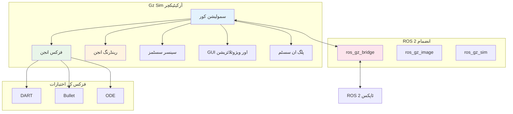
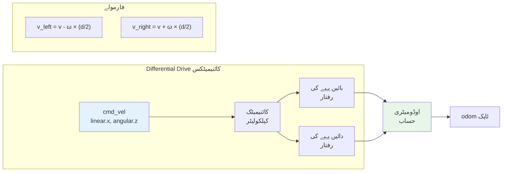

# باب 2: Gazebo کے ساتھ سمولیشن

## سیکھنے کے مقاصد

اس باب کے اختتام تک، آپ قابل ہوں گے:

- **سمجھنا** کہ سمولیشن روبوٹکس ڈیویلپمنٹ کے لیے کیوں ضروری ہے اور یہ ڈیویلپمنٹ سائیکل کو کیسے تیز کرتی ہے
- **وضاحت کرنا** Gazebo کے آرکیٹیکچر کی، بشمول اس کے فزکس انجنز، رینڈرنگ سسٹم، اور پلگ ان فریم ورک
- **کنفیگر کرنا** Gazebo سمولیشن ماحول کو حسب ضرورت worlds، روشنی، اور زمین کے ساتھ
- **بنانا** SDF (Simulation Description Format) استعمال کرتے ہوئے روبوٹ ماڈلز اور URDF ماڈلز کو ضم کرنا
- **نافذ کرنا** سمولیٹڈ سینسرز بشمول کیمرے، LiDAR، IMU، اور ڈیپتھ سینسرز
- **جوڑنا** ROS 2 نوڈز کو سمولیٹڈ روبوٹس سے ros_gz_bridge استعمال کرتے ہوئے
- **ڈیبگ کرنا** فزیکل ہارڈویئر پر تعیناتی سے پہلے سمولیشن میں روبوٹ کا رویہ

## پیشگی ضروریات

اس باب کو شروع کرنے سے پہلے، یقینی بنائیں کہ آپ کے پاس:

- باب 1 (Introduction to Physical AI & ROS 2) مکمل ہو
- ROS 2 Humble انسٹال اور کام کرتا ہو
- باب 1 سے URDF کی بنیادی سمجھ ہو
- کم از کم 8GB RAM اور ایک dedicated GPU والا کمپیوٹر (تجویز کردہ)
- Ubuntu 22.04 یا ہم آہنگ آپریٹنگ سسٹم

---

## 1. سمولیشن کیوں اہم ہے

Gazebo میں جانے سے پہلے، آئیے سمجھیں کہ سمولیشن روبوٹکس ڈیویلپمنٹ کے لیے کیوں اہم ہے۔ Physical AI کی دنیا میں، براہ راست ہارڈویئر پر ٹیسٹنگ مہنگی، وقت طلب، اور ممکنہ طور پر خطرناک ہے۔

### 1.1 فزیکل ٹیسٹنگ کی لاگت

خودکار گاڑی بنانے پر غور کریں۔ حقیقی دنیا کی ٹیسٹنگ کے ہر گھنٹے میں درکار ہے:
- ایک فزیکل گاڑی ($50,000+)
- سیفٹی ڈرائیورز ($50-100/گھنٹہ)
- ایندھن اور دیکھ بھال
- انشورنس اور اجازت نامے
- حادثات اور ذمہ داری کا خطرہ

اس کے برعکس، سمولیشن آپ کو ایک معیاری کمپیوٹر پر رات بھر میں ہزاروں منظرناموں کی جانچ کرنے کی اجازت دیتی ہے۔ Waymo رپورٹ کرتا ہے کہ انہوں نے سمولیشن میں 15 بلین میل سے زیادہ چلائی—ایک فاصلہ جو حقیقی دنیا میں حاصل کرنا ناممکن ہے۔

### 1.2 سمولیشن-فرسٹ ڈیویلپمنٹ کے فوائد

**تیز ترین تکرار**: کوڈ بدلیں، فوری طور پر ٹیسٹ کریں۔ بیٹریاں چارج کرنے، ہارڈویئر ری سیٹ کرنے، یا اچھے موسم کا انتظار کرنے کی ضرورت نہیں۔

**محفوظ ناکامی**: آپ کا سمولیٹڈ روبوٹ دیواروں سے ٹکرا سکتا ہے، چٹانوں سے گر سکتا ہے، یا پیدل چلنے والوں سے ٹکرا سکتا ہے بغیر کسی نتائج کے۔ سامان توڑے بغیر ناکامیوں سے سیکھیں۔

**منظرنامے کی کوریج**: ایسے کنارے کے کیسز کی جانچ کریں جو حقیقی دنیا میں شاذ و نادر ہی ہوتے ہیں: سینسر کی ناکامیاں، انتہائی موسم، غیر معمولی رکاوٹیں، اور مخالفانہ حالات۔

**دوبارہ پیدا کرنے کی صلاحیت**: درست منظرناموں کو دوبارہ چلا کر مسائل کو ڈیبگ کریں۔ حقیقی دنیا کی ڈیبگنگ میں اکثر "میں اسے دوبارہ پیدا نہیں کر سکا" جیسی مایوسی شامل ہوتی ہے۔

**متوازی کاری**: کلاؤڈ کمپیوٹرز پر بیک وقت سینکڑوں سمولیشن چلائیں، جو ٹیسٹنگ کو کئی گنا تیز کرتی ہے۔

### 1.3 سمولیشن سے حقیقت کا فرق

جبکہ سمولیشن بے پناہ فوائد پیش کرتی ہے، سمولیٹڈ اور حقیقی دنیا کی کارکردگی کے درمیان ہمیشہ ایک فرق ہوتا ہے۔ یہ "سم-ٹو-ریئل گیپ" اس سے پیدا ہوتا ہے:

- **فزکس تخمینے**: اصلی فزکس ناقابل یقین حد تک پیچیدہ ہے۔ سمولیشنز آسان ماڈلز استعمال کرتی ہیں جو رگڑ، تبدیلی، یا سیال حرکیات کو مکمل طور پر نہیں پکڑتے۔
- **سینسر نوائز**: اصلی سینسرز میں نوائز، ڈرفٹ، اور ناکامی کی حالتیں ہوتی ہیں جنہیں درست طریقے سے ماڈل کرنا مشکل ہے۔
- **ماحولیاتی تغیرات**: حقیقی روشنی، ٹیکسچرز، اور مواد ایسے طریقوں سے مختلف ہوتے ہیں جنہیں سمولیشنز پکڑنے میں مشکل محسوس کرتی ہیں۔
- **غیر ماڈل شدہ حرکیات**: کیبل مینجمنٹ، ٹوٹ پھوٹ، درجہ حرارت کے اثرات—بہت سے عوامل حقیقی روبوٹس کو متاثر کرتے ہیں لیکن سمولیٹ نہیں ہوتے۔

جدید روبوٹکس ریسرچ اس خلا کو پر کرنے کی تکنیکوں پر بہت زیادہ توجہ دیتی ہے، بشمول ڈومین رینڈمائزیشن، سسٹم آئیڈینٹیفیکیشن، اور سم-ٹو-ریئل ٹرانسفر لرننگ۔

---

## 2. Gazebo کا تعارف

**Gazebo** سب سے زیادہ استعمال ہونے والا اوپن سورس روبوٹکس سمولیٹر ہے، جو ROS 2 کے ساتھ مضبوطی سے ضم ہے۔ اصل میں Willow Garage (ROS کے بنانے والوں) میں تیار کیا گیا، Gazebo اعلیٰ معیار کی فزکس سمولیشن، سینسر ماڈلنگ، اور توسیع پذیری کے لیے پلگ ان آرکیٹیکچر فراہم کرتا ہے۔

### 2.1 Gazebo کا ارتقاء: Classic سے Ignition سے Gz

Gazebo میں اہم تبدیلیاں آئی ہیں:

| ورژن | سال | نوٹس |
|---------|-------|-------|
| **Gazebo Classic** | 2004-2022 | اصل ورژن، مضبوط ROS 1 انضمام |
| **Ignition Gazebo** | 2019-2022 | جدید آرکیٹیکچر کے ساتھ مکمل نئی تحریر |
| **Gz Sim** | 2022+ | Ignition سے نام تبدیل، ROS 2 نیٹو |

ROS 2 Humble کے لیے، ہم **Gz Sim** (Gazebo Fortress یا Garden ریلیزز) استعمال کرتے ہیں۔ آرکیٹیکچر ماڈیولر ہے، فزکس، رینڈرنگ، سینسرز، اور GUI کے لیے الگ لائبریریوں کے ساتھ۔

### 2.2 Gazebo آرکیٹیکچر



**اہم اجزاء:**

- **سمولیشن کور (gz-sim)**: مین سمولیشن لوپ، entity-component سسٹم کا انتظام
- **فزکس انجن (gz-physics)**: پلگ ایبل فزکس بیک اینڈز (DART, Bullet, ODE)
- **رینڈرنگ (gz-rendering)**: حقیقت پسندانہ ویژوئلائزیشن کے لیے OGRE2 استعمال کرتے ہوئے 3D گرافکس
- **سینسرز (gz-sensors)**: سمولیٹڈ کیمرے، LiDAR، IMU، GPS، اور مزید
- **ٹرانسپورٹ (gz-transport)**: اجزاء کے درمیان اندرونی میسج پاسنگ
- **GUI (gz-gui)**: ڈاک ایبل ویجٹس کے ساتھ Qt پر مبنی یوزر انٹرفیس

### 2.3 انسٹالیشن

Gazebo Fortress انسٹال کریں (ROS 2 Humble کے ساتھ ہم آہنگ):

```bash
# Gazebo Fortress انسٹال کریں
sudo apt update
sudo apt install gz-fortress

# ROS 2 - Gazebo انٹیگریشن پیکجز انسٹال کریں
sudo apt install ros-humble-ros-gz

# انسٹالیشن کی تصدیق کریں
gz sim --version
```

`ros-humble-ros-gz` پیکج میں شامل ہیں:
- `ros_gz_bridge`: ROS 2 اور Gazebo کے درمیان دو طرفہ میسج کنورژن
- `ros_gz_sim`: لانچ فائل ہیلپرز اور سپون یوٹیلیٹیز
- `ros_gz_image`: Gazebo کیمروں کے لیے امیج ٹرانسپورٹ

---

## 3. اپنی پہلی سمولیشن World بنانا

ایک Gazebo world اس ماحول کی تعریف کرتی ہے جہاں آپ کا روبوٹ کام کرتا ہے: گراؤنڈ پلینز، رکاوٹیں، روشنی، اور فزکس خصوصیات۔

### 3.1 SDF (Simulation Description Format) کو سمجھنا

جبکہ URDF روبوٹس کی وضاحت کرتا ہے، **SDF** مکمل سمولیشن ماحول کی وضاحت کرتا ہے بشمول:
- متعدد ماڈلز (روبوٹس، اشیاء، زمین)
- روشنی اور ماحولیاتی حالات
- فزکس انجن کنفیگریشن
- نوائز ماڈلز کے ساتھ سینسرز
- حسب ضرورت رویے کے لیے پلگ انز

یہاں ایک کم از کم world فائل ہے:

```xml
<?xml version="1.0" ?>
<sdf version="1.8">
  <world name="physical_ai_world">

    <!-- فزکس کنفیگریشن -->
    <physics name="1ms" type="dart">
      <max_step_size>0.001</max_step_size>
      <real_time_factor>1.0</real_time_factor>
    </physics>

    <!-- روشنی -->
    <light type="directional" name="sun">
      <cast_shadows>true</cast_shadows>
      <pose>0 0 10 0 0 0</pose>
      <diffuse>0.8 0.8 0.8 1</diffuse>
      <specular>0.2 0.2 0.2 1</specular>
      <direction>-0.5 0.1 -0.9</direction>
    </light>

    <!-- گراؤنڈ پلین -->
    <model name="ground_plane">
      <static>true</static>
      <link name="link">
        <collision name="collision">
          <geometry>
            <plane>
              <normal>0 0 1</normal>
              <size>100 100</size>
            </plane>
          </geometry>
        </collision>
        <visual name="visual">
          <geometry>
            <plane>
              <normal>0 0 1</normal>
              <size>100 100</size>
            </plane>
          </geometry>
          <material>
            <ambient>0.8 0.8 0.8 1</ambient>
            <diffuse>0.8 0.8 0.8 1</diffuse>
          </material>
        </visual>
      </link>
    </model>

    <!-- ایک سادہ رکاوٹ -->
    <model name="box_obstacle">
      <static>true</static>
      <pose>2 0 0.5 0 0 0</pose>
      <link name="link">
        <collision name="collision">
          <geometry>
            <box><size>1 1 1</size></box>
          </geometry>
        </collision>
        <visual name="visual">
          <geometry>
            <box><size>1 1 1</size></box>
          </geometry>
          <material>
            <ambient>0.8 0.2 0.2 1</ambient>
          </material>
        </visual>
      </link>
    </model>

  </world>
</sdf>
```

### 3.2 سمولیشن چلانا

world فائل کو `my_world.sdf` کے طور پر محفوظ کریں اور اسے لانچ کریں:

```bash
# اپنی world کے ساتھ Gazebo شروع کریں
gz sim my_world.sdf

# یا headless چلائیں (بغیر GUI) خودکار ٹیسٹنگ کے لیے
gz sim -s my_world.sdf  # صرف سرور
```

### 3.3 World Building کی بہترین طریقے

**Include فائلوں کے ساتھ منظم کریں**: بڑی worlds کو دوبارہ قابل استعمال ماڈل فائلوں میں تقسیم کریں:

```xml
<include>
  <uri>model://warehouse_robot</uri>
  <pose>0 0 0 0 0 0</pose>
</include>
```

**فزکس کو مناسب طریقے سے کنفیگر کریں**:
- زیادہ `max_step_size` = تیز سمولیشن، کم درستگی
- کم `real_time_factor` = حقیقی وقت سے سست، پیچیدہ سمولیشنز کے لیے مفید
- ضروریات کی بنیاد پر فزکس انجن منتخب کریں: DART آرٹیکولیٹڈ باڈیز کے لیے، Bullet رجڈ باڈی ڈائنامکس کے لیے

**حقیقت پسندانہ روشنی شامل کریں**: ناقص روشنی کیمرے پر مبنی ادراک کو غیر حقیقی بناتی ہے۔ ویژن سسٹمز کی تربیت کے لیے متعدد روشنی کے ذرائع شامل کریں اور سائے کو فعال کریں۔

---

## 4. Gazebo میں روبوٹ ماڈلز

اپنے روبوٹ کی سمولیٹ کرنے کے لیے، آپ کو ایک ماڈل کی ضرورت ہے جو اس کی فزیکل ساخت، ظاہری شکل، اور رویے کی وضاحت کرے۔

### 4.1 URDF کو SDF میں تبدیل کرنا

Gazebo براہ راست URDF فائلز استعمال کر سکتا ہے یا انہیں SDF میں تبدیل کر سکتا ہے۔ تاہم، SDF ایسی خصوصیات کی حمایت کرتا ہے جو URDF نہیں کرتا، اس لیے تبدیلی ضروری ہو سکتی ہے:

```bash
# URDF کو SDF میں تبدیل کریں
gz sdf -p my_robot.urdf > my_robot.sdf
```

### 4.2 Differential Drive روبوٹ بنانا

آئیے ایک مکمل differential drive روبوٹ بنائیں—سب سے عام موبائل روبوٹ قسم:

```xml
<?xml version="1.0" ?>
<sdf version="1.8">
  <model name="diff_drive_robot">

    <!-- روبوٹ بیس -->
    <link name="base_link">
      <inertial>
        <mass>5.0</mass>
        <inertia>
          <ixx>0.1</ixx><iyy>0.1</iyy><izz>0.1</izz>
        </inertia>
      </inertial>

      <collision name="base_collision">
        <geometry>
          <box><size>0.4 0.3 0.1</size></box>
        </geometry>
      </collision>

      <visual name="base_visual">
        <geometry>
          <box><size>0.4 0.3 0.1</size></box>
        </geometry>
        <material>
          <ambient>0.2 0.2 0.8 1</ambient>
        </material>
      </visual>
    </link>

    <!-- بائیں پہیہ -->
    <link name="left_wheel">
      <pose>0 0.175 0 -1.5707 0 0</pose>
      <inertial>
        <mass>0.5</mass>
        <inertia>
          <ixx>0.001</ixx><iyy>0.001</iyy><izz>0.001</izz>
        </inertia>
      </inertial>

      <collision name="collision">
        <geometry>
          <cylinder>
            <radius>0.08</radius>
            <length>0.04</length>
          </cylinder>
        </geometry>
        <surface>
          <friction>
            <ode><mu>1.0</mu><mu2>1.0</mu2></ode>
          </friction>
        </surface>
      </collision>

      <visual name="visual">
        <geometry>
          <cylinder>
            <radius>0.08</radius>
            <length>0.04</length>
          </cylinder>
        </geometry>
        <material>
          <ambient>0.1 0.1 0.1 1</ambient>
        </material>
      </visual>
    </link>

    <!-- دائیں پہیہ -->
    <link name="right_wheel">
      <pose>0 -0.175 0 -1.5707 0 0</pose>
      <inertial>
        <mass>0.5</mass>
        <inertia>
          <ixx>0.001</ixx><iyy>0.001</iyy><izz>0.001</izz>
        </inertia>
      </inertial>

      <collision name="collision">
        <geometry>
          <cylinder>
            <radius>0.08</radius>
            <length>0.04</length>
          </cylinder>
        </geometry>
        <surface>
          <friction>
            <ode><mu>1.0</mu><mu2>1.0</mu2></ode>
          </friction>
        </surface>
      </collision>

      <visual name="visual">
        <geometry>
          <cylinder>
            <radius>0.08</radius>
            <length>0.04</length>
          </cylinder>
        </geometry>
        <material>
          <ambient>0.1 0.1 0.1 1</ambient>
        </material>
      </visual>
    </link>

    <!-- استحکام کے لیے کاسٹر پہیہ -->
    <link name="caster">
      <pose>-0.15 0 -0.04 0 0 0</pose>
      <inertial>
        <mass>0.1</mass>
        <inertia>
          <ixx>0.0001</ixx><iyy>0.0001</iyy><izz>0.0001</izz>
        </inertia>
      </inertial>

      <collision name="collision">
        <geometry>
          <sphere><radius>0.04</radius></sphere>
        </geometry>
        <surface>
          <friction>
            <ode><mu>0.0</mu><mu2>0.0</mu2></ode>
          </friction>
        </surface>
      </collision>

      <visual name="visual">
        <geometry>
          <sphere><radius>0.04</radius></sphere>
        </geometry>
      </visual>
    </link>

    <!-- جوائنٹس -->
    <joint name="left_wheel_joint" type="revolute">
      <parent>base_link</parent>
      <child>left_wheel</child>
      <axis><xyz>0 0 1</xyz></axis>
    </joint>

    <joint name="right_wheel_joint" type="revolute">
      <parent>base_link</parent>
      <child>right_wheel</child>
      <axis><xyz>0 0 1</xyz></axis>
    </joint>

    <joint name="caster_joint" type="ball">
      <parent>base_link</parent>
      <child>caster</child>
    </joint>

    <!-- Differential drive پلگ ان -->
    <plugin
      filename="gz-sim-diff-drive-system"
      name="gz::sim::systems::DiffDrive">
      <left_joint>left_wheel_joint</left_joint>
      <right_joint>right_wheel_joint</right_joint>
      <wheel_separation>0.35</wheel_separation>
      <wheel_radius>0.08</wheel_radius>
      <topic>cmd_vel</topic>
      <odom_topic>odom</odom_topic>
    </plugin>

  </model>
</sdf>
```

### 4.3 Differential Drive پلگ ان کو سمجھنا

`gz-sim-diff-drive-system` پلگ ان رفتار کی کمانڈز کو پہیوں کی گردش میں تبدیل کرتا ہے:



جہاں:
- `v` = لینیئر ویلوسٹی (m/s)
- `ω` = اینگولر ویلوسٹی (rad/s)
- `d` = پہیوں کا فاصلہ

---

## 5. سینسرز کی سمولیشن

سینسرز آپ کے روبوٹ کی آنکھیں اور کان ہیں۔ Gazebo کنفیگر ایبل نوائز ماڈلز کے ساتھ اعلیٰ معیار کی سینسر سمولیشنز فراہم کرتا ہے۔

### 5.1 کیمرہ شامل کرنا

```xml
<!-- کیمرہ سینسر لنک -->
<link name="camera_link">
  <pose>0.2 0 0.15 0 0 0</pose>
  <inertial>
    <mass>0.1</mass>
    <inertia>
      <ixx>0.0001</ixx><iyy>0.0001</iyy><izz>0.0001</izz>
    </inertia>
  </inertial>

  <visual name="visual">
    <geometry>
      <box><size>0.02 0.05 0.05</size></box>
    </geometry>
    <material>
      <ambient>0.1 0.1 0.1 1</ambient>
    </material>
  </visual>

  <sensor name="camera" type="camera">
    <always_on>true</always_on>
    <update_rate>30</update_rate>
    <visualize>true</visualize>

    <camera>
      <horizontal_fov>1.047</horizontal_fov>
      <image>
        <width>640</width>
        <height>480</height>
        <format>R8G8B8</format>
      </image>
      <clip>
        <near>0.1</near>
        <far>100</far>
      </clip>
      <noise>
        <type>gaussian</type>
        <mean>0</mean>
        <stddev>0.007</stddev>
      </noise>
    </camera>

    <topic>camera/image_raw</topic>
  </sensor>
</link>

<joint name="camera_joint" type="fixed">
  <parent>base_link</parent>
  <child>camera_link</child>
</joint>
```

### 5.2 LiDAR شامل کرنا

LiDAR (Light Detection and Ranging) 360 ڈگری فاصلے کی پیمائش فراہم کرتا ہے:

```xml
<link name="lidar_link">
  <pose>0 0 0.2 0 0 0</pose>
  <inertial>
    <mass>0.2</mass>
    <inertia>
      <ixx>0.0001</ixx><iyy>0.0001</iyy><izz>0.0001</izz>
    </inertia>
  </inertial>

  <visual name="visual">
    <geometry>
      <cylinder>
        <radius>0.03</radius>
        <length>0.05</length>
      </cylinder>
    </geometry>
  </visual>

  <sensor name="lidar" type="gpu_lidar">
    <always_on>true</always_on>
    <update_rate>10</update_rate>
    <visualize>true</visualize>

    <lidar>
      <scan>
        <horizontal>
          <samples>360</samples>
          <resolution>1</resolution>
          <min_angle>-3.14159</min_angle>
          <max_angle>3.14159</max_angle>
        </horizontal>
        <vertical>
          <samples>1</samples>
          <resolution>1</resolution>
          <min_angle>0</min_angle>
          <max_angle>0</max_angle>
        </vertical>
      </scan>
      <range>
        <min>0.1</min>
        <max>30.0</max>
        <resolution>0.01</resolution>
      </range>
      <noise>
        <type>gaussian</type>
        <mean>0</mean>
        <stddev>0.01</stddev>
      </noise>
    </lidar>

    <topic>scan</topic>
  </sensor>
</link>
```

### 5.3 IMU شامل کرنا

Inertial Measurement Unit ایکسلریشن اور اینگولر ویلوسٹی فراہم کرتا ہے:

```xml
<sensor name="imu" type="imu">
  <always_on>true</always_on>
  <update_rate>100</update_rate>

  <imu>
    <angular_velocity>
      <x><noise type="gaussian">
        <mean>0</mean><stddev>0.0001</stddev>
      </noise></x>
      <y><noise type="gaussian">
        <mean>0</mean><stddev>0.0001</stddev>
      </noise></y>
      <z><noise type="gaussian">
        <mean>0</mean><stddev>0.0001</stddev>
      </noise></z>
    </angular_velocity>
    <linear_acceleration>
      <x><noise type="gaussian">
        <mean>0</mean><stddev>0.001</stddev>
      </noise></x>
      <y><noise type="gaussian">
        <mean>0</mean><stddev>0.001</stddev>
      </noise></y>
      <z><noise type="gaussian">
        <mean>0</mean><stddev>0.001</stddev>
      </noise></z>
    </linear_acceleration>
  </imu>

  <topic>imu</topic>
</sensor>
```

### 5.4 سینسر نوائز ماڈلز

حقیقت پسندانہ سمولیشن کے لیے حقیقت پسندانہ سینسر نوائز ضروری ہے۔ Gazebo کئی نوائز اقسام کی حمایت کرتا ہے:

| نوائز قسم | تفصیل | پیرامیٹرز |
|------------|-------------|------------|
| **Gaussian** | حقیقی قدر کے ارد گرد نارمل ڈسٹریبیوشن | mean, stddev |
| **Gaussian Quantized** | Gaussian + ڈسکریٹائزیشن | mean, stddev, precision |
| **Custom** | پلگ ان سے متعین نوائز ماڈل | مختلف |

**نوائز کیوں اہم ہے**: بالکل صحیح سینسر ڈیٹا پر ادراکی الگورتھمز کی تربیت سے حقیقی دنیا میں ناقص کارکردگی ہوتی ہے۔ سمولیشن کے دوران نوائز شامل کرنے سے مضبوط سسٹمز بنانے میں مدد ملتی ہے۔

---

## 6. ROS 2 - Gazebo انضمام

`ros_gz_bridge` پیکج ROS 2 اور Gazebo کے درمیان مواصلت کو فعال کرتا ہے، دو طرفہ میسجز کو تبدیل کرتا ہے۔

### 6.1 ROS 2 کے ساتھ Gazebo میں روبوٹ لانچ کرنا

ایک لانچ فائل بنائیں جو Gazebo شروع کرے اور آپ کے روبوٹ کو سپون کرے:

```python
# launch/simulation.launch.py
from launch import LaunchDescription
from launch.actions import IncludeLaunchDescription, DeclareLaunchArgument
from launch.launch_description_sources import PythonLaunchDescriptionSource
from launch.substitutions import LaunchConfiguration, PathJoinSubstitution
from launch_ros.actions import Node
from launch_ros.substitutions import FindPackageShare


def generate_launch_description():
    # پیکج کا راستہ حاصل کریں
    pkg_share = FindPackageShare('my_robot_sim')

    # World فائل آرگومنٹ
    world_arg = DeclareLaunchArgument(
        'world',
        default_value='my_world.sdf',
        description='world فائل کا نام'
    )

    # Gazebo لانچ کریں
    gazebo = IncludeLaunchDescription(
        PythonLaunchDescriptionSource([
            PathJoinSubstitution([
                FindPackageShare('ros_gz_sim'),
                'launch',
                'gz_sim.launch.py'
            ])
        ]),
        launch_arguments={
            'gz_args': ['-r ', LaunchConfiguration('world')]
        }.items()
    )

    # روبوٹ سپون کریں
    spawn_robot = Node(
        package='ros_gz_sim',
        executable='create',
        arguments=[
            '-name', 'my_robot',
            '-file', PathJoinSubstitution([pkg_share, 'models', 'robot.sdf']),
            '-x', '0',
            '-y', '0',
            '-z', '0.1'
        ],
        output='screen'
    )

    # cmd_vel کے لیے برج (ROS 2 -> Gazebo)
    bridge_cmd_vel = Node(
        package='ros_gz_bridge',
        executable='parameter_bridge',
        arguments=[
            '/cmd_vel@geometry_msgs/msg/Twist@gz.msgs.Twist'
        ],
        output='screen'
    )

    # اوڈومیٹری کے لیے برج (Gazebo -> ROS 2)
    bridge_odom = Node(
        package='ros_gz_bridge',
        executable='parameter_bridge',
        arguments=[
            '/odom@nav_msgs/msg/Odometry@gz.msgs.Odometry'
        ],
        output='screen'
    )

    # LiDAR کے لیے برج (Gazebo -> ROS 2)
    bridge_lidar = Node(
        package='ros_gz_bridge',
        executable='parameter_bridge',
        arguments=[
            '/scan@sensor_msgs/msg/LaserScan@gz.msgs.LaserScan'
        ],
        output='screen'
    )

    # کیمرے کے لیے برج (Gazebo -> ROS 2)
    bridge_camera = Node(
        package='ros_gz_image',
        executable='image_bridge',
        arguments=['/camera/image_raw'],
        output='screen'
    )

    return LaunchDescription([
        world_arg,
        gazebo,
        spawn_robot,
        bridge_cmd_vel,
        bridge_odom,
        bridge_lidar,
        bridge_camera,
    ])
```

### 6.2 سمولیٹڈ روبوٹ کو کنٹرول کرنا

برج چلنے کے ساتھ، آپ معیاری ROS 2 ٹولز استعمال کرتے ہوئے اپنے سمولیٹڈ روبوٹ کو کنٹرول کر سکتے ہیں:

```bash
# رفتار کی کمانڈز شائع کریں
ros2 topic pub /cmd_vel geometry_msgs/msg/Twist "{linear: {x: 0.5}, angular: {z: 0.2}}"

# اوڈومیٹری دیکھیں
ros2 topic echo /odom

# RViz2 میں LiDAR ویژوئلائز کریں
ros2 run rviz2 rviz2

# کیمرے کی فیڈ دیکھیں
ros2 run image_view image_view --ros-args -r image:=/camera/image_raw
```

### 6.3 ایک سادہ کنٹرولر لکھنا

آئیے ایک ROS 2 نوڈ لکھیں جو سمولیٹڈ روبوٹ کو کنٹرول کرے:

```python
import rclpy
from rclpy.node import Node
from geometry_msgs.msg import Twist
from sensor_msgs.msg import LaserScan
import math


class ObstacleAvoider(Node):
    """LiDAR استعمال کرتے ہوئے سادہ رکاوٹ سے بچاؤ۔"""

    def __init__(self):
        super().__init__('obstacle_avoider')

        # رفتار کی کمانڈز کے لیے پبلشر
        self.cmd_pub = self.create_publisher(Twist, 'cmd_vel', 10)

        # LiDAR ڈیٹا کے لیے سبسکرائبر
        self.scan_sub = self.create_subscription(
            LaserScan,
            'scan',
            self.scan_callback,
            10
        )

        # پیرامیٹرز
        self.declare_parameter('min_distance', 0.5)
        self.declare_parameter('linear_speed', 0.3)
        self.declare_parameter('angular_speed', 0.5)

        self.get_logger().info('رکاوٹ سے بچنے والا شروع ہو گیا')

    def scan_callback(self, msg: LaserScan):
        """LiDAR سکین پر عمل کریں اور رفتار کمانڈ بنائیں۔"""
        min_dist = self.get_parameter('min_distance').value
        lin_speed = self.get_parameter('linear_speed').value
        ang_speed = self.get_parameter('angular_speed').value

        # روبوٹ کے سامنے (-30 سے +30 ڈگری) کم از کم فاصلہ تلاش کریں
        front_ranges = []
        for i, r in enumerate(msg.ranges):
            angle = msg.angle_min + i * msg.angle_increment
            if -math.pi/6 < angle < math.pi/6:
                if msg.range_min < r < msg.range_max:
                    front_ranges.append(r)

        cmd = Twist()

        if front_ranges:
            front_min = min(front_ranges)

            if front_min < min_dist:
                # رکاوٹ کا پتہ چلا - مڑیں
                cmd.linear.x = 0.0
                cmd.angular.z = ang_speed
                self.get_logger().info(f'رکاوٹ {front_min:.2f}m پر - مڑ رہا ہے')
            else:
                # آگے صاف ہے - آگے بڑھیں
                cmd.linear.x = lin_speed
                cmd.angular.z = 0.0
        else:
            # کوئی درست ریڈنگ نہیں - رکیں
            cmd.linear.x = 0.0
            cmd.angular.z = 0.0

        self.cmd_pub.publish(cmd)


def main(args=None):
    rclpy.init(args=args)
    node = ObstacleAvoider()

    try:
        rclpy.spin(node)
    except KeyboardInterrupt:
        pass
    finally:
        node.destroy_node()
        rclpy.shutdown()


if __name__ == '__main__':
    main()
```

---

## 7. جدید سمولیشن تکنیکیں

### 7.1 ڈومین رینڈمائزیشن

سم-ٹو-ریئل گیپ کو پر کرنے کے لیے، تربیت کے دوران سمولیشن پیرامیٹرز کو بے ترتیب بنائیں:

```xml
<!-- رگڑ کو بے ترتیب بنائیں -->
<surface>
  <friction>
    <ode>
      <mu>0.8</mu>  <!-- 0.5 اور 1.2 کے درمیان مختلف کریں -->
    </ode>
  </friction>
</surface>
```

Gazebo پلگ ان میں پروگرامیٹک رینڈمائزیشن نافذ کریں:

```cpp
// ڈومین رینڈمائزیشن پلگ ان کے لیے سوڈو کوڈ
void OnUpdate() {
    // روشنی کو بے ترتیب بنائیں
    light->SetDiffuse(RandomColor());

    // ماس کو بے ترتیب بنائیں (نامینل کے 20% کے اندر)
    link->SetMass(nominal_mass * RandomRange(0.8, 1.2));

    // سینسر نوائز کو بے ترتیب بنائیں
    camera->SetNoiseStddev(RandomRange(0.005, 0.02));
}
```

### 7.2 متوازی سمولیشن

تیز ڈیٹا جمع کرنے کے لیے متعدد سمولیشن انسٹینسز چلائیں:

```bash
# ٹرمینل 1
GZ_SIM_RESOURCE_PATH=./models gz sim -s world.sdf --network-role primary

# ٹرمینلز 2-N (ثانوی انسٹینسز)
gz sim -s world.sdf --network-role secondary --network-secondaries N
```

### 7.3 CI/CD کے لیے Headless سمولیشن

خودکار ٹیسٹنگ کے لیے بغیر گرافکس کے سمولیشنز چلائیں:

```bash
# headless سمولیشن چلائیں
gz sim -s -r world.sdf &

# اپنا ٹیسٹ اسکرپٹ چلائیں
python3 run_test.py

# نتائج چیک کریں اور صفائی کریں
gz sim --stop
```

روبوٹ الگورتھمز کی مسلسل ٹیسٹنگ کے لیے GitHub Actions یا Jenkins کے ساتھ ضم کریں۔

---

## 8. ویژوئلائزیشن اور ڈیبگنگ ٹولز

مؤثر ڈیبگنگ کے لیے یہ دیکھنا ضروری ہے کہ آپ کا روبوٹ کیا "سوچ" رہا ہے۔ ROS 2 اور Gazebo طاقتور ویژوئلائزیشن ٹولز فراہم کرتے ہیں۔

### 8.1 RViz2: روبوٹ ویژوئلائزیشن

RViz2 ROS 2 کے لیے بنیادی ویژوئلائزیشن ٹول ہے۔ یہ سینسر ڈیٹا، روبوٹ ماڈلز، اور الگورتھم آؤٹ پٹس کو 3D ماحول میں ڈسپلے کرتا ہے۔

```bash
# RViz2 لانچ کریں
ros2 run rviz2 rviz2

# یا محفوظ شدہ کنفیگریشن کے ساتھ
ros2 run rviz2 rviz2 -d my_config.rviz
```

**ضروری RViz2 ڈسپلیز:**

| ڈسپلے قسم | استعمال کا معاملہ | اہم سیٹنگز |
|--------------|----------|--------------|
| **RobotModel** | روبوٹ URDF دکھائیں | ٹاپک: `/robot_description` |
| **LaserScan** | LiDAR ویژوئلائز کریں | ٹاپک: `/scan` |
| **PointCloud2** | 3D LiDAR ڈیٹا | ٹاپک: `/points` |
| **Image** | کیمرہ فیڈز | ٹاپک: `/camera/image_raw` |
| **TF** | کوآرڈینیٹ فریمز | محور، نام دکھائیں |
| **Path** | نیویگیشن راستے | ٹاپک: `/plan` |
| **Marker** | حسب ضرورت ویژوئلائزیشنز | ٹاپک: `/visualization_marker` |

### 8.2 عام ڈیبگنگ منظرنامے

**روبوٹ حرکت نہیں کر رہا:**
1. چیک کریں کہ رفتار کی کمانڈز شائع ہو رہی ہیں: `ros2 topic echo /cmd_vel`
2. تصدیق کریں کہ برج چل رہا ہے: `ros2 node list | grep bridge`
3. چیک کریں کہ Gazebo کمانڈز وصول کر رہا ہے: `gz topic -e /model/my_robot/cmd_vel`

**سینسر ڈیٹا ظاہر نہیں ہو رہا:**
1. تصدیق کریں کہ سینسر SDF میں فعال ہے: `<always_on>true</always_on>`
2. ٹاپک نام ملتے ہیں: `ros2 topic list` بمقابلہ `gz topic -l`
3. برج کنفیگریشن میسج اقسام سے ملتی ہے

---

## 9. سمولیشن سے اصلی روبوٹ تک

### 9.1 سمولیشن-ریئلٹی چیک لسٹ

ہارڈویئر پر تعیناتی سے پہلے، تصدیق کریں:

- [ ] **ٹاپک نام ملتے ہیں** سمولیشن اور اصلی روبوٹ کے درمیان
- [ ] **میسج اقسام** ایک جیسی ہیں
- [ ] TF ٹری میں **فریم IDs** مستقل ہیں
- [ ] **پیرامیٹرز** اصلی ہارڈویئر کے لیے مناسب ہیں
- [ ] **سیفٹی حدود** کنفیگر ہیں
- [ ] سینسر کی ناکامیوں کے لیے **فال بیک رویے** موجود ہیں

### 9.2 بتدریج تعیناتی کی حکمت عملی

1. **صرف سمولیشن**: سمولیشن میں تمام الگورتھمز کی جانچ
2. **Hardware-in-the-Loop**: اصلی سینسرز کو سمولیٹڈ فزکس سے جوڑیں
3. **زیر نگرانی آٹونومی**: انسانی اوور رائیڈ کے ساتھ ہارڈویئر پر چلائیں
4. **محدود آٹونومی**: کنٹرولڈ ماحول میں مکمل آٹونومی
5. **مکمل تعیناتی**: مانیٹرنگ کے ساتھ پروڈکشن آپریشن

---

## اہم نکات

اس باب کو مکمل کرنے کے بعد، آپ کو سمجھنا چاہیے:

- **سمولیشن ڈیویلپمنٹ کو تیز کرتی ہے** تیز تکرار، محفوظ ناکامی، اور جامع ٹیسٹنگ کو ممکن بنا کر
- **Gazebo (Gz Sim)** پلگ ایبل فزکس انجنز کے ساتھ اعلیٰ معیار کی فزکس سمولیشن فراہم کرتا ہے
- **SDF** URDF کو مکمل world وضاحتوں کی حمایت کے ساتھ توسیع دیتا ہے
- **ros_gz_bridge** ROS 2 اور Gazebo کو جوڑتا ہے
- **سم-ٹو-ریئل گیپ** ایک بنیادی چیلنج ہے جسے ڈومین رینڈمائزیشن سے کم کیا جا سکتا ہے
- **Differential drive کائنیمیٹکس** موبائل روبوٹ کنٹرول کی بنیاد بناتے ہیں

---

## مشقیں

### مشق 1: حسب ضرورت World بنانا (ابتدائی)
ایک گودام جیسی world بنائیں جس میں 20m x 20m فرش، کم از کم 5 رکاوٹیں، مناسب روشنی، اور ایک مقرر "گول" علاقہ ہو۔

### مشق 2: سینسر کنفیگریشن (انٹرمیڈیٹ)
روبوٹ ماڈل میں ڈیپتھ کیمرہ، پیچھے کی طرف دیکھنے والا کیمرہ، اور الٹراسونک سینسرز شامل کریں۔

### مشق 3: Wall Following الگورتھم (انٹرمیڈیٹ)
Wall-following رویہ نافذ کریں جو دیوار سے مستقل فاصلہ برقرار رکھے۔

### مشق 4: ملٹی روبوٹ سمولیشن (ایڈوانسڈ)
دو روبوٹس کے ساتھ سمولیشن بنائیں جو بغیر ٹکراؤ نیویگیٹ کریں۔

---

## مزید مطالعہ

- [Gazebo Sim Documentation](https://gazebosim.org/docs)
- [ROS 2 - Gazebo Integration Guide](https://gazebosim.org/docs/fortress/ros2_integration)
- [SDF Specification](http://sdformat.org/spec)
- [Domain Randomization for Sim-to-Real Transfer](https://arxiv.org/abs/1703.06907)

---

*اگلا باب: [Vision-Language-Action ماڈلز](/docs/chapter-3) - سیکھیں کہ جدید AI ماڈلز کس طرح روبوٹس کو کنٹرول کرنے کے لیے بصری ادراک کو زبان کی سمجھ کے ساتھ جوڑتے ہیں۔*
