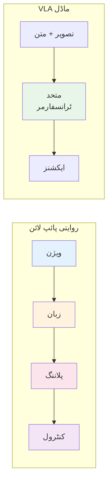
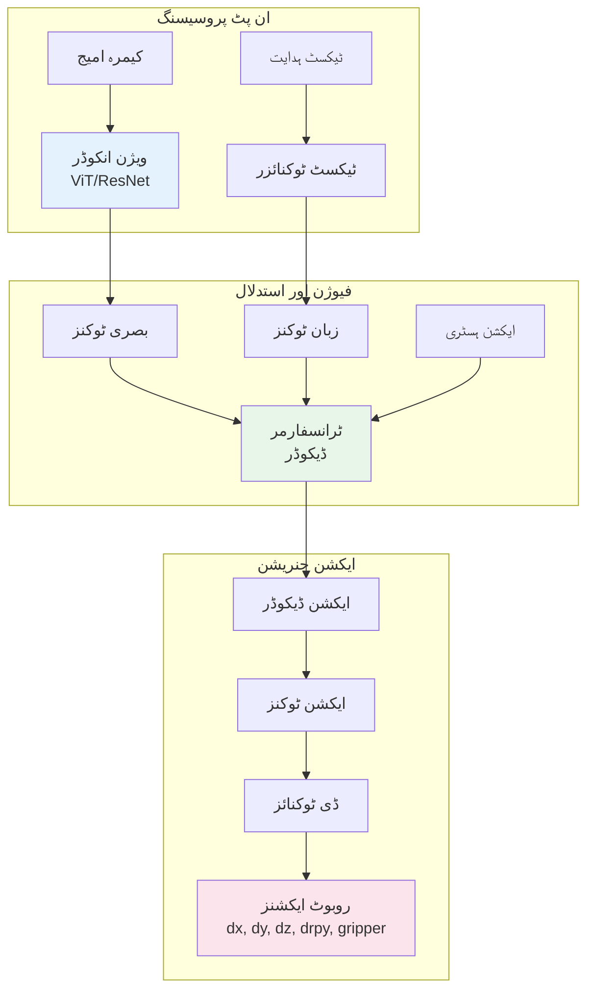

# باب 3: Vision-Language-Action ماڈلز

## سیکھنے کے مقاصد

اس باب کے اختتام تک، آپ قابل ہوں گے:

- **سمجھنا** Vision-Language-Action (VLA) ماڈلز کے پیچھے آرکیٹیکچر اور اصول
- **وضاحت کرنا** ٹرانسفارمرز کس طرح ویژن، زبان، اور ایکشن موڈالیٹیز کے انضمام کو ممکن بناتے ہیں
- **بیان کرنا** الگ ادراک اور کنٹرول سسٹمز سے اینڈ-ٹو-اینڈ VLA ماڈلز تک کا ارتقاء
- **موازنہ کرنا** بڑے VLA آرکیٹیکچرز بشمول RT-2، PaLM-E، اور OpenVLA
- **نافذ کرنا** روبوٹ کنٹرول کے لیے ایک بنیادی VLA انفرینس پائپ لائن
- **ضم کرنا** ROS 2 کے ساتھ پری ٹرینڈ VLA ماڈلز عملی ایپلیکیشنز کے لیے
- **جائزہ لینا** موجودہ VLA سسٹمز کی صلاحیتوں اور حدود کا

## پیشگی ضروریات

اس باب کو شروع کرنے سے پہلے، یقینی بنائیں کہ آپ کے پاس:

- باب 1 اور 2 مکمل ہوں (ROS 2 کی بنیادیں اور Gazebo سمولیشن)
- نیورل نیٹ ورکس اور ڈیپ لرننگ کی بنیادی سمجھ
- Python اور PyTorch یا TensorFlow سے واقفیت
- کم از کم 8GB VRAM والے GPU تک رسائی (انفرینس چلانے کے لیے)
- ٹرانسفارمرز اور اٹینشن میکانزمز کی سمجھ (مددگار لیکن ضروری نہیں)

---

## 1. Vision-Language-Action انقلاب

Physical AI روایتی طور پر ماڈیولر پائپ لائنز پر انحصار کرتی رہی ہے: ایک ادراکی سسٹم تصاویر پروسیس کرتا ہے، ایک پلانر منظر کی تشریح کرتا ہے، اور ایک کنٹرولر ایکشنز انجام دیتا ہے۔ ہر جز الگ سے تیار اور ٹیون کیا جاتا ہے۔ Vision-Language-Action (VLA) ماڈلز ایک پیراڈائم شفٹ کی نمائندگی کرتے ہیں—یہ ان تمام صلاحیتوں کو ایک واحد نیورل نیٹ ورک میں جوڑتے ہیں جو براہ راست بصری مشاہدات اور زبان کی ہدایات کو روبوٹ ایکشنز میں نقشہ بناتا ہے۔

### 1.1 VLA ماڈلز کیوں اہم ہیں

ایک روبوٹ سے "سرخ کپ اٹھاؤ" کہنے کے کام پر غور کریں۔ روایتی سسٹم میں:

1. **ویژن ماڈیول**: اشیاء کا پتہ لگاتا ہے، منظر کو سیگمنٹ کرتا ہے، "کپ" اور "سرخ" کی شناخت کرتا ہے
2. **زبان ماڈیول**: "اٹھاؤ" کو گرسپنگ ایکشن کے طور پر پارس کرتا ہے
3. **پلاننگ ماڈیول**: کپ کے لیے گرسپ پوز کا حساب لگاتا ہے
4. **کنٹرول ماڈیول**: پہنچنے اور پکڑنے کی حرکت انجام دیتا ہے

ہر ماڈیول کو الگ تربیتی ڈیٹا، احتیاط سے انضمام، اور ناکامی کے طریقے کئی گنا بڑھ جاتے ہیں۔ اگر ویژن سسٹم کپ کو غلط پکڑتا ہے، تو سب کچھ ناکام ہو جاتا ہے۔

VLA ماڈلز یہ پورا میپنگ اینڈ-ٹو-اینڈ سیکھتے ہیں:



**VLA ماڈلز کے اہم فوائد:**

- **ابھرتی صلاحیتیں**: متنوع ڈیٹا پر تربیت سے واضح تربیتی مثالوں سے آگے عمومی بنانا
- **قدرتی زبان انٹرفیس**: روبوٹس کو بدیہی ہدایات سے کنٹرول کریں، پروگرامنگ سے نہیں
- **ٹرانسفر لرننگ**: پری ٹرینڈ لینگویج ماڈلز دنیاوی علم روبوٹکس میں لاتے ہیں
- **آسان ڈیویلپمنٹ**: ایک ماڈل متعدد ہاتھ سے بنائے گئے ماڈیولز کی جگہ لیتا ہے

### 1.2 VLA تک کا ارتقاء

VLA ماڈلز تک کا راستہ ڈیپ لرننگ کی وسیع تر رفتار کی پیروی کرتا ہے:

| دور | نقطہ نظر | مثال |
|-----|----------|---------|
| **2012-2016** | الگ ویژن اور کنٹرول | AlexNet + MPC |
| **2016-2019** | اینڈ-ٹو-اینڈ ویژوموٹر لرننگ | روبوٹکس کے لیے Deep RL |
| **2019-2022** | زبان سے مشروط پالیسیاں | CLIP + BC |
| **2022-موجودہ** | متحد VLA ٹرانسفارمرز | RT-2، PaLM-E |

اہم کامیابی اس ادراک سے آئی کہ بڑے زبان ماڈلز (LLMs) صرف ٹیکسٹ پروسیسرز نہیں ہیں—یہ عام سیکوینس ماڈلز ہیں جو مناسب ٹوکنائزیشن کے ساتھ کسی بھی موڈالٹی کی نمائندگی کر سکتے ہیں۔

---

## 2. VLA آرکیٹیکچر کو سمجھنا

بنیادی طور پر، VLA ماڈلز ٹرانسفارمر پر مبنی نیورل نیٹ ورکس ہیں جو متعدد ان پٹ موڈالیٹیز (تصاویر، متن) پروسیس کرتے ہیں اور ایکشن ٹوکنز آؤٹ پٹ کرتے ہیں۔

### 2.1 ٹرانسفارمر بنیاد

ٹرانسفارمرز، "Attention Is All You Need" پیپر میں متعارف کرائے گئے، اپنے سیلف-اٹینشن میکانزم کے ذریعے AI میں انقلاب برپا کر دیا۔ VLA ماڈلز کے لیے، ٹرانسفارمرز فراہم کرتے ہیں:

**متحد نمائندگی**: تصاویر، متن، اور ایکشنز ٹوکنز کی سیکوینسز بن جاتے ہیں جو یکساں طریقے سے پروسیس ہوتے ہیں۔

**کراس-موڈل اٹینشن**: ماڈل بصری خصوصیات اور زبان کے تصورات کے درمیان تعلقات سیکھتا ہے۔

**سکیل ایبلٹی**: زیادہ ڈیٹا کے ساتھ بڑے ماڈلز مسلسل کارکردگی بہتر کرتے ہیں۔

### 2.2 موڈالیٹیز کی ٹوکنائزیشن

متنوع ڈیٹا کو ٹرانسفارمر میں فیڈ کرنے کے لیے، سب کچھ ٹوکنز بننا چاہیے:

**زبان ٹوکنز**: معیاری ٹیکسٹ ٹوکنائزیشن (BPE، SentencePiece) ہدایات کو ٹوکن IDs میں تبدیل کرتی ہے۔

**ویژن ٹوکنز**: تصاویر کو ویژن انکوڈر (ViT، ResNet) پروسیس کرتا ہے جو فیچر ویکٹرز پیدا کرتا ہے جو ٹوکنز بن جاتے ہیں۔

**ایکشن ٹوکنز**: روبوٹ ایکشنز کو بنز میں ڈسکریٹائز کیا جاتا ہے۔ مثال کے طور پر، 0-100mm کی گرپر پوزیشن کو 256 بنز میں تقسیم کیا جا سکتا ہے، ہر ایک منفرد ٹوکن۔

```python
# مثال: مسلسل ایکشنز کو ٹوکنز میں ڈسکریٹائز کرنا
def action_to_token(continuous_action, min_val, max_val, num_bins=256):
    """مسلسل ایکشن کو ڈسکریٹ ٹوکن میں تبدیل کریں۔"""
    normalized = (continuous_action - min_val) / (max_val - min_val)
    bin_index = int(normalized * (num_bins - 1))
    return min(max(bin_index, 0), num_bins - 1)

# گرپر پوزیشن 45mm -> ٹوکن 115 (اگر رینج 0-100mm، 256 بنز ہے)
token = action_to_token(45.0, 0.0, 100.0, 256)  # 115 واپس کرتا ہے
```

### 2.3 VLA ماڈل آرکیٹیکچر

ایک عام VLA ماڈل پر مشتمل ہے:



**ویژن انکوڈر**: RGB تصاویر کو بصری ٹوکنز میں پروسیس کرتا ہے۔ عام انتخابات میں Vision Transformer (ViT) یا convolutional نیٹ ورکس جیسے EfficientNet شامل ہیں۔

**ٹیکسٹ ٹوکنائزر**: قدرتی زبان کی ہدایات کو بیس LLM کی طرح کی vocabulary استعمال کرتے ہوئے ٹوکن سیکوینسز میں تبدیل کرتا ہے۔

**ٹرانسفارمر بیک بون**: اکثر روبوٹکس کے لیے فائن ٹیونڈ پری ٹرینڈ LLM (PaLM، LLaMA، Gemma)۔ یہ زبان کی سمجھ اور دنیاوی علم لاتا ہے۔

**ایکشن ہیڈ**: ڈسکریٹ ایکشن ٹوکنز کی پیش گوئی کرتا ہے جو پھر مسلسل روبوٹ کمانڈز میں واپس تبدیل ہوتے ہیں۔

---

## 3. بڑے VLA ماڈلز

کئی اہم ماڈلز نے VLA منظر نامے کو شکل دی ہے۔ ان کے ڈیزائن انتخابات کو سمجھنا فیلڈ کے ارتقاء کو روشن کرتا ہے۔

### 3.1 RT-2: Robotic Transformer 2

**تیار کردہ**: Google DeepMind (2023)

RT-2 پہلا ماڈل تھا جس نے ظاہر کیا کہ vision-language ماڈلز (VLMs) براہ راست روبوٹ ایکشنز آؤٹ پٹ کر سکتے ہیں۔ PaLI-X (55B پیرامیٹر VLM) پر بنایا گیا، RT-2 روبوٹ ایکشنز کو نئی "روبوٹ زبان" میں ٹیکسٹ ٹوکنز کے طور پر سمجھتا ہے۔

**اہم اختراعات:**
- **زبان کے طور پر ایکشنز**: روبوٹ ایکشنز کو `"1 128 91 241 1 128 128"` جیسے سٹرنگز کے طور پر 7 DoF آرم موومنٹس کے لیے دکھایا جاتا ہے
- **شریک تربیت**: ویب ڈیٹا اور روبوٹ مظاہروں پر مشترکہ طور پر تربیت یافتہ، علم کی منتقلی کو ممکن بناتا ہے
- **ابھرتا استدلال**: زبان کی سمجھ کو روبوٹک مہارتوں کے ساتھ جوڑ کر نئی ہدایات پر عمل کر سکتا ہے

**RT-2 تعامل کی مثال:**
```
تصویر: [پھلوں کے پیالے کے ساتھ کچن کا منظر]
ہدایت: "کیلے کو سفید پیالے میں منتقل کریں"
آؤٹ پٹ: "1 145 98 236 0 128 128"  # روبوٹ کمانڈز میں ڈیکوڈ
```

**حدود**: بہت زیادہ کمپیوٹ کی ضرورت ہے (55B پیرامیٹرز)، انفرینس سست ہے (~3-5 Hz)، اور آؤٹ پٹس ایک روبوٹ embodiment کے لیے مخصوص ہیں۔

### 3.2 PaLM-E: Embodied Multimodal Language Model

**تیار کردہ**: Google Research (2023)

PaLM-E بصری معلومات کو براہ راست PaLM کی (540B پیرامیٹر LLM) ایمبیڈنگ سپیس میں ضم کرتا ہے، جسمانی دنیا کے بارے میں استدلال کو ممکن بناتا ہے۔

**اہم خصوصیات:**
- **ملٹی موڈل پرامپٹنگ**: تصاویر اور متن کو ایک ساتھ ملا سکتا ہے: "روبوٹ کو [تصویر: سیب] اٹھانا چاہیے اور [تصویر: ٹوکری] میں رکھنا چاہیے"
- **Chain-of-Thought پلاننگ**: ایکشنز انجام دینے سے پہلے مرحلہ وار منصوبے بناتا ہے
- **ملٹی روبوٹ ٹرانسفر**: ایک ہی ماڈل مختلف روبوٹ morphologies کو کنٹرول کر سکتا ہے

**پلاننگ کی مثال:**
```
صارف: "میرے لیے سینڈوچ بناؤ"
PaLM-E:
1. کاؤنٹر پر روٹی کے ٹکڑے تلاش کریں
2. پہلا روٹی کا ٹکڑا اٹھائیں
3. کاٹنے والے بورڈ پر رکھیں
4. پینٹ بٹر کا جار تلاش کریں
5. جار کا ڈھکن کھولیں
6. پھیلانے والا چاقو اٹھائیں
...
[قابل عمل ذیلی کاموں کے ساتھ جاری]
```

### 3.3 OpenVLA: اوپن سورس VLA

**تیار کردہ**: Stanford/Berkeley (2024)

OpenVLA اوپن سورس، دوبارہ پیدا کرنے کے قابل متبادل فراہم کرکے VLA ریسرچ کو جمہوری بناتا ہے۔

**تفصیلات:**
- **آرکیٹیکچر**: Llama 2 پر مبنی 7B پیرامیٹر ماڈل
- **تربیتی ڈیٹا**: Open X-Embodiment ڈیٹاسیٹ (1M+ روبوٹ trajectories)
- **انفرینس سپیڈ**: کنزیومر GPUs پر ~10 Hz
- **اوپن ویٹس**: تربیتی کوڈ کے ساتھ مکمل طور پر اوپن سورس

**عملی فوائد:**
- API لاگت کے بغیر مقامی طور پر چلایا جا سکتا ہے
- کسٹم روبوٹ ڈیٹا پر فائن ٹیون کیا جا سکتا ہے
- فعال کمیونٹی ڈیویلپمنٹ

### 3.4 موازنہ جدول

| ماڈل | پیرامیٹرز | بیس ماڈل | اوپن سورس | انفرینس سپیڈ |
|-------|------------|------------|-------------|-----------------|
| **RT-2** | 55B | PaLI-X | نہیں | ~3 Hz |
| **PaLM-E** | 562B | PaLM | نہیں | ~1 Hz |
| **OpenVLA** | 7B | Llama 2 | ہاں | ~10 Hz |
| **Octo** | 93M | کسٹم | ہاں | ~50 Hz |
| **RT-1** | 35M | EfficientNet | جزوی | ~100 Hz |

---

## 4. VLA ماڈلز کی تربیت

VLA ماڈل کی تربیت کے لیے ڈیٹا، مقاصد، اور کمپیوٹیشنل وسائل پر احتیاط سے غور کرنا ضروری ہے۔

### 4.1 تربیتی ڈیٹا: روبوٹ مظاہرے

VLA ماڈلز مظاہروں سے سیکھتے ہیں—کامیاب ٹاسک ایگزیکیوشن کی ریکارڈنگز۔ ہر مظاہرے میں شامل ہے:

- **تصاویر**: ہر ٹائم سٹیپ پر کیمرہ مشاہدات
- **زبان**: ٹاسک کی قدرتی زبان کی تفصیل
- **ایکشنز**: ہر قدم پر انجام دیے گئے روبوٹ کمانڈز
- **میٹا ڈیٹا**: گرپر سٹیٹ، کامیابی/ناکامی لیبلز

**ڈیٹا فارمیٹ کی مثال:**
```python
demonstration = {
    "task": "سرخ بلاک اٹھائیں",
    "frames": [
        {
            "timestamp": 0.0,
            "image": np.array([...]),  # 224x224x3
            "action": {
                "delta_xyz": [0.01, 0.0, -0.02],
                "delta_rpy": [0.0, 0.0, 0.0],
                "gripper": 1.0  # کھلا
            },
            "gripper_state": "open"
        },
        # ... مزید فریمز
    ],
    "success": True
}
```

### 4.2 Open X-Embodiment ڈیٹاسیٹ

روبوٹکس کمیونٹی نے VLA تربیت کے لیے بڑے پیمانے پر ڈیٹاسیٹس بنائے ہیں:

**Open X-Embodiment** (2023): 22 روبوٹ embodiments سے 1M+ trajectories
- Bridge V2: کچن مینیپولیشن کی 60k trajectories
- RT-1 ڈیٹا: 130k حقیقی دنیا کے روبوٹ ایپی سوڈز
- Berkeley UR5: ٹیبل ٹاپ مینیپولیشن
- Stanford Kuka: صنعتی آرم ٹاسکس

**ڈیٹاسیٹ کی خصوصیات:**
```
کل Trajectories: 1,000,000+
روبوٹ اقسام: 22 مختلف embodiments
ٹاسک کیٹیگریز: 500+ منفرد ٹاسکس
ڈیٹا کے گھنٹے: 100,000+ گھنٹے
```

### 4.3 تربیتی مقصد: Behavior Cloning

بنیادی تربیتی نقطہ نظر **behavior cloning** ہے—ماہر ایکشنز کی پیش گوئی کے لیے supervised لرننگ:

```python
def vla_loss(model, batch):
    """VLA تربیتی نقصان کا حساب لگائیں۔"""
    images = batch["images"]          # [B, T, C, H, W]
    instructions = batch["text"]      # [B, max_len]
    target_actions = batch["actions"] # [B, T, action_dim]

    # فارورڈ پاس
    predicted_actions = model(images, instructions)

    # ڈسکریٹ ایکشن ٹوکنز کے لیے کراس-اینٹروپی نقصان
    loss = F.cross_entropy(
        predicted_actions.view(-1, num_action_bins),
        target_actions.view(-1)
    )

    return loss
```

### 4.4 کسٹم ٹاسکس کے لیے فائن ٹیوننگ

پری ٹرینڈ VLA کو نئے ٹاسکس یا روبوٹس کے مطابق ڈھالنے کے لیے:

```python
from transformers import AutoModelForVision2Seq
from openvla import OpenVLA

# پری ٹرینڈ ماڈل لوڈ کریں
model = OpenVLA.from_pretrained("openvla/openvla-7b")

# کسٹم ڈیٹاسیٹ تیار کریں
train_dataset = RobotDemonstrationDataset(
    data_path="./my_robot_demos",
    transform=model.image_transform
)

# کارکردگی کے لیے LoRA کے ساتھ فائن ٹیون کریں
from peft import LoraConfig, get_peft_model

lora_config = LoraConfig(
    r=16,
    lora_alpha=32,
    target_modules=["q_proj", "v_proj"],
    lora_dropout=0.05
)

model = get_peft_model(model, lora_config)

# تربیتی لوپ
optimizer = torch.optim.AdamW(model.parameters(), lr=1e-4)

for epoch in range(10):
    for batch in train_dataset:
        loss = vla_loss(model, batch)
        loss.backward()
        optimizer.step()
        optimizer.zero_grad()
```

---

## 5. ROS 2 کے ساتھ VLA انفرینس نافذ کرنا

آئیے ایک عملی VLA انفرینس پائپ لائن بنائیں جو ROS 2 کے ساتھ ضم ہو۔

### 5.1 سسٹم آرکیٹیکچر

```mermaid
graph LR
    subgraph "ROS 2"
        CAM[کیمرہ نوڈ] --> IMG[/camera/image_raw]
        CMD[ہدایت نوڈ] --> TXT[/instruction]
        IMG --> VLA_NODE
        TXT --> VLA_NODE
        VLA_NODE[VLA نوڈ] --> ACT[/cmd_vel یا /joint_commands]
    end

    subgraph "VLA انفرینس"
        VLA_NODE --> MODEL[VLA ماڈل<br/>GPU]
        MODEL --> VLA_NODE
    end

    style VLA_NODE fill:#e8f5e9
    style MODEL fill:#fce4ec
```

### 5.2 VLA ROS 2 نوڈ Implementation

```python
#!/usr/bin/env python3
"""ROS 2 کے لیے VLA انفرینس نوڈ۔"""

import rclpy
from rclpy.node import Node
from sensor_msgs.msg import Image
from std_msgs.msg import String
from geometry_msgs.msg import Twist
from cv_bridge import CvBridge
import torch
import numpy as np


class VLANode(Node):
    """VLA ماڈل انفرینس کے لیے ROS 2 نوڈ۔"""

    def __init__(self):
        super().__init__('vla_node')

        # پیرامیٹرز
        self.declare_parameter('model_path', 'openvla/openvla-7b')
        self.declare_parameter('device', 'cuda')
        self.declare_parameter('inference_rate', 10.0)

        model_path = self.get_parameter('model_path').value
        self.device = self.get_parameter('device').value

        # VLA ماڈل لوڈ کریں
        self.get_logger().info(f'{model_path} سے VLA ماڈل لوڈ ہو رہا ہے...')
        self.model = self._load_model(model_path)
        self.get_logger().info('ماڈل کامیابی سے لوڈ ہو گیا')

        # امیج پروسیسنگ
        self.bridge = CvBridge()
        self.current_image = None
        self.current_instruction = "انتظار کریں"

        # سبسکرائبرز
        self.image_sub = self.create_subscription(
            Image,
            '/camera/image_raw',
            self.image_callback,
            10
        )

        self.instruction_sub = self.create_subscription(
            String,
            '/instruction',
            self.instruction_callback,
            10
        )

        # پبلشر
        self.action_pub = self.create_publisher(Twist, '/cmd_vel', 10)

        # انفرینس ٹائمر
        rate = self.get_parameter('inference_rate').value
        self.timer = self.create_timer(1.0 / rate, self.inference_callback)

        self.get_logger().info('VLA نوڈ شروع ہو گیا')

    def _load_model(self, model_path):
        """VLA ماڈل لوڈ اور تیار کریں۔"""
        from openvla import OpenVLA

        model = OpenVLA.from_pretrained(model_path)
        model = model.to(self.device)
        model.eval()

        return model

    def image_callback(self, msg: Image):
        """تازہ ترین کیمرہ امیج محفوظ کریں۔"""
        try:
            cv_image = self.bridge.imgmsg_to_cv2(msg, 'rgb8')
            self.current_image = cv_image
        except Exception as e:
            self.get_logger().error(f'امیج کنورژن ناکام: {e}')

    def instruction_callback(self, msg: String):
        """موجودہ ہدایت اپ ڈیٹ کریں۔"""
        self.current_instruction = msg.data
        self.get_logger().info(f'نئی ہدایت: {msg.data}')

    def inference_callback(self):
        """VLA انفرینس چلائیں اور ایکشنز شائع کریں۔"""
        if self.current_image is None:
            return

        try:
            # امیج پری پروسیس کریں
            image_tensor = self._preprocess_image(self.current_image)

            # انفرینس چلائیں
            with torch.no_grad():
                actions = self.model.predict(
                    image_tensor,
                    self.current_instruction
                )

            # روبوٹ کمانڈز میں تبدیل کریں
            cmd = self._actions_to_twist(actions)
            self.action_pub.publish(cmd)

        except Exception as e:
            self.get_logger().error(f'انفرینس ناکام: {e}')

    def _preprocess_image(self, image):
        """ماڈل ان پٹ کے لیے امیج تیار کریں۔"""
        from PIL import Image as PILImage
        import torchvision.transforms as T

        transform = T.Compose([
            T.ToPILImage(),
            T.Resize((224, 224)),
            T.ToTensor(),
            T.Normalize(
                mean=[0.485, 0.456, 0.406],
                std=[0.229, 0.224, 0.225]
            )
        ])

        tensor = transform(image).unsqueeze(0)
        return tensor.to(self.device)

    def _actions_to_twist(self, actions):
        """VLA آؤٹ پٹ کو Twist میسج میں تبدیل کریں۔"""
        cmd = Twist()

        # فرض کرتے ہوئے ایکشنز ہے [dx, dy, dz, drx, dry, drz, gripper]
        # موبائل روبوٹ میں میپ کریں: dx -> linear.x, drz -> angular.z
        cmd.linear.x = float(actions[0]) * 0.5  # سکیل فیکٹر
        cmd.angular.z = float(actions[5]) * 1.0

        return cmd


def main(args=None):
    rclpy.init(args=args)
    node = VLANode()

    try:
        rclpy.spin(node)
    except KeyboardInterrupt:
        pass
    finally:
        node.destroy_node()
        rclpy.shutdown()


if __name__ == '__main__':
    main()
```

### 5.3 ہدایات بھیجنا

ہدایات بھیجنے کے لیے ایک سادہ نوڈ یا CLI ٹول بنائیں:

```python
#!/usr/bin/env python3
"""VLA نوڈ کو ہدایات بھیجیں۔"""

import rclpy
from rclpy.node import Node
from std_msgs.msg import String
import sys


class InstructionSender(Node):
    def __init__(self):
        super().__init__('instruction_sender')
        self.publisher = self.create_publisher(String, '/instruction', 10)

    def send(self, instruction: str):
        msg = String()
        msg.data = instruction
        self.publisher.publish(msg)
        self.get_logger().info(f'بھیجا: {instruction}')


def main():
    rclpy.init()
    node = InstructionSender()

    if len(sys.argv) > 1:
        instruction = ' '.join(sys.argv[1:])
        node.send(instruction)
    else:
        # انٹرایکٹو موڈ
        print("ہدایات درج کریں (Ctrl+C سے باہر نکلیں):")
        while True:
            try:
                instruction = input("> ")
                node.send(instruction)
            except (KeyboardInterrupt, EOFError):
                break

    node.destroy_node()
    rclpy.shutdown()


if __name__ == '__main__':
    main()
```

استعمال:
```bash
# ایک بار ہدایت
ros2 run my_vla_pkg instruction_sender "سرخ بلاک اٹھاؤ"

# انٹرایکٹو موڈ
ros2 run my_vla_pkg instruction_sender
> دروازے کی طرف جاؤ
> بائیں مڑو
> رکو
```

---

## 6. VLA ماڈلز کے لیے پرامپٹنگ کی حکمت عملیاں

آپ ہدایات کیسے لکھتے ہیں یہ VLA ماڈل کی کارکردگی کو نمایاں طور پر متاثر کرتا ہے۔

### 6.1 مؤثر ہدایت کے نمونے

**اشیاء کے بارے میں مخصوص ہوں:**
- اچھا: "میز کی **بائیں طرف** **سرخ کپ** اٹھاؤ"
- خراب: "وہ چیز اٹھاؤ"

**مقامی سیاق شامل کریں:**
- اچھا: "سیب کو **پیالے سے** **خالی پلیٹ** میں منتقل کریں"
- خراب: "سیب منتقل کرو"

**ایکشن فعل استعمال کریں:**
- اچھا: "بوتل **پکڑو**، 10cm **اٹھاؤ**، 90 ڈگری **گھماؤ**"
- خراب: "بوتل کے ساتھ کچھ کرو"

### 6.2 کثیر مرحلہ ہدایات

VLA ماڈلز مناسب طریقے سے پرامپٹ کیے جانے پر پیچیدہ، کثیر مرحلہ ٹاسکس کو سنبھال سکتے ہیں:

```
ہدایت: "پہلے، سپنج اٹھاؤ۔ پھر، میز کی سطح کو بائیں سے دائیں صاف کرو۔ آخر میں، سپنج کو پیالے میں واپس رکھو۔"
```

ماڈل اندرونی طور پر اسے atomic ایکشنز میں تقسیم کرتا ہے۔

### 6.3 ناکامیوں کو سنبھالنا

VLA ماڈلز ناکام ہو سکتے ہیں یا غیر متوقع رویہ پیدا کر سکتے ہیں۔ فال بیک حکمت عملیاں نافذ کریں:

```python
def execute_with_retry(vla_node, instruction, max_retries=3):
    """ریٹرائی لاجک کے ساتھ ہدایت انجام دیں۔"""
    for attempt in range(max_retries):
        success = vla_node.execute(instruction)

        if success:
            return True

        # ناکامی پر ہدایت میں ترمیم کریں
        if attempt == 1:
            instruction = f"دوبارہ کوشش کرو: {instruction}"
        elif attempt == 2:
            instruction = f"احتیاط سے اور آہستہ، {instruction}"

    return False
```

---

## 7. چیلنجز اور حدود

جبکہ VLA ماڈلز انقلابی ہیں، انہیں اہم چیلنجز کا سامنا ہے۔

### 7.1 حقیقی وقت کی کارکردگی

موجودہ VLA ماڈلز کمپیوٹیشنل طور پر مہنگے ہیں:

| ماڈل | پیرامیٹرز | GPU درکار | لیٹینسی |
|-------|------------|--------------|---------|
| RT-2 (55B) | 55B | 8x A100 | 300ms |
| OpenVLA (7B) | 7B | 1x RTX 4090 | 100ms |
| Octo (93M) | 93M | 1x RTX 3080 | 20ms |

تیز ردعمل کی ضرورت والے ٹاسکس (>30 Hz) کے لیے، بڑے VLA ماڈلز غیر عملی ہو سکتے ہیں۔

**تخفیف کی حکمت عملیاں:**
- چھوٹے آرکیٹیکچرز میں ماڈل distillation
- ایکشن چنکنگ (متعدد مستقبل کے ایکشنز کی پیش گوئی)
- ہائبرڈ نقطہ نظر (اعلیٰ سطح کی پلاننگ کے لیے VLA، ایگزیکیوشن کے لیے کلاسیکل کنٹرول)

### 7.2 عمومی بنانا بمقابلہ مخصوصیت

VLA ماڈلز ایک trade-off کا سامنا کرتے ہیں:
- **عام ماڈلز** (متنوع ڈیٹا پر تربیت یافتہ) بہت سے ٹاسکس کی کوشش کر سکتے ہیں لیکن درستگی کی کمی ہو سکتی ہے
- **مخصوص ماڈلز** (مخصوص ٹاسکس پر فائن ٹیونڈ) ان ٹاسکس میں ماہر ہیں لیکن دوسری جگہ ناکام

### 7.3 حفاظتی خدشات

VLA ماڈلز خطرناک ایکشنز پیدا کر سکتے ہیں:
- ناکامیوں کے دوران غیر متوقع حرکات
- مبہم ہدایات کی غلط تشریح
- واضح حفاظتی حدود کی کمی

**حفاظتی اقدامات:**
```python
class SafeVLAController:
    """حفاظتی حدود کے ساتھ VLA کنٹرولر۔"""

    def __init__(self, vla_model, safety_config):
        self.model = vla_model
        self.max_velocity = safety_config.max_velocity
        self.workspace_bounds = safety_config.workspace_bounds

    def predict_safe_action(self, image, instruction):
        """حفاظتی constraints کے ساتھ ایکشن کی پیش گوئی کریں۔"""
        raw_action = self.model.predict(image, instruction)

        # رفتار کی حد بندی
        raw_action[:3] = np.clip(
            raw_action[:3],
            -self.max_velocity,
            self.max_velocity
        )

        # ورک سپیس بائنڈنگ
        if not self._in_workspace(raw_action):
            return self._safe_stop_action()

        return raw_action

    def _in_workspace(self, action):
        """چیک کریں کہ ایکشن روبوٹ کو محفوظ ورک سپیس میں رکھتا ہے۔"""
        pass

    def _safe_stop_action(self):
        """صفر رفتار ایکشن واپس کریں۔"""
        return np.zeros(7)
```

### 7.4 Embodiment گیپ

ایک روبوٹ پر تربیت یافتہ VLA ماڈلز براہ راست دوسرے میں منتقل نہیں ہوتے:
- مختلف جوائنٹ کنفیگریشنز
- مختلف سینسر پلیسمنٹس
- الگ ایکشن سپیسز

---

## 8. مستقبل کی سمتیں

VLA فیلڈ تیزی سے ارتقاء پذیر ہے۔ اہم ریسرچ کی سمتیں شامل ہیں:

### 8.1 سمولیشن سے حقیقت کی منتقلی

خالصتاً سمولیشن میں VLAs کی تربیت ڈیٹا جمع کرنے کی لاگت کو ڈرامائی طور پر کم کر سکتی ہے۔

### 8.2 ملٹی موڈل ان پٹس

مستقبل کے VLAs اضافی موڈالیٹیز شامل کر سکتے ہیں:
- **ٹیکٹائل سینسنگ**: گرسپنگ فورسز اور آبجیکٹ پراپرٹیز کو سمجھیں
- **آڈیو**: وائس کمانڈز کا جواب دیں، ماحولیاتی آوازوں کا پتہ لگائیں
- **Proprioception**: روبوٹ سٹیٹ کی بہتر آگاہی

### 8.3 انٹرایکٹو لرننگ

سٹیٹک ڈیٹاسیٹس سے آگے بڑھنا:
- ڈیپلائمنٹ کے دوران انسانی فیڈ بیک سے سیکھنا
- غیر یقینی ہونے پر واضح سوالات پوچھنا
- آزمائش اور غلطی کے ذریعے خود بہتری

### 8.4 Compositional Generalization

معلوم مہارتوں کو نئے طریقوں سے ملانا:
- "کپ اٹھاؤ" + "پانی ڈالو" = "کپ سے پانی ڈالو" (چاہے کبھی مظاہرہ نہ کیا گیا ہو)
- درجہ بند مہارت کی ترکیب
- زبان سے رہنمائی یافتہ مہارت کی زنجیر

---

## 9. VLA ڈیپلائمنٹ کے لیے عملی غور و فکر

حقیقی دنیا کی ایپلیکیشنز میں VLA ماڈلز ڈیپلائی کرنے کے لیے انفراسٹرکچر، مانیٹرنگ، اور آپریشنل طریقہ کار پر احتیاط سے غور کرنا ضروری ہے۔

### 9.1 ہارڈویئر کی ضروریات

VLA ماڈلز چلانے کے لیے مناسب کمپیوٹیشنل وسائل کی ضرورت ہے:

**انفرینس ہارڈویئر کے اختیارات:**

| ڈیپلائمنٹ منظرنامہ | تجویز کردہ ہارڈویئر | پاور کھپت | لاگت رینج |
|--------------------|--------------------|-------------------|------------|
| **ریسرچ/ڈیویلپمنٹ** | RTX 4090 (24GB) | 450W | $1,600 |
| **ایج ڈیپلائمنٹ** | Jetson AGX Orin | 60W | $1,999 |
| **کلاؤڈ API** | A100 (40GB) | 400W | $10-15/hr |
| **ملٹی روبوٹ فلیٹ** | L40S فی روبوٹ | 350W | $7,000 |

### 9.2 ناکامی سے بحالی

VLA ماڈلز کبھی کبھار ناکام ہوں گے۔ مضبوط سسٹمز کو بحالی کی حکمت عملیوں کی ضرورت ہے:

**بتدریج تنزلی:**
- VLA ناکام ہونے پر سادہ پالیسیوں پر واپس جائیں
- غیر یقینی پیش گوئیوں کا پتہ لگانے کے لیے اعتماد کی حدود استعمال کریں
- مبہم حالات کے لیے محفوظ اسٹاپ رویے نافذ کریں

---

## اہم نکات

اس باب کو مکمل کرنے کے بعد، آپ کو سمجھنا چاہیے:

- **Vision-Language-Action (VLA) ماڈلز** ادراک، زبان کی سمجھ، اور روبوٹ کنٹرول کو ایک واحد نیورل نیٹ ورک میں متحد کرتے ہیں، روبوٹس کے قدرتی زبان کنٹرول اور ابھرتی عمومیت کی صلاحیتوں کو ممکن بناتے ہیں۔

- **ٹرانسفارمر آرکیٹیکچرز** VLA ماڈلز کو تصاویر، متن، اور ایکشنز کو ٹوکن سیکوینسز کے طور پر پروسیس کرکے ممکن بناتے ہیں۔ پری ٹرینڈ لینگویج ماڈلز روبوٹکس میں دنیاوی علم لاتے ہیں۔

- **ایکشن ٹوکنائزیشن** مسلسل روبوٹ کمانڈز کو ڈسکریٹ ٹوکنز میں تبدیل کرتی ہے، زبان ماڈلز کو روبوٹ ایکشنز نئی زبان کے طور پر "بولنے" کی اجازت دیتی ہے۔

- **بڑے VLA ماڈلز** میں RT-2 (Google، 55B پیرامیٹرز)، PaLM-E (Google، 562B پیرامیٹرز)، اور OpenVLA (اوپن سورس، 7B پیرامیٹرز) شامل ہیں۔ ہر ایک صلاحیت اور رسائی کے درمیان مختلف trade-offs کی نمائندگی کرتا ہے۔

- **VLA ماڈلز کی تربیت** کے لیے Open X-Embodiment جیسے بڑے پیمانے پر روبوٹ مظاہرے کے ڈیٹاسیٹس کی ضرورت ہے۔ Behavior cloning بنیادی تربیتی نقطہ نظر ہے۔

- **ROS 2 انضمام** حقیقی روبوٹس پر VLA ماڈلز کی عملی ڈیپلائمنٹ کو ممکن بناتا ہے۔ لیٹینسی، حفاظت، اور ناکامی کو سنبھالنے پر احتیاط سے توجہ ضروری ہے۔

- **موجودہ حدود** میں کمپیوٹیشنل مطالبات (سست انفرینس)، embodiment گیپ (روبوٹس کے درمیان ناقص منتقلی)، اور حفاظتی خدشات (غیر متوقع ناکامیاں) شامل ہیں۔

---

## مشقیں

### مشق 1: VLA تصورات (ابتدائی)
اپنے الفاظ میں وضاحت کریں:
1. VLA ماڈلز کو روایتی روبوٹکس پائپ لائنز سے "پیراڈائم شفٹ" کیوں سمجھا جاتا ہے؟
2. ایکشن ٹوکنائزیشن کیسے کام کرتی ہے، اور یہ کیوں ضروری ہے؟
3. "embodiment گیپ" کیا ہے اور یہ کیوں اہم ہے؟

### مشق 2: ماڈل موازنہ (ابتدائی)
تین VLA ماڈلز (RT-2، OpenVLA، اور اپنی پسند کا ایک اور) کے لیے موازنہ جدول بنائیں بشمول:
- پیرامیٹر کاؤنٹ
- درکار ہارڈویئر
- اوپن سورس سٹیٹس
- بہترین استعمال کے کیسز

### مشق 3: پرامپٹنگ تجربات (انٹرمیڈیٹ)
اگر آپ کے پاس VLA ماڈل API یا ڈیمو تک رسائی ہے:
1. ایک ہی ٹاسک کو تین مختلف ہدایت کے جملوں کے ساتھ ٹیسٹ کریں
2. دستاویز کریں کہ کون سا بہترین کام کرتا ہے اور مفروضہ بنائیں کیوں
3. ناکامی کے طریقے شناخت کریں اور بہتر پرامپٹس تجویز کریں

### مشق 4: ROS 2 انضمام (انٹرمیڈیٹ)
سیکشن 5 سے VLA ROS 2 نوڈ میں توسیع کریں:
1. زیادہ سے زیادہ رفتاروں کو محدود کرنے والا سیفٹی ریپر شامل کریں
2. ڈیبگنگ کے لیے ایکشن لاگنگ نافذ کریں
3. "اسٹینڈ بائی" اور "ایکٹو" موڈز کے درمیان سوئچ کرنے کے لیے سروس شامل کریں

### مشق 5: فائن ٹیوننگ سمولیشن (ایڈوانسڈ)
باب 2 سے Gazebo سمولیشن استعمال کرتے ہوئے:
1. ایک سادہ ٹاسک کے لیے 100 مظاہرے trajectories جمع کریں
2. VLA تربیت کے لیے ڈیٹا فارمیٹ کریں
3. اگر کمپیوٹ اجازت دے، چھوٹا ماڈل فائن ٹیون کریں
4. فائن ٹیوننگ سے پہلے اور بعد کی کارکردگی کا موازنہ کریں

---

## مزید مطالعہ

### بنیادی مقالات
- [RT-2: Vision-Language-Action Models](https://arxiv.org/abs/2307.15818) (Google DeepMind, 2023)
- [PaLM-E: An Embodied Multimodal Language Model](https://arxiv.org/abs/2303.03378) (Google, 2023)
- [OpenVLA: An Open-Source Vision-Language-Action Model](https://openvla.github.io/) (Stanford/Berkeley, 2024)

### ڈیٹاسیٹس
- [Open X-Embodiment Dataset](https://robotics-transformer-x.github.io/)
- [Bridge Data V2](https://rail-berkeley.github.io/bridgedata/)

### ٹیوٹوریلز اور کوڈ
- [OpenVLA GitHub Repository](https://github.com/openvla/openvla)
- [LeRobot: Hugging Face Robotics Library](https://github.com/huggingface/lerobot)
- [Octo: Generalist Robot Policy](https://octo-models.github.io/)

---

*اختتام: آپ نے اب اس Physical AI نصابی کتاب کے بنیادی ابواب مکمل کر لیے ہیں۔ آپ Physical AI اور ROS 2 کی بنیادیں سمجھتے ہیں، Gazebo کے ساتھ سمولیشن میں روبوٹس بنا اور ٹیسٹ کر سکتے ہیں، اور جدید ترین VLA ماڈلز کی قدر کرتے ہیں جو روبوٹس کے کنٹرول کے طریقے کو نئی شکل دے رہے ہیں۔ سفر جاری ہے جب آپ ان تصورات کو اپنے منصوبوں پر لاگو کرتے ہیں!*
